# 自动驾驶与 VLA 大模型课程

> **来源**：自动驾驶之心（公众号） · Bilibili
> **主讲**：咖喱学长
> **单位**：清华大学

---

## Slide 01 — 课程封面 / Cover

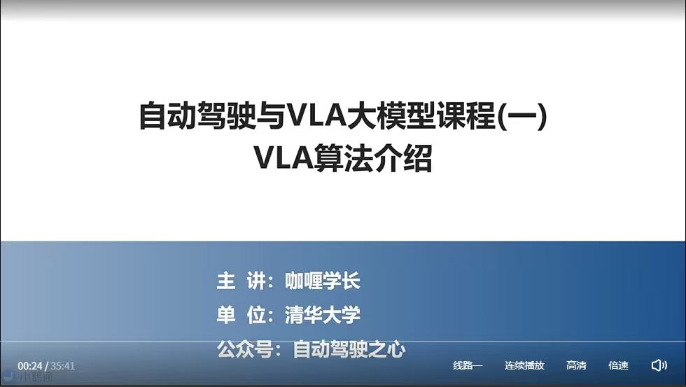

### 主题
**自动驾驶与 VLA 大模型课程（一）—— VLA 算法介绍**

系列课程的第一讲，聚焦 **VLA（Vision-Language-Action）大模型** 在自动驾驶领域的算法基础与原理介绍。

### 基本信息
| 项目 | 内容 |
| --- | --- |
| 课程名称 | 自动驾驶与 VLA 大模型课程（一） |
| 本讲主题 | VLA 算法介绍 |
| 主讲人 | 咖喱学长 |
| 单位 | 清华大学 |
| 公众号 | 自动驾驶之心 |
| 视频时长 | 35:41 |

### 关键概念
- **VLA = Vision + Language + Action**
  - **Vision**：感知输入（图像 / 视频 / 多模态传感器）
  - **Language**：语言理解与指令推理（LLM / VLM）
  - **Action**：动作输出（驾驶决策 / 控制信号）
- 是当前端到端自动驾驶与具身智能（Embodied AI）研究的核心范式之一。

---

## Slide 02 — 主要内容 / Outline

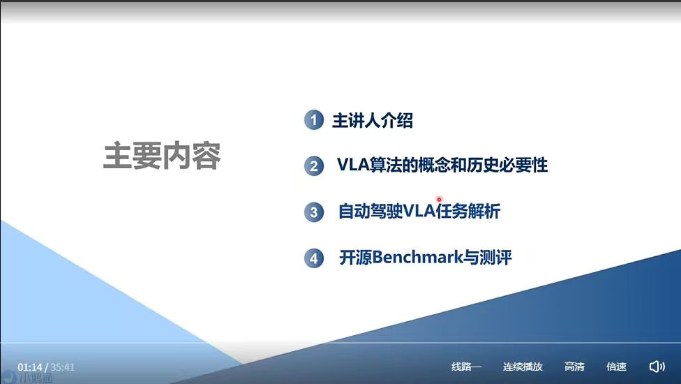

### 主题
**主要内容 —— 本讲四大模块**

### 课程目录
| # | 章节 | 说明 |
| --- | --- | --- |
| 1 | **主讲人介绍** | 讲师背景与研究方向 |
| 2 | **VLA 算法的概念和历史必要性** | VLA 的定义、起源、为什么需要 VLA |
| 3 | **自动驾驶 VLA 任务解析** | VLA 在自动驾驶场景下的具体任务拆解 |
| 4 | **开源 Benchmark 与测评** | 主流开源数据集 / 评测基准与对比 |

### 结构要点
- 从 **人 → 概念 → 任务 → 评测** 层层递进。
- 第 2 章奠定理论基础，第 3 章落地到自动驾驶，第 4 章给出量化对比工具。

---

## Slide 03 — 章节分隔页：第 02 章

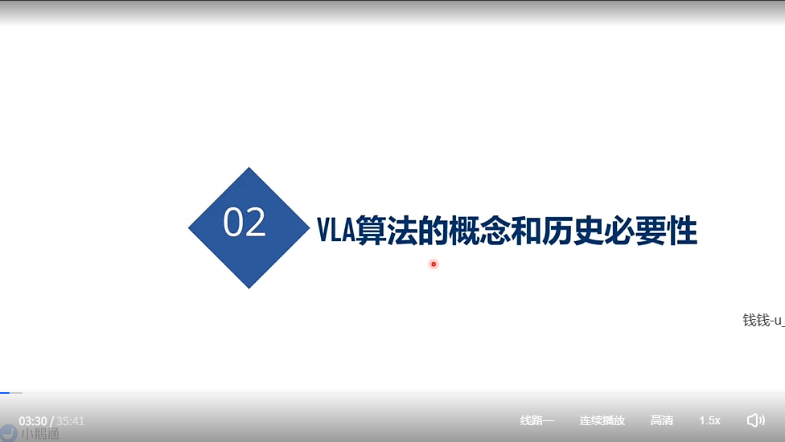

### 主题
**02 — VLA 算法的概念和历史必要性**

进入课程第 2 章节，开始讲解 VLA 的核心概念以及它在技术发展史中的必要性。

### 章节预告
- **概念（What）**：什么是 VLA？Vision-Language-Action 的统一表征。
- **历史必要性（Why）**：
  - 传统模块化自动驾驶（感知-预测-规划-控制）的局限
  - 端到端方法的兴起与不足
  - 为什么需要引入「语言 / 推理」作为桥梁 → 走向 VLA

---

## Slide 04 — VLA 算法概念

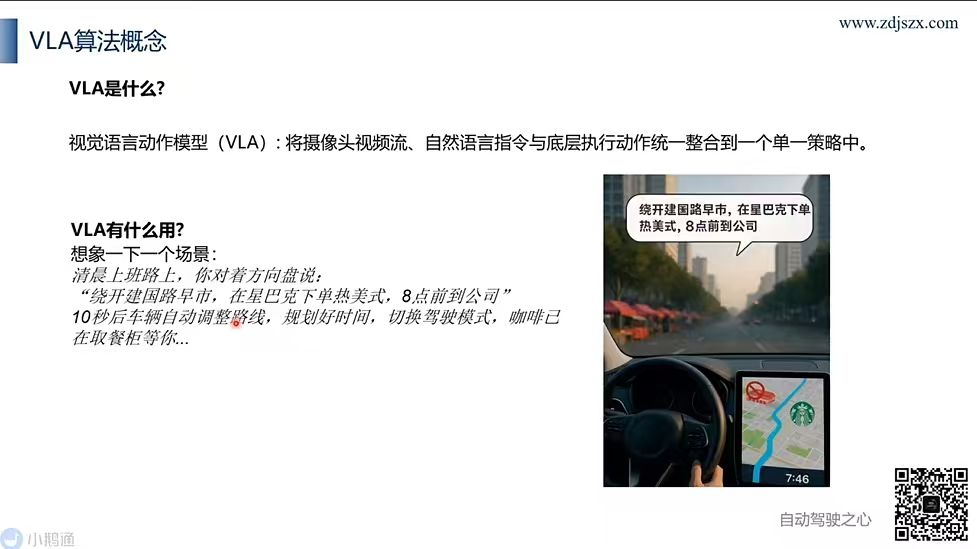

### 主题
**VLA 算法概念 —— What & Why**

### VLA 是什么？
**视觉语言动作模型（Vision-Language-Action, VLA）**：
> 将 **摄像头视频流**、**自然语言指令** 与 **底层执行动作** 统一整合到一个 **单一策略（single policy）** 中。

即：一个端到端模型同时吃下「看到的画面 + 听到的指令」→ 直接输出「方向盘 / 油门 / 路径规划」等动作。

### VLA 有什么用？—— 场景示例
**清晨上班路上**，你对着方向盘说：
> 「绕开建国路早市，在星巴克下单热美式，8 点前到公司。」

**10 秒后**：
- 🚗 车辆自动调整路线
- ⏰ 规划好时间
- 🔄 切换驾驶模式
- ☕ 咖啡已在取餐柜等你 ...

### 核心价值
| 维度 | 传统自动驾驶 | VLA 模型 |
| --- | --- | --- |
| 输入 | 仅传感器数据 | 传感器 + **自然语言** |
| 任务 | 单一驾驶任务 | 驾驶 + **多模态意图理解** |
| 输出 | 控制信号 | 路径 / 控制 / **协同服务调度** |
| 用户交互 | 按钮 / 屏幕 | **对话式自然交互** |

→ VLA 把「驾驶」从工具升级为 **能听懂人话的智能体（agent）**。

---

## Slide 05 — 自动驾驶 VLA 结构

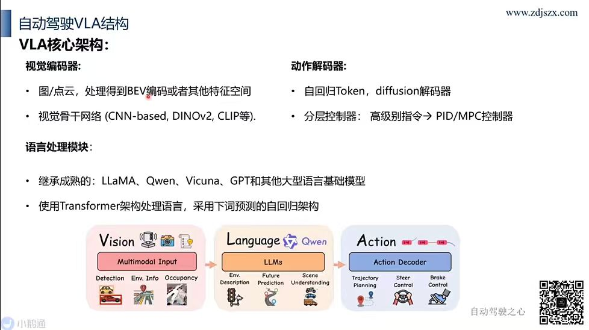

### 主题
**VLA 核心架构 —— Vision → Language → Action 三段式**

### 核心架构

#### ① 视觉编码器 / Vision Encoder
- 处理 **图像 / 点云** → 输出 **BEV 编码** 或其他特征空间
- 视觉骨干网络：**CNN-based、DINOv2、CLIP** 等

#### ② 语言处理模块 / Language Module
- 继承成熟的大型语言模型：**LLaMA、Qwen、Vicuna、GPT** 等
- 使用 **Transformer 架构** 处理语言
- 采用 **下词预测（next-token prediction）** 的自回归架构

#### ③ 动作解码器 / Action Decoder
- **自回归 Token** 解码器 + **Diffusion** 解码器
- **分层控制器**：高级别指令 → **PID / MPC 控制器**

### 三段式流水线（底部图示）

```
Vision                Language              Action
─────────             ─────────             ─────────
Multimodal Input  →   LLMs (Qwen 等)    →   Action Decoder
                                              │
├ Detection            ├ Env. Description     ├ Trajectory Planning
├ Env. Info            ├ Future Prediction    ├ Steer Control
└ Occupancy            └ Scene Understanding  └ Brake Control
```

| 阶段 | 输入 | 输出 |
| --- | --- | --- |
| **Vision** | 多模态传感器（图像 / 点云） | 检测 / 环境信息 / Occupancy |
| **Language** | 视觉特征 + 自然语言指令 | 环境描述 / 未来预测 / 场景理解 |
| **Action** | 语言模块的语义输出 | 轨迹规划 / 方向盘控制 / 刹车控制 |

### 设计要点
- **统一表征**：视觉 / 语言 / 动作共享 Token 化表征，可在 Transformer 内联合训练。
- **借力 LLM 生态**：语言模块直接复用 LLaMA / Qwen 等开源大模型，免去重训。
- **多种解码方式**：自回归 vs Diffusion，灵活适配实时性与多模态动作分布。
- **分层落地**：高层语义动作 → PID/MPC 底层控制，兼顾「智能」与「可控」。

---

## Slide 06 — 自动驾驶 VLA 结构「考考你」：DriveGPT4 框图

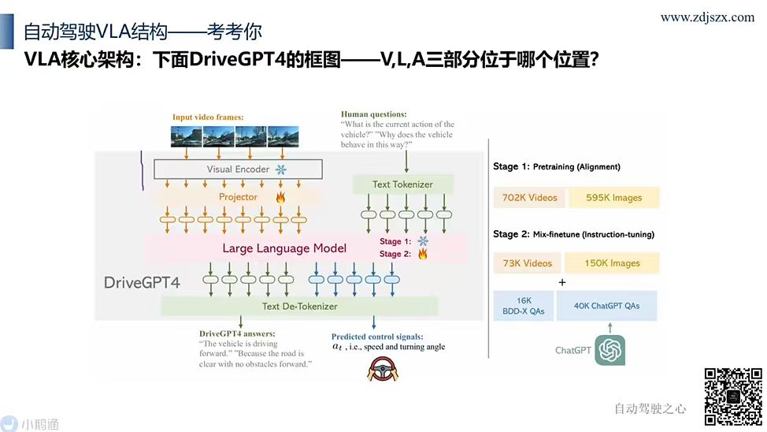

### 主题
**VLA 核心架构小测验 —— DriveGPT4 框图中 V、L、A 三部分位于哪个位置？**

### DriveGPT4 框图解析

#### 输入端
- **Input video frames**：连续车载视频帧
- **Human questions**：自然语言提问，例如
  > "What is the current action of the vehicle?"
  > "Why does the vehicle behave in this way?"

#### 模型主干
| 模块 | 角色 | VLA 映射 |
| --- | --- | --- |
| **Visual Encoder** ❄️ | 视频帧 → 视觉特征 | **V (Vision)** |
| **Projector** 🔥 | 视觉特征对齐到 LLM token 空间 | V→L 桥接 |
| **Text Tokenizer** | 文本 → token | **L (Language)** 输入侧 |
| **Large Language Model** ❄️Stage1 / 🔥Stage2 | 跨模态推理主干 | **L (Language)** |
| **Text De-Tokenizer** | token → 文本 / 控制信号 | **A (Action)** 输出侧 |

#### 输出端
- **DriveGPT4 answers**（语言回答）：
  > "The vehicle is driving forward." "Because the road is clear with no obstacles ahead."
- **Predicted control signals**（动作输出）：
  > 速度 + 转向角 $a_t$（speed and turning angle） → **A (Action)**

### 答案速查 ✅
- **V (Vision)**：左上 **Visual Encoder + Projector**
- **L (Language)**：中部 **Text Tokenizer + Large Language Model**
- **A (Action)**：右下 **Text De-Tokenizer → 控制信号（speed / turning angle）**

### 训练策略（右栏）

#### Stage 1：Pretraining (Alignment)
| 数据 | 规模 |
| --- | --- |
| Videos | **702K** |
| Images | **595K** |

→ 目的：对齐视觉编码器与 LLM 的表征空间（Projector 训练）。

#### Stage 2：Mix-finetune (Instruction-tuning)
| 数据 | 规模 |
| --- | --- |
| Videos | **73K** |
| Images | **150K** |
| BDD-X QAs | **16K** |
| ChatGPT QAs | **40K**（由 ChatGPT 生成的指令数据） |

→ 目的：指令微调，让模型学会回答驾驶问题并输出控制信号。

### 关键观察
- **冻结❄️ vs 微调🔥**：
  - Stage 1：Visual Encoder 冻结，主要训 Projector + LLM 对齐
  - Stage 2：LLM 解冻，端到端微调驾驶任务
- **ChatGPT 数据增强**：用 ChatGPT 自动扩充 QA 数据 —— 低成本获得大规模指令样本，是 VLA 数据构造的常用套路。
- **多任务输出**：DriveGPT4 同时输出 **自然语言解释 + 控制信号**，体现 VLA 的「可解释端到端」优势。

---

## Slide 07 — 自动驾驶 VLA 结构「考考你」：OpenDriveVLA 框图

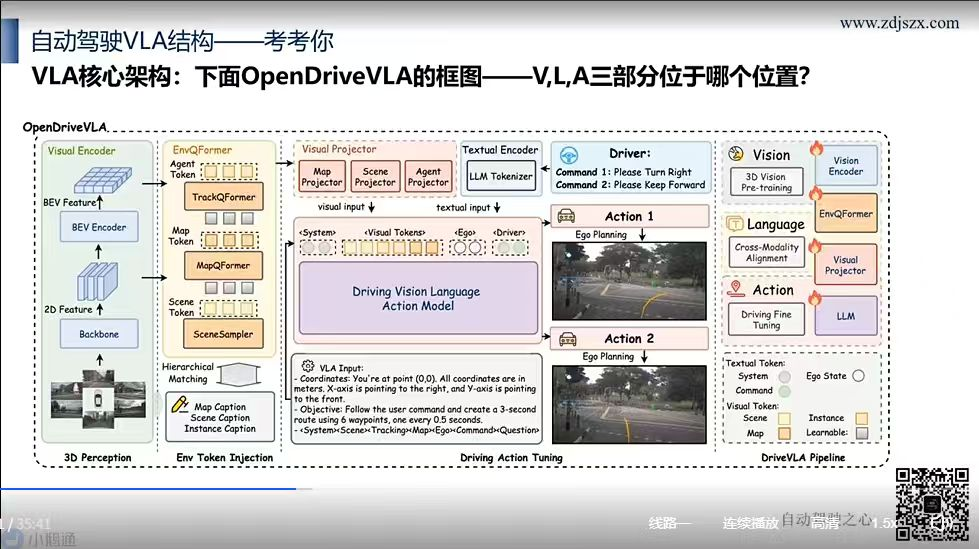

### 主题
**VLA 核心架构小测验 —— OpenDriveVLA 框图中 V、L、A 三部分位于哪个位置？**

### OpenDriveVLA 框图解析（四大区块）

#### ① 3D Perception（左侧）—— **V (Vision)**
- **Backbone**：2D Feature 提取
- **BEV Encoder**：生成 BEV Feature
- **Visual Encoder**：综合视觉编码器
- 输出：3D 感知特征（BEV + 多视图）

#### ② Env Token Injection（左中）—— V→L 桥接
| 模块 | 功能 |
| --- | --- |
| **EnvQFormer** | 环境 Q-Former，将视觉特征 → token |
| ├ TrackQFormer | Agent Token（动态目标） |
| ├ MapQFormer | Map Token（地图元素） |
| └ SceneSampler | Scene Token（场景采样） |
| **Hierarchical Matching** | Map / Scene / Instance Caption 多层级匹配 |

#### ③ Driving Action Tuning（中间）—— **L (Language) + A (Action)**
- **Visual Projector**：Map / Scene / Agent Projector → 视觉 token 对齐
- **Textual Encoder**：LLM Tokenizer 处理文本
- **Driver Input（指令）**：
  > Command 1: Please Turn Right
  > Command 2: Please Keep Forward
- **Driving Vision Language Action Model**（核心 LLM）：
  - 输入序列：`<System> <Visual Tokens> <Ego> <Driver>`
  - 输出：**Action 1 / Action 2** → Ego Planning（自车轨迹规划）

##### VLA Input 提示词模板
```
Coordinates: You're at point (0,0). X-axis right, Y-axis pointing to the front.
Objective: Follow the user command and create a 3-second
           route using 6 waypoints, one every 0.5 seconds.
<System><Scene><Tracking><Map><Ego><Command><Question>
```

#### ④ DriveVLA Pipeline（右侧）—— 训练范式总览
| 阶段 | 状态 | 模块 |
| --- | --- | --- |
| **Vision** | ❄️ 冻结 | 3D Vision Pre-training → Vision Encoder + EnvQFormer + Visual Projector |
| **Language** | ❄️ 冻结 | Cross-Modality Alignment → LLM |
| **Action** | 🔥 微调 | Driving Fine Tuning → LLM 端到端学习驾驶动作 |

### 答案速查 ✅
- **V (Vision)**：左侧 **3D Perception + Env Token Injection（BEV/Visual Encoder + EnvQFormer）**
- **L (Language)**：中部 **Visual Projector + Textual Encoder + Driving Vision Language Action Model（LLM 主干）**
- **A (Action)**：右侧 **Action 1 / Action 2 → Ego Planning（6 个 waypoint 轨迹）**

### Token 类型说明（右下）
| 类型 | 内容 |
| --- | --- |
| Textual Token | System、Command、Ego State |
| Visual Token | Scene、Map、Instance、Learnable |

### 与 DriveGPT4 的对比
| 维度 | DriveGPT4 | OpenDriveVLA |
| --- | --- | --- |
| 视觉输入 | 单一 Visual Encoder | 3D Perception + 多 Q-Former（Track/Map/Scene） |
| Token 设计 | 通用 visual token | 显式区分 **Agent / Map / Scene** token |
| 动作输出 | 速度 + 转向角 | **6 waypoint 轨迹（3s @ 0.5s 间隔）** |
| 训练范式 | 两阶段（对齐 + 指令微调） | 三阶段（3D 视觉预训练 + 跨模态对齐 + 驾驶微调） |

→ OpenDriveVLA 更强调 **结构化 3D 场景理解** 与 **轨迹级动作输出**，更贴近真实自动驾驶任务。

---

## Slide 08 — VLA 算法历史必要性（1）：端到端自动驾驶

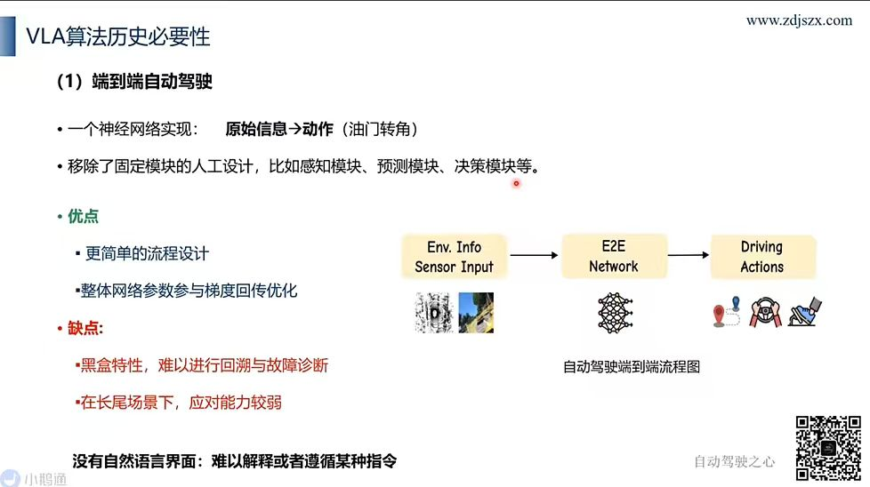

### 主题
**VLA 算法历史必要性 ——（1）端到端自动驾驶（End-to-End AV）**

回顾自动驾驶范式演进的第一步：从模块化流水线 → 端到端神经网络，理解 VLA 出现的背景。

### 核心定义
- **一个神经网络实现**：**原始信息 → 动作（油门 / 转角）**
- **移除了固定模块的人工设计**，比如：
  - 感知模块
  - 预测模块
  - 决策模块 ...

### 端到端流程图
```
Env. Info Sensor Input  →  E2E Network  →  Driving Actions
   (摄像头 / 雷达)          (单一神经网络)    (油门 / 转向 / 刹车)
```

### ✅ 优点
- **更简单的流程设计**：去掉手工模块拼接，统一为一个网络。
- **整体网络参数参与梯度回传优化**：端到端可微分，全局最优而非局部最优。

### ❌ 缺点
- **黑盒特性**：难以进行回溯与故障诊断（出问题不知道是哪个环节）。
- **在长尾场景下，应对能力较弱**：罕见 Corner Case 训练数据少，泛化差。
- **没有自然语言界面**：难以解释，或者遵循某种指令。

### 与 VLA 的衔接（为什么需要 VLA？）
| 端到端短板 | VLA 的应对 |
| --- | --- |
| 黑盒，无法解释 | 语言模块输出 **自然语言解释**（可解释性） |
| 长尾场景泛化弱 | 借力 **LLM 世界知识** 推理罕见场景 |
| 无指令界面 | **自然语言指令** 输入，实现人机交互 |

→ 端到端解决了「模块化的拼接负担」，但留下了「不会说话、不会推理」的硬伤；
→ **VLA = 端到端 + 语言推理**，正是为弥补这三大缺陷而生。

---

## Slide 09 — VLA 算法历史必要性（2）：基于 VLM 的自动驾驶方案

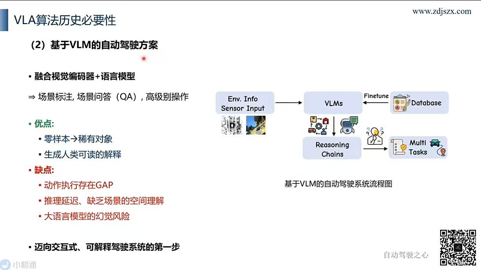

### 主题
**VLA 算法历史必要性 ——（2）基于 VLM 的自动驾驶方案**

VLA 出现前的过渡形态：用 **视觉语言模型（VLM）** 给端到端加上「语义理解 + 推理链」能力。

### 核心定义
- **融合视觉编码器 + 语言模型**
- ⇒ 支持 **场景标注、场景问答（QA）、高级别操作**

### 系统流程图（右侧）
```
Env. Info Sensor Input  ─►  VLMs  ◄── Finetune ── Database
                              │
                              ▼
                       Reasoning Chains  ─►  Multi Tasks
                                              (规划 / 检测 / 多车控制 ...)
```
- **VLMs**：视觉语言模型核心（吃图 + 出语言）
- **Database + Finetune**：用领域驾驶数据微调
- **Reasoning Chains**：思维链推理
- **Multi Tasks**：下游多任务（规划 / 决策 / 检测）

### ✅ 优点
- **零样本 → 稀有对象**：VLM 携带大模型世界知识，可零样本识别罕见物体
- **生成人类可读的解释**：天然具备可解释性

### ❌ 缺点
- **动作执行存在 GAP**：VLM 输出语言/语义，与底层动作之间需要二次映射，不连贯
- **推理延迟、缺乏场景的空间理解**：LLM 推理慢，对 3D 空间结构理解弱
- **大语言模型的幻觉风险**：可能"一本正经地胡说"，安全性隐患

### 历史定位
> **迈向交互式、可解释驾驶系统的第一步**

| 阶段 | 范式 | 核心问题 |
| --- | --- | --- |
| 模块化 | 感知-预测-规划-控制 | 模块拼接、误差累积 |
| 端到端 | 单一神经网络 | 黑盒、无语言 |
| **VLM-based** | **VLM + 下游任务** | **动作 GAP、延迟、幻觉** |
| **VLA** | **统一 V-L-A 单策略** | ← 解决以上所有问题 |

→ VLM 方案证明了「语言 + 视觉」在驾驶中可行，但 **动作执行的 GAP** 是它无法跨越的鸿沟 ——
→ **VLA 正是把 Action 直接纳入同一策略**，消除这道 GAP。

---

## Slide 10 — VLA 算法历史必要性（3）：基于 VLA 的自动驾驶方案

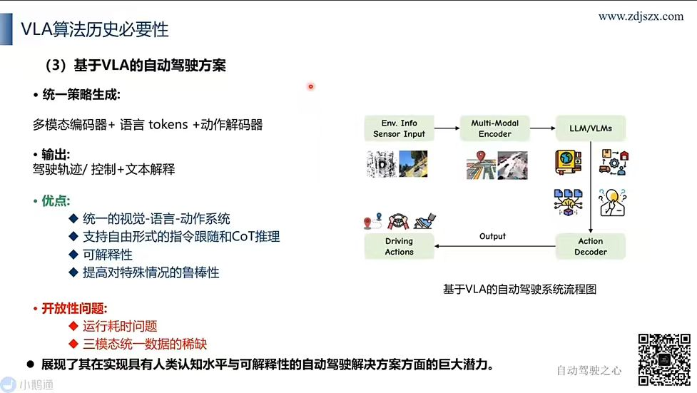

### 主题
**VLA 算法历史必要性 ——（3）基于 VLA 的自动驾驶方案**

最终形态：从端到端 → VLM → **VLA 统一策略**，把视觉/语言/动作合三为一。

### 核心定义
- **统一策略生成**：
  > **多模态编码器 + 语言 tokens + 动作解码器**
- **输出**：
  > **驾驶轨迹 / 控制 + 文本解释**

### 系统流程图（右侧）
```
Env. Info Sensor Input  →  Multi-Modal Encoder  →  LLM / VLMs
                                                      │
                                                      ▼
Driving Actions  ◄── Output ──  Action Decoder  ◄────┘
```
- **Multi-Modal Encoder**：多模态视觉编码器（图像 / 点云 / 地图）
- **LLM / VLMs**：语言推理主干
- **Action Decoder**：动作解码器 → 直接输出 Driving Actions

### ✅ 优点
- **统一的视觉-语言-动作系统**：单一策略端到端贯通三模态
- **支持自由形式的指令跟随和 CoT 推理**：自然语言任意指令 + 链式思维
- **可解释性**：附带文本解释，黑盒不再黑
- **提高对特殊情况的鲁棒性**：长尾 / Corner Case 表现更好

### ❌ 开放性问题
- **运行耗时问题**：LLM 推理延迟仍是车端落地痛点
- **三模态统一数据的稀缺**：同时含 V + L + A 标注的高质量数据集稀少

### 总结
> **展现了其在实现具有人类认知水平与可解释性的自动驾驶解决方案方面的巨大潜力。**

### 三代范式总览（端到端 → VLM → VLA）
| 范式 | 核心 | 输出 | 关键短板 | VLA 的回应 |
| --- | --- | --- | --- | --- |
| **端到端** | 单一神经网络 | 控制 | 黑盒 / 无语言 | 加入语言模块 → 可解释 |
| **VLM-based** | VLM + 下游任务 | 语义 → 二次映射 | 动作 GAP | Action Decoder 直出 |
| **VLA** | **统一 V-L-A 策略** | **轨迹/控制 + 文本** | 延迟 + 数据 | 待解决（业界共同攻关） |

→ VLA 是当前自动驾驶算法演进的「集大成者」，但 **算力延迟** 与 **三模态数据** 是落地必须跨过的两道坎。

---

## Slide 11 — 章节分隔页：第 03 章

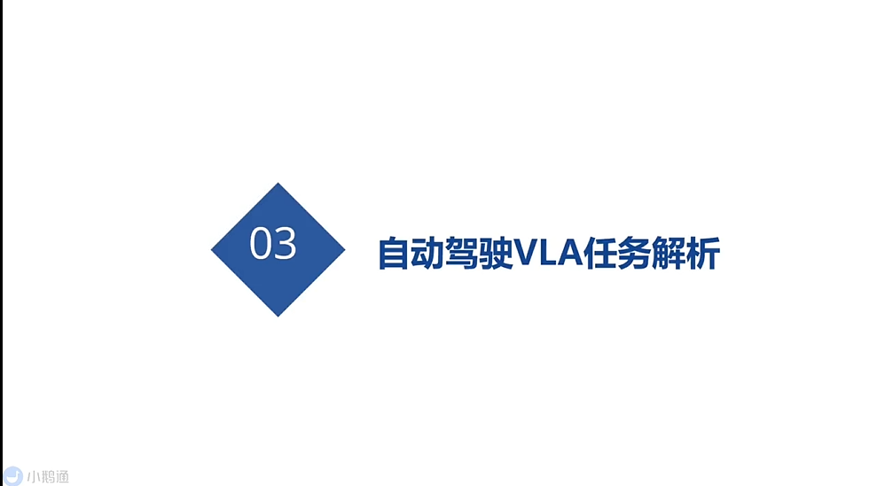

### 主题
**03 — 自动驾驶 VLA 任务解析**

进入课程第 3 章节，从「概念层」下沉到「任务层」，拆解 VLA 在自动驾驶场景下到底要做哪些具体任务。

### 章节预告
- **任务分类（What tasks）**：VLA 在自动驾驶中要承担的子任务
  - 场景理解 / 问答（VQA）
  - 高级别行为决策（Planning）
  - 轨迹预测 / 控制信号生成
  - 解释生成（Why did the car do that?）
- **输入输出范式**：每类任务的 Prompt 模板与输出格式
- **数据与标注**：任务对应的开源数据集与标注规范

---

## Slide 12 — 自动驾驶任务解析：输入和输出范式

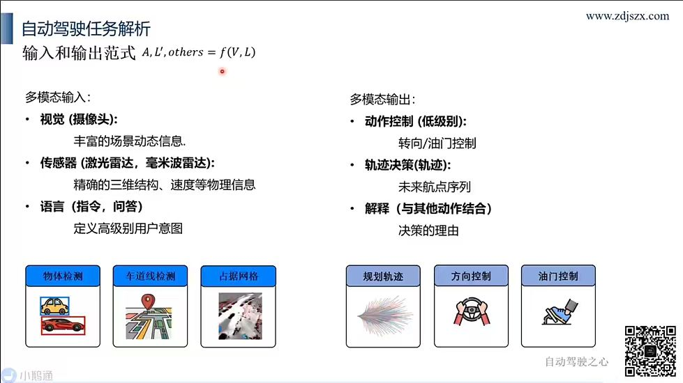

### 主题
**自动驾驶任务解析 —— 输入和输出范式**

$$A,\ L',\ others = f(V,\ L)$$

> 用一个统一函数 $f$ 把 **视觉 V + 语言 L** 映射为 **动作 A + 语言输出 L'（解释 / QA）+ 其他**（占据网格 / 检测等）。

### 多模态输入

| 模态 | 来源 | 提供的信息 |
| --- | --- | --- |
| **视觉**（摄像头） | RGB Camera | 丰富的场景动态信息 |
| **传感器**（激光雷达 / 毫米波雷达） | LiDAR / Radar | 精确的三维结构、速度等物理信息 |
| **语言**（指令 / 问答） | 用户文本 / 语音 | 定义高级别用户意图 |

#### 输入侧辅助任务（左下图示）
- 🚗 **物体检测** — 识别车辆、行人等动态目标
- 🛣 **车道线检测** — 提取车道几何与拓扑
- 🧊 **占据网格**（Occupancy Grid） — 体素级 3D 场景占据表征

### 多模态输出

| 输出类型 | 含义 | 例子 |
| --- | --- | --- |
| **动作控制**（低级别） | 直接控制信号 | 转向 / 油门控制 |
| **轨迹决策**（轨迹） | 未来航点序列 | 3s 内 6 个 waypoint |
| **解释**（与其他动作结合） | 决策的理由 | "Because the road is clear..." |

#### 输出侧任务（右下图示）
- 📈 **规划轨迹** — 多模态未来轨迹分布
- 🎯 **方向控制** — 方向盘转角
- 🦶 **油门控制** — 加速 / 减速踏板

### 公式拆解 $A, L', others = f(V, L)$

| 符号 | 含义 |
| --- | --- |
| $V$ | Vision 输入（图像 / 点云 / Occupancy） |
| $L$ | Language 输入（指令 / 问题） |
| $A$ | Action 输出（轨迹 / 控制） |
| $L'$ | 输出端语言（解释 / QA 回答） |
| $others$ | 辅助输出（检测 / 占据 / 地图等中间表征） |

→ **VLA 的本质就是这个跨模态多任务函数 $f$**：
- 输入：丰富感知 + 自然语言意图
- 输出：可执行动作 + 可解释语言 + 中间表征

### 设计启示
- **多模态融合**：摄像头 / 激光 / 毫米波各司其职（语义 / 几何 / 速度）。
- **多任务输出**：单一策略同时回答「怎么开（A）」「为什么（L'）」「看到了什么（others）」。
- **语言既是输入也是输出**：$L$ 入、$L'$ 出 —— 形成自然的人车对话闭环。

---

## Slide 13 — 章节分隔页：第 04 章

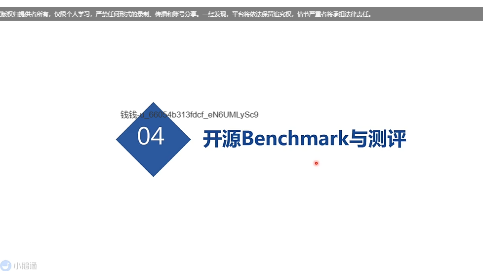

### 主题
**04 — 开源 Benchmark 与测评**

进入课程最后一章节，介绍 VLA 自动驾驶领域的 **开源数据集 / Benchmark / 评测指标**，给前面的算法落地提供量化对比的工具与方法。

### 章节预告
- **开源数据集**：BDD-X、nuScenes、DriveLM、CARLA 等
- **Benchmark 任务**：感知问答 / 规划 / 解释生成 / 闭环驾驶
- **评测指标**：
  - 语言侧：BLEU / ROUGE / CIDEr / GPT-Judge
  - 动作侧：L2 距离 / 碰撞率 / 通过率 / 路径完成率
- **典型工作横向对比**：DriveGPT4、OpenDriveVLA、DriveLM 等的得分与排行

---

## Slide 14 — 相关数据集 / Related Datasets

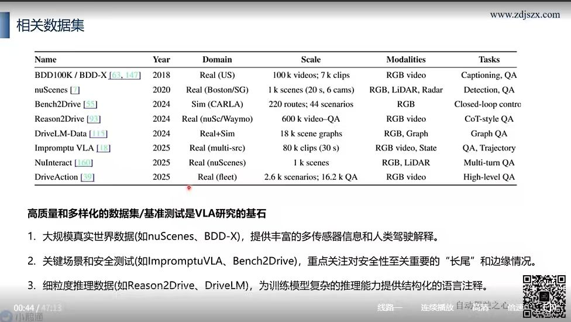

### 主题
**VLA 自动驾驶相关数据集汇总**

> 高质量和多样化的数据集 / 基准测试是 VLA 研究的基石。

### 数据集汇总表

| Name | Year | Domain | Scale | Modalities | Tasks |
| --- | --- | --- | --- | --- | --- |
| **BDD100K / BDD-X** | 2018 | Real (US) | 100k videos · 7k clips | RGB video | Captioning, QA |
| **nuScenes** | 2020 | Real (Boston/SG) | 1k scenes (20s · 6 cams) | RGB, LiDAR, Radar | Detection, QA |
| **Bench2Drive** | 2024 | Sim (CARLA) | 220 routes · 44 scenarios | RGB | Closed-loop control |
| **Reason2Drive** | 2024 | Real (nuSc / Waymo) | 600k video-QA | RGB video | **CoT-style QA** |
| **DriveLM-Data** | 2024 | Real + Sim | 18k scene graphs | RGB, Graph | Graph QA |
| **Impromptu VLA** | 2025 | Real (multi-src) | 80k clips (30s) | RGB video, State | QA, Trajectory |
| **NuInteract** | 2025 | Real (nuScenes) | 1k scenes | RGB, LiDAR | Multi-turn QA |
| **DriveAction** | 2025 | Real (fleet) | 2.6k scenarios · 16.2k QA | RGB video | High-level QA |

### 三大主题分类（金句总结）

#### 1️⃣ 大规模真实世界数据
- **代表**：nuScenes、BDD-X
- **价值**：提供丰富的多传感器信息和人类驾驶解释
- **特点**：真实道路、多模态（RGB + LiDAR + Radar）

#### 2️⃣ 关键场景和安全测试
- **代表**：Impromptu VLA、Bench2Drive
- **价值**：重点关注对安全性至关重要的「**长尾**」和边缘情况
- **特点**：仿真闭环 / 安全攸关 Corner Case

#### 3️⃣ 细粒度推理数据
- **代表**：Reason2Drive、DriveLM
- **价值**：为训练模型复杂的推理能力提供**结构化的语言注释**
- **特点**：CoT QA、Graph QA、多步推理标注

### 时间线观察
| 年份 | 演进趋势 |
| --- | --- |
| 2018-2020 | **感知 + 解释** (BDD-X, nuScenes) |
| 2024 | **闭环仿真 + CoT 推理** (Bench2Drive, Reason2Drive, DriveLM) |
| 2025 | **轨迹生成 + 多轮交互 + 车队规模** (Impromptu, NuInteract, DriveAction) |

→ 数据集从「感知+描述」→「推理+决策」→「交互+轨迹+车队规模」演进，
→ 与 VLA 范式从「VLM 解释」→「Action 直出」→「闭环交互」的发展高度同步。

---
