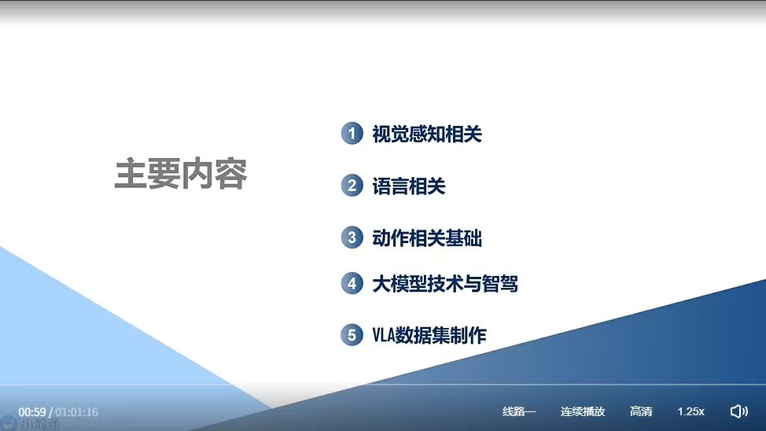
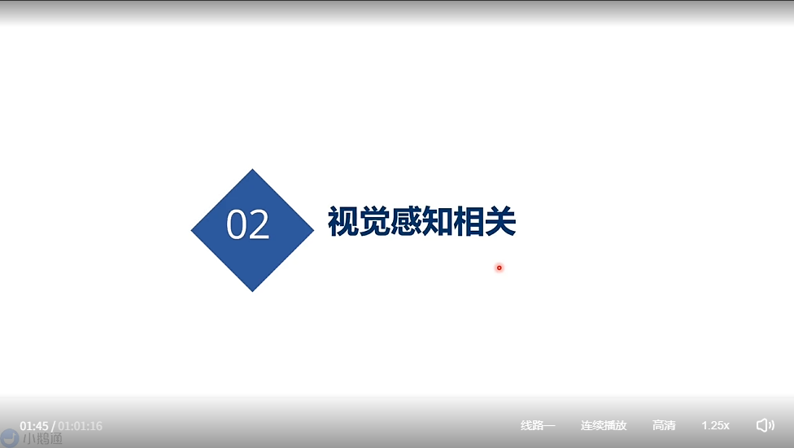
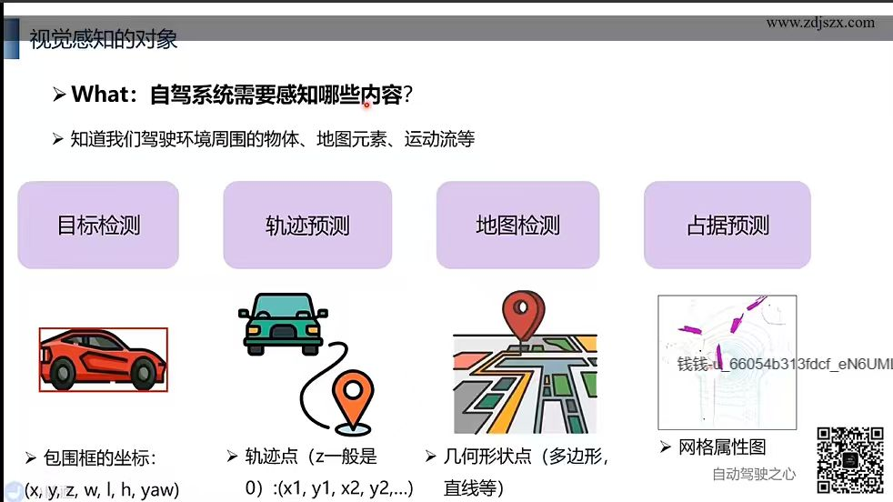
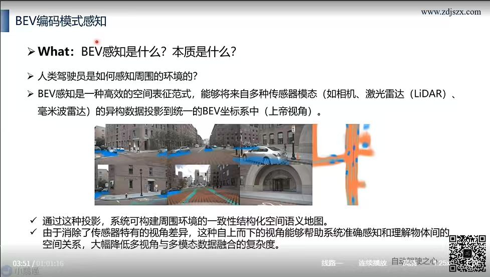
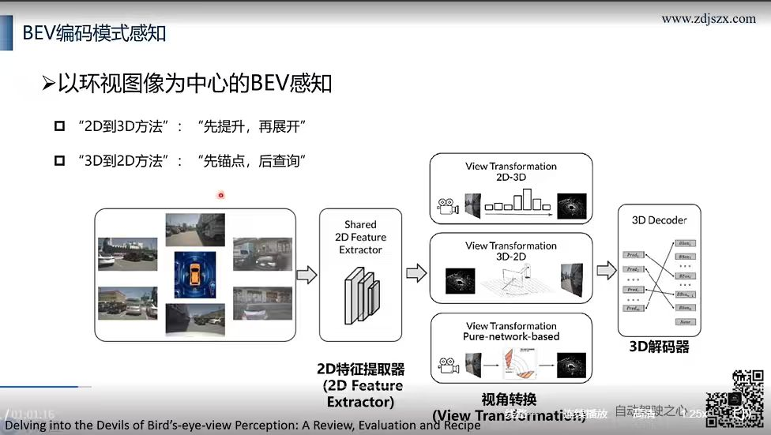
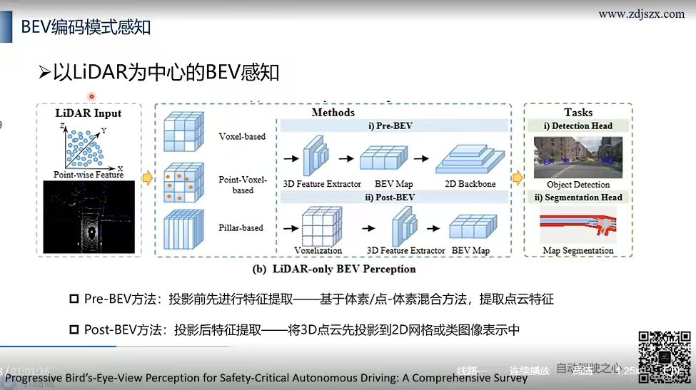
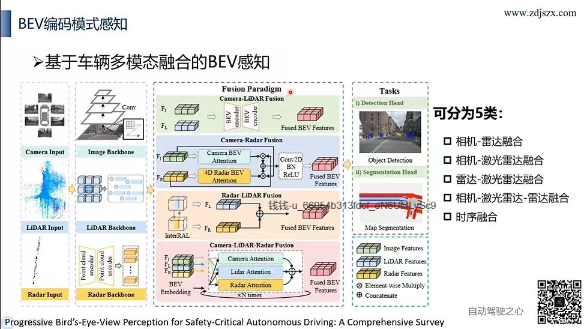
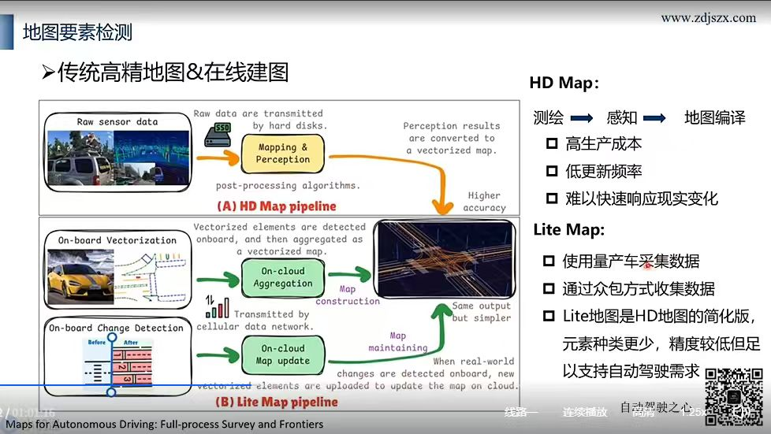

# Vision in VLA / 视觉模块在自动驾驶 VLA 中的角色

## Slide 01 — 主要内容 / Outline

### 主题
**主要内容 —— 本讲五大模块**

### 课程目录
| # | 章节 | 说明 |
| --- | --- | --- |
| 1 | **视觉感知相关** | VLA 中 Vision 模块的核心技术（本讲重点） |
| 2 | **语言相关** | 语言模型（LLM）在 VLA 中的角色与接入方式 |
| 3 | **动作相关基础** | Action 解码器：自回归 / Diffusion / 控制信号 |
| 4 | **大模型技术与智驾** | 通用大模型技术如何赋能自动驾驶 |
| 5 | **VLA 数据集制作** | 三模态（V+L+A）数据集的构造方法 |

### 结构要点
- 从 **V → L → A** 三模态逐模块拆解，再上升到 **大模型 + 数据** 落地视角。

---

## Slide 02 — 章节分隔页：第 02 章

### 主题
**02 — 视觉感知相关**

进入第 2 章节，聚焦 VLA 框架中 **Vision（视觉感知）** 模块的核心技术。

### 章节预告
- **视觉骨干网络**：CNN、ViT、DINOv2、CLIP 等主流编码器
- **多视图融合**：环视相机 → BEV 表征（Bird's-Eye View）
- **3D 表征**：Occupancy、Voxel、Point Cloud、Tri-Plane
- **视觉 → 语言对齐**：Projector / Q-Former / Token 化策略

---

## Slide 03 — 视觉感知的对象

### 主题
**视觉感知的对象 —— What：自驾系统需要感知哪些内容？**

> 知道我们驾驶环境周围的 **物体、地图元素、运动流** 等。

### 四大感知任务

| 任务 | 图标 | 表示形式 | 说明 |
| --- | --- | --- | --- |
| **目标检测** | 🚗 红色轿车 + 包围框 | **包围框坐标**：$(x, y, z, w, l, h, yaw)$ | 7 维 3D Box —— 中心位置 + 长宽高 + 朝向角 |
| **轨迹预测** | 🚕 车辆 + 两个定位点 | **轨迹点（z 一般为 0）**：$(x_1, y_1, x_2, y_2, \ldots)$ | 未来 N 个 waypoint 序列（2D 俯视） |
| **地图检测** | 🗺 地图 + 路标 | **几何形状点**：多边形 / 直线等 | 车道线、人行道、停车区等矢量地图元素 |
| **占据预测** | 🌐 网格化雷达扫描 | **网格属性图** | 体素 / 栅格级 3D 空间占据 (Occupancy Grid) |

### 设计启示
- **多任务并行**：VLA 的 Vision 模块通常需同时支撑这 4 类任务，不能只做检测。
- **不同表征互补**

---

## Slide 04 — BEV 编码模式感知 / BEV Representation

### 主题
**What: BEV感知是什么？本质是什么？**

从人类驾驶经验出发，通过统一视角解决异构数据融合难题。

### 核心定义
- **本质**：一种高效的 **空间表征范式**。
- **功能**：将来自相机、激光雷达（LiDAR）、毫米波雷达等多传感器模态的异构数据，统一投影到一个 **BEV 坐标系（上帝视角 / Top-down View）** 中。

### 核心价值
- **构建一致性结构化空间语义地图**
- **消除视角差异（Perspective Gap）**
- **降低融合复杂度**

---

## Slide 05 — BEV 感知范式演进 / BEV Perception Evolution

### 主题
**BEV 感知的三大演进阶段 (SafeBEV 1.0 → 2.0 → 3.0)**

### 三阶段对比

| 阶段 | 名称 | 方法 | 优点 (✅) | 缺点 (❌) |
| --- | --- | --- | --- | --- |
| **SafeBEV 1.0** | **单模态车载感知** | BEVDepth, BEVFormer, LSS | 成本低、实时性高 | 鲁棒性差、深度信息不足 |
| **SafeBEV 2.0** | **多模态车载感知** | BEVFusion, PointPainting, BEVDet | 传感器互补、准确性高、全天候 | 感知范围有限、遮挡、数据孤岛 |
| **SafeBEV 3.0** | **多智能体协作感知** | CoBEV, DiscoNet, BEVHeight | 全局感知、更安全、鲁棒 | 带宽瓶颈、通信延迟、安全隐私 |

### 核心演进逻辑
-   **1.0 → 2.0**：走向 **多模态融合**。
-   **2.0 → 3.0**：走向 **车路协同（V2X）**。

---

## Slide 06 — 以环视图像为中心的 BEV 感知

### 主题
**以环视图像为中心的 BEV 感知：核心流程与三大技术路线**

### 核心流程
环视图像 → 2D 特征提取器 → 视角转换 → 3D 解码器

### 视角转换 (View Transformation) 的三条技术路线
1.  **2D-to-3D 方法** (“先提升，再展开”) - 代表: LSS
2.  **3D-to-2D 方法** (“先锚点，后查询”) - 代表: DETR3D
3.  **纯网络方法** (Pure-network-based) - 代表: BEVFormer

---

## Slide 07 — 以LiDAR为中心的BEV感知

### 主题
**以LiDAR为中心的BEV感知：两大技术路线 (Pre-BEV vs. Post-BEV)**

### 两大技术路线
1.  **Pre-BEV 方法** (“先提特征，后投影”): 先用 3D 卷积，精度高但慢。
2.  **Post-BEV 方法** (“先投影，后提特征”): 先转为 Pillar，再用 2D 卷积，效率高。

---

## Slide 08 — 基于车辆多模态融合的 BEV 感知

### 主题
**多模态融合 BEV 感知：四大融合范式与五大融合类型**

### 四大融合范式
1.  **相机-激光雷达 (Camera-LiDAR)**
2.  **相机-毫米波 (Camera-Radar)**
3.  **雷达-激光雷达 (Radar-LiDAR)**
4.  **相机-激光-雷达 (三模态)**

---

## Slide 09 — 地图元素检测 (外部引入)

### 主题：自动驾驶地图是什么？

### 三种地图形态
| 地图形态 | 核心特点 |
| :--- | :--- |
| **HD Map (高精地图)** | **离线、高精度、静态** |
| **Lite Map (轻量化地图)** | **在线、动态、矢量化** |
| **Implicit Map (隐式地图)** | **神经网络驱动、端到端** |

---

## Slide 10 — HD Map vs. Lite Map Pipeline (回顾)

### 两大技术路线对比

#### 1. HD Map Pipeline (离线后处理)
-   **核心**: **高成本、低更新频率、高精度**。

#### 2. Lite Map Pipeline (在线众包)
-   **核心**: **低成本、高更新频率、精度满足需求**。

---
