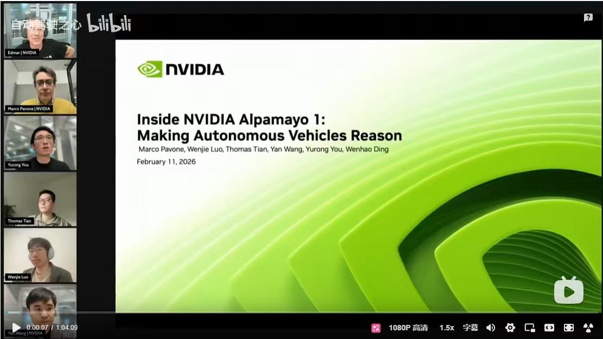
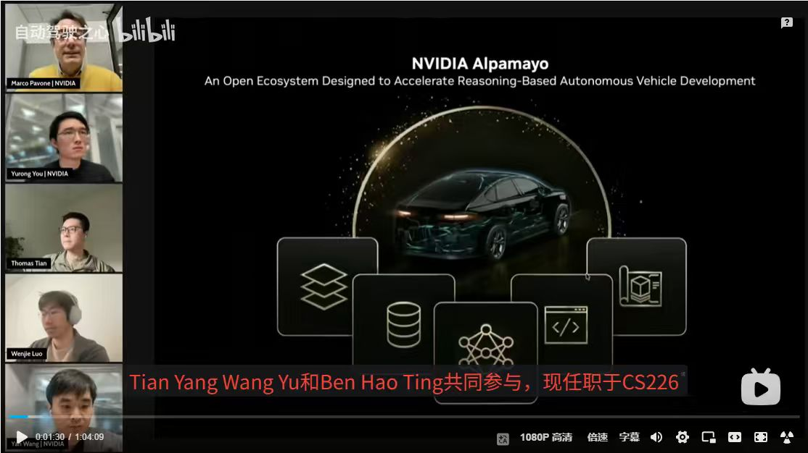
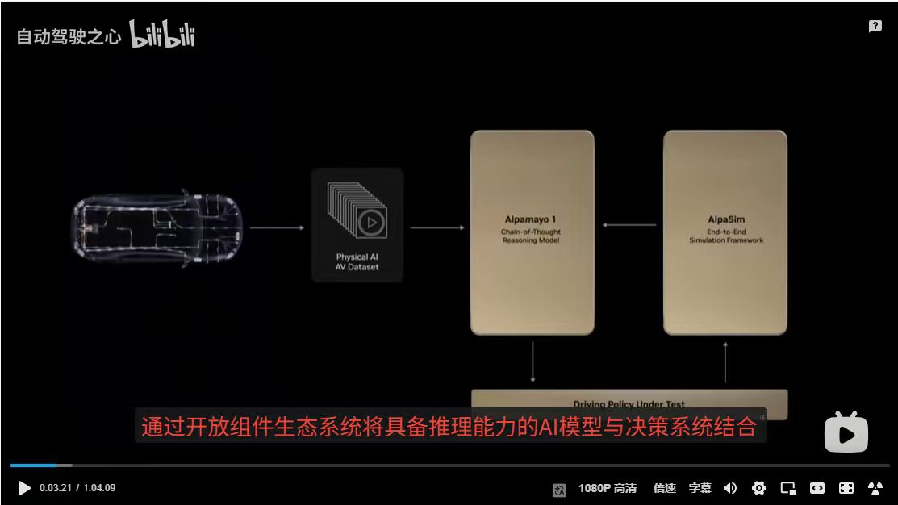

# Inside NVIDIA Alpamayo 1: Making Autonomous Vehicles Reason

> **日期**：February 11, 2026 　|　 **主办**：NVIDIA 　|　 **来源**：Bilibili（自动驾驶之心）
> **演讲者**：Marco Pavone · Wenjie Luo · Thomas Tian · Yan Wang · Yurong You · Wenhao Ding

---

## Slide 00 — 封面 / Cover



### 主题
**Inside NVIDIA Alpamayo 1：Making Autonomous Vehicles Reason**
聚焦 NVIDIA 自研端到端自动驾驶基础模型 **Alpamayo** 的设计理念与技术路径，让自动驾驶车辆具备「推理（Reason）」能力。

### 演讲者
- Marco Pavone
- Wenjie Luo
- Thomas Tian
- Yan Wang
- Yurong You
- Wenhao Ding

### 基本信息
| 项目 | 内容 |
| --- | --- |
| 日期 | February 11, 2026 |
| 主办方 | NVIDIA |
| 视频来源 | Bilibili（自动驾驶之心） |

---

## Slide 01 — Open Ecosystem



### 主题
**NVIDIA Alpamayo — An Open Ecosystem Designed to Accelerate Reasoning-Based Autonomous Vehicle Development**
Alpamayo 定位为 **开放生态系统**，目标是加速 **基于推理（Reasoning-Based）** 的自动驾驶车辆开发。

### 核心信息
- **Open Ecosystem**：开放、可扩展，面向产业协作。
- **Reasoning-Based AV**：从传统感知-规划-控制流水线，迈向以「推理」为核心的端到端范式。
- **Accelerate Development**：通过统一的模型 / 数据 / 工具链，缩短研发周期。

### 生态组件示意（车辆周围 5 个图标）
| 图标 | 含义（推测） |
| --- | --- |
| 🗂 多层堆叠 | Multi-Layer Stack — 分层架构 / 多模态数据层 |
| 🗄 数据库 | Data — 大规模驾驶数据与数据管理 |
| 🕸 神经网络 | Foundation Model — Alpamayo 基础模型（推理核心） |
| `</>` 代码窗口 | SDK / Tooling — 开发者工具与 API |
| 📦 3D 立方体 | Simulation / Digital Twin — 仿真与数字孪生 |

### 演讲嘉宾画面
左侧分屏：Marco Pavone · Yurong You · Thomas Tian · Wenjie Luo · Yan Wang（均来自 NVIDIA）

---

## Slide 02 — Alpamayo 生态架构图 / Ecosystem Architecture



### 主题
**通过开放组件生态系统将「具备推理能力的 AI 模型」与「决策系统」结合**
*Combine reasoning-capable AI models with the driving policy via an open ecosystem of components.*

### 架构流程
```
[Vehicle / 车辆数据采集]
        │
        ▼
[Physical AI AV Dataset]   ← 真实世界自动驾驶数据集
        │
        ▼
[Alpamayo 1]               ← Chain-of-Thought Reasoning Model（链式思维推理模型）
        │
        ▼
[AlpaSim]                  ← End-to-End Simulation Framework（端到端仿真框架）
        │
        ▼
[Driving Policy Under Test] ← 被测驾驶策略
```

### 组件说明
| 组件 | 角色 | 描述 |
| --- | --- | --- |
| **Physical AI AV Dataset** | 数据层 | 真实世界采集的自动驾驶多模态数据集 |
| **Alpamayo 1** | 推理模型 | Chain-of-Thought Reasoning Model —— 用 CoT 链式思维做驾驶推理 |
| **AlpaSim** | 仿真层 | End-to-End Simulation Framework —— 端到端闭环仿真平台 |
| **Driving Policy Under Test** | 被测对象 | 接收 Alpamayo 推理 + AlpaSim 仿真反馈，迭代优化 |

### 核心要点
- **闭环（Closed Loop）**：数据 → 推理模型 → 仿真 → 策略测试，形成开发闭环。
- **Chain-of-Thought**：Alpamayo 1 强调「链式思维推理」，区别于黑盒端到端模型。
- **Open Ecosystem**：每个组件均可独立替换 / 扩展，对外开放接口。

---
