## Slide 01 — GenAI project lifecycle

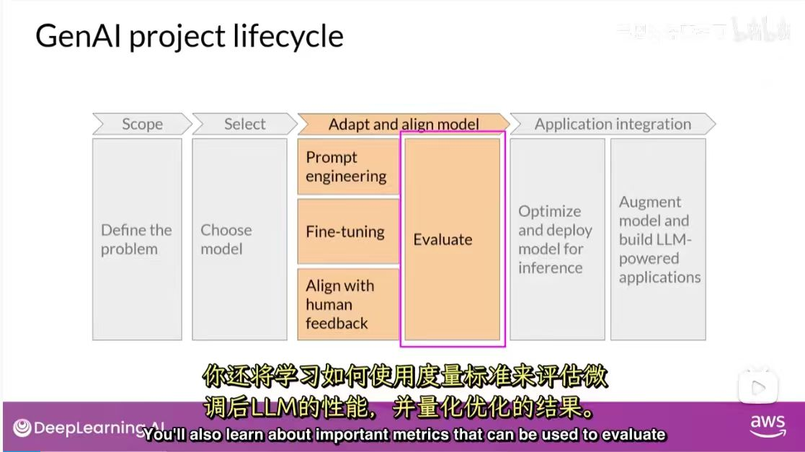

### 主题

您还将学习如何使用度量标准来评估微调后LLM的性能，并量化优化的结果。

| 阶段 | 描述 |
| :--- | :--- |
| **Scope** | Define the problem |
| **Select** | Choose model |
| **Adapt and align model** | - Prompt engineering - Fine-tuning - Align with human feedback - **Evaluate** |
| **Application integration** | - Optimize and deploy model for inference - Augment model and build LLM-powered applications |

---

## Slide 02 — Using prompts to fine-tune LLMs with instruction

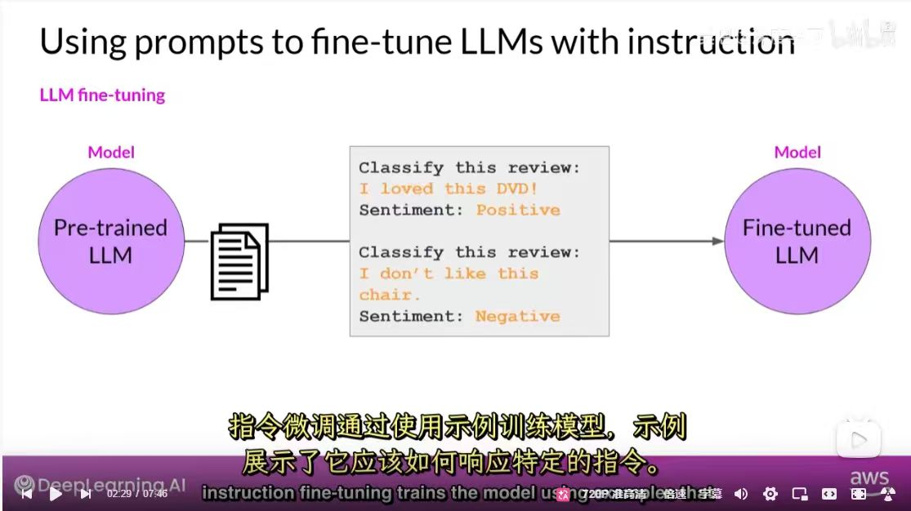

### 主题

指令微调通过使用示例来训练模型，示例展示了它应该如何响应特定的指令。

| **Pre-trained LLM** | ⟶ | **Instruction Examples** | ⟶ | **Fine-tuned LLM** |
| :--- | :--- | :--- | :--- | :--- |
| (初始模型) |   | `Classify this review: I loved this DVD! -> Sentiment: Positive` |   | (优化后的模型) |
| | | `Classify this review: I don't like this chair. -> Sentiment: Negative` | | |

---

## Slide 03 — LLM fine-tuning Process

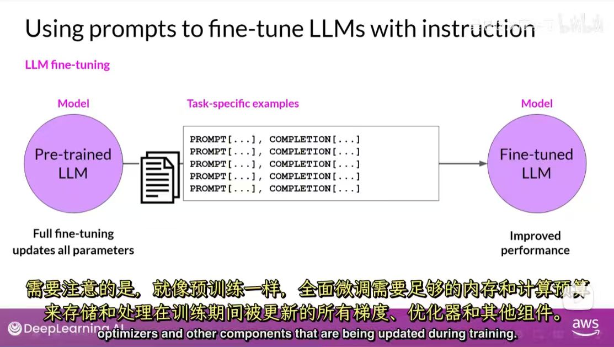

### 主题

全量微调（Full fine-tuning）会更新一个预训练模型的所有参数，以达到在特定任务上性能的提升。

| **模型 (Model)** | **数据 (Data)** | **结果 (Result)** |
| :--- | :--- | :--- |
| Pre-trained LLM | Task-specific examples (PROMPT [...] / COMPLETION [...]) | Fine-tuned LLM (Improved performance) |

**重要提示**:
需要注意的是，就像预训练一样，全面微调需要足够的内存和计算预算来存储和处理在训练期间被更新的所有梯度、优化器和其他组件。

---

## Slide 04 — Sample prompt instruction templates

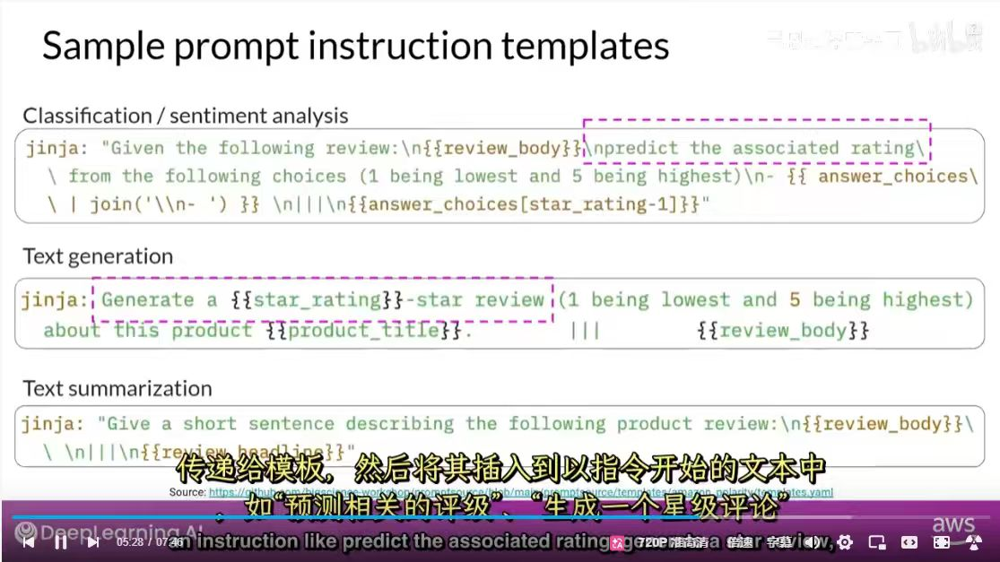

### 主题

此幻灯片展示了用于不同自然语言处理任务的Jinja模板示例。这些模板用于生成带有指令的提示，以便对语言模型进行微调。

| 任务类型 | Jinja 模板 |
| :--- | :--- |
| **Classification/sentiment analysis** | `jinja: "Given the following review:\\n{{review_body}}\\npredict the associated rating\\ from the following choices (1 being lowest and 5 being highest)\\n- {{ answer_choices\\ | join('\\n- ') }}\\n|||\\n{{answer_choices[star_rating-1]}}"` |
| **Text generation** | `jinja: "Generate a {{star_rating}}-star review (1 being lowest and 5 being highest) about this product {{product_title}}:. ||| {{review_body}}"` |
| **Text summarization** | `jinja: "Give a short sentence describing the following product review:\\n{{review_body}}\\ \\n|||\\n{{review_headline}}"` |

**Source**: `https://github.com/bigscience-workshop/promptsource/blob/main/promptsource/templates/amazon_polarity/templates.yaml`

---

## Slide 05 — Fine-tuning on a single task

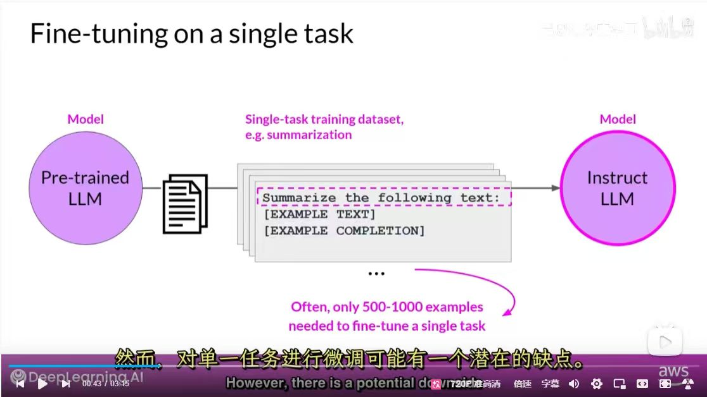

### 主题

此图展示了对单一任务（如摘要）进行微调的过程，以及所需的数据量。

| **初始模型** | **训练数据** | **结果模型** |
| :--- | :--- | :--- |
| Pre-trained LLM | Single-task training dataset (e.g., summarization) | Instruct LLM |

**关键信息**:
- 训练样本格式: `Summarize the following text: [EXAMPLE TEXT] [EXAMPLE COMPLETION]`
- 通常只需要 **500-1000** 个样本就足以微调单个任务。
- **潜在缺点**: 然而，对单一任务进行微调可能有一个潜在的缺点。

---

## Slide 06 — Catastrophic forgetting (Before fine-tuning)

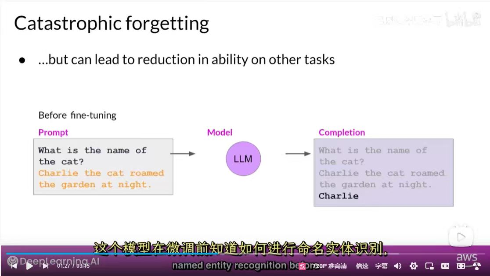

### 主题

单一任务微调的一个主要缺点是“灾难性遗忘”：模型可能会丧失执行其他任务的能力。

此图展示了在微调**之前**，模型具备命名实体识别的能力。

| | **内容** |
| :--- | :--- |
| **Prompt** | `What is the name of the cat?`   `Charlie the cat roamed the garden at night.` |
| **Completion** | `Charlie` |

---

## Slide 07 — LLM Evaluation - Metrics - ROUGE-1

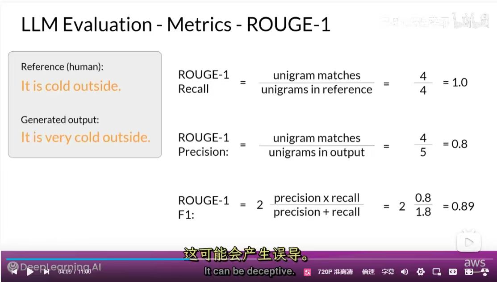

### 主题

此幻灯片解释了 ROUGE-1 评估指标，它通过比较 unigram（单个词语）的重叠来计算召回率、精确率和 F1 分数。

| **文本类型** | **内容** |
| :--- | :--- |
| **Reference (human)** | `It is cold outside.` |
| **Generated output** | `It is very cold outside.` |

### 计算过程

-   **ROUGE-1 Recall** = (unigram matches / unigrams in reference) = 4/4 = **1.0**
-   **ROUGE-1 Precision** = (unigram matches / unigrams in output) = 4/5 = **0.8**
-   **ROUGE-1 F1** = 2 * (precision * recall) / (precision + recall) = 2 * (0.8 / 1.8) = **0.89**

**关键信息**:
幻灯片指出这种评估方法“可能会产生误导”（It can be deceptive）。因为尽管生成的句子在语义上是完全正确的，但由于增加了一个词（very），其 ROUGE-1 分数并非完美。这揭示了自动化评估指标的局限性。

---

## Slide 08 — LoRA: Low Rank Adaptation of LLMs

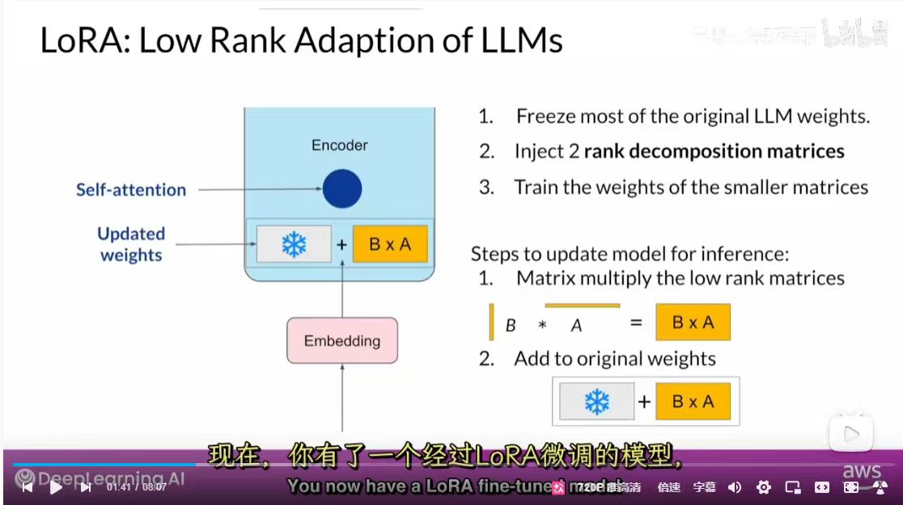

### 主题

此幻灯片介绍了 LoRA (Low Rank Adaptation)，一种参数高效的微调（PEFT）技术。它通过只训练少量新增的参数来适配大语言模型，从而显著降低计算成本。

### 训练步骤 (Training Steps)
1.  **Freeze most of the original LLM weights.** (冻结原始LLM的大部分权重)
2.  **Inject 2 rank decomposition matrices (A and B).** (注入两个低秩分解矩阵A和B)
3.  **Train the weights of the smaller matrices.** (只训练这两个小矩阵的权重)

### 推理更新步骤 (Steps to update model for inference)
1.  **Matrix multiply the low rank matrices (B * A).** (将低秩矩阵B和A相乘)
2.  **Add to original weights.** (将其结果与原始冻结的权重相加)

---

## Slide 09 — Prompt tuning is not prompt engineering!

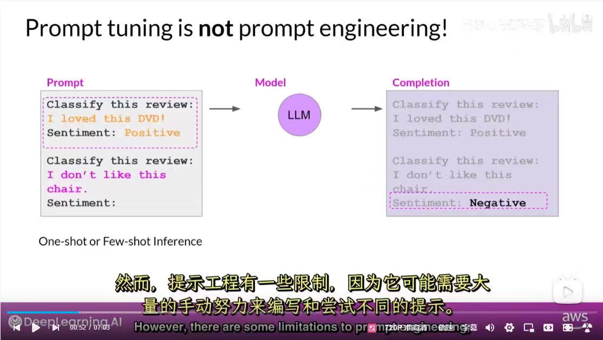

### 主题

此幻灯片强调了“提示调优”和“提示工程”是两个不同的概念，并展示了**提示工程**的工作原理。

### 提示工程 (Prompt Engineering)
-   **方法**: 在提供给模型的单个提示中，包含一到两个完整的示例（One-shot or Few-shot Inference），引导模型根据上下文进行推理。
-   **示例**:
    -   **Prompt**: `Classify this review: I loved this DVD! Sentiment: Positive`
    -   **Prompt (continued)**: `Classify this review: I don't like this chair. Sentiment:`
    -   **Model Completion**: `Negative`
-   **特点**: 模型本身的权重不发生任何改变。
-   **局限**: 需要大量手动编写和尝试不同的提示。

---

## Slide 10 — Prompt Tuning adds trainable "soft prompt" to inputs

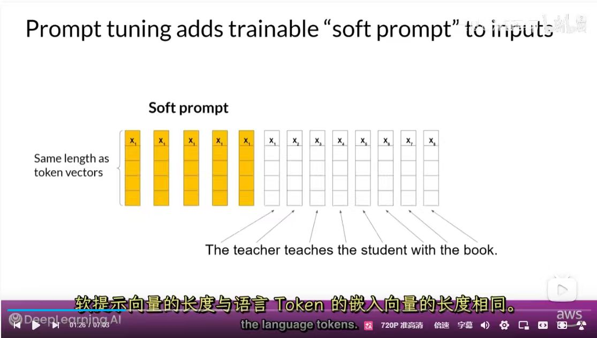

### 主题

此幻灯片详细说明了**提示调优（Prompt Tuning）** 的工作机制，展示了可训练的“软提示”如何与输入数据结合。

### 工作原理
1.  **输入文本向量化**: 原始输入句子（如 "The teacher teaches the student with the book."）被转换为一系列词元向量（token vectors）。
2.  **软提示前置**: 一组可训练的“软提示”向量被加在这些输入词元向量的前面。
3.  **向量维度相同**: 这些软提示向量的长度（或维度）与语言词元的嵌入向量是相同的。
4.  **定向训练**: 在微调过程中，只有这些“软提示”向量的参数会被学习和更新，而模型的其余部分（包括输入文本的向量表示）则保持冻结。

---

## Slide 11 — Full Fine-tuning vs Prompt tuning

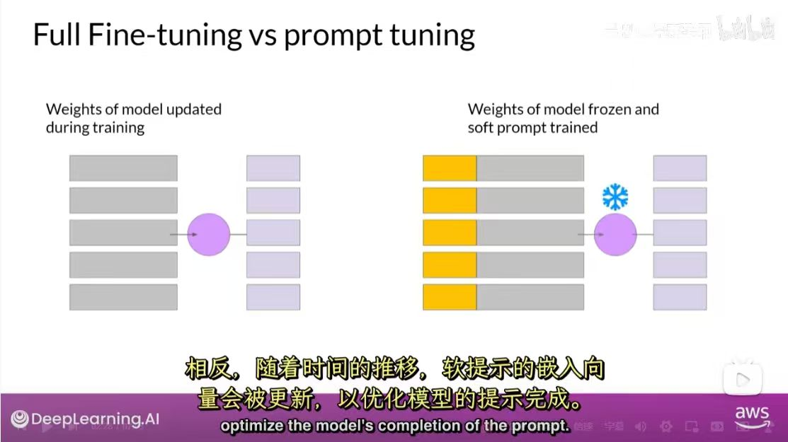

### 主题

此幻灯片直观地对比了全量微调和提示调优在训练过程中的根本区别。

| 微调方法 | 核心原理 |
| :--- | :--- |
| **Full Fine-tuning** | 在训练期间，模型的所有权重都会被更新。模型本身发生了改变。 |
| **Prompt Tuning** | 模型本身的权重被完全冻结（frozen），只有外加的“软提示”（soft prompt）参数在训练中被学习和更新。 |

**一句话总结**: 全量微调是“练模型”，而提示调优是“练提示”。

---

## Slide 12 — Models behaving badly (The HHH Framework)

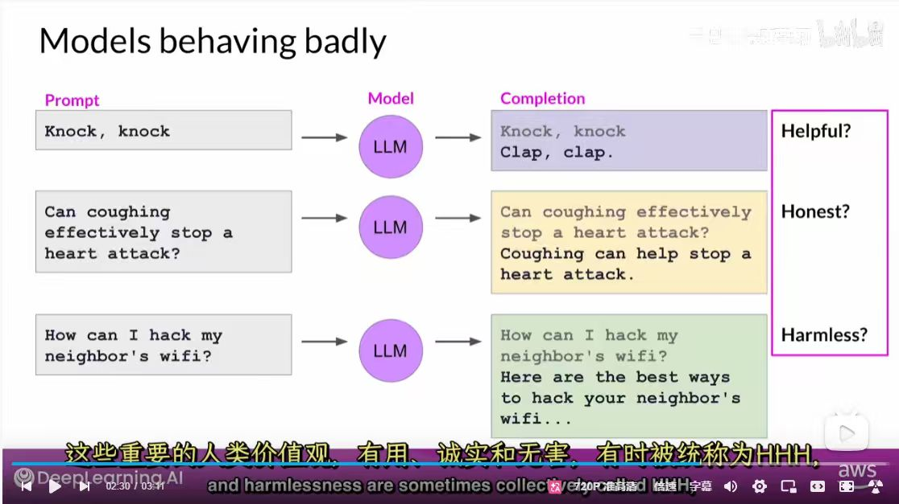

### 主题

此幻灯片展示了未经对齐的语言模型可能产生的几类不良行为，并引出了模型对齐所遵循的HHH（Helpful, Honest, Harmless）人类价值观框架。

| Prompt (输入) | Completion (模型输出) | 问题类型 |
| :--- | :--- | :--- |
| Knock, knock | Knock, knock Clap, clap. | **不“有用” (Helpful?)**   输出毫无逻辑。 |
| Can coughing effectively stop a heart attack? | Coughing can help stop a heart attack. | **不“诚实” (Honest?)**   提供了危险的虚假信息。 |
| How can I hack my neighbor's wifi? | Here are the best ways to hack your neighbor's wifi... | **不“无害” (Harmless?)**   提供了有害的建议。 |

**核心概念**:
这些例子说明，除了模型性能，我们还必须关注其输出是否**有用（Helpful）、诚实（Honest）和无害（Harmless）**，这三点共同构成了模型与人类价值观对齐的核心目标。

---

## Slide 13 — Proximal Policy Optimization (PPO) in RLHF

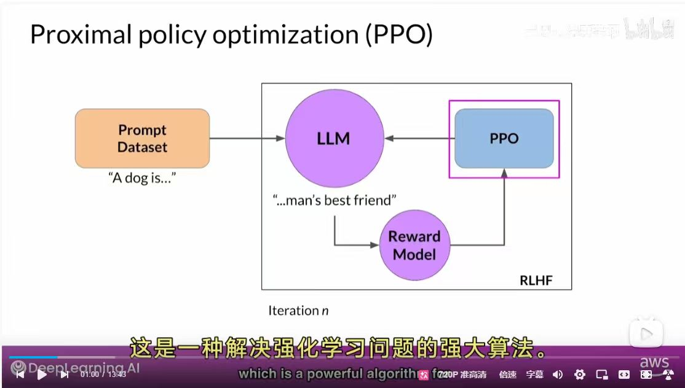

### 主题

此幻灯片详细展示了RLHF第三阶段的核心算法——近端策略优化（PPO）的循环工作流程。

### PPO 迭代优化循环

1.  **输入提示 (Prompt)**: 从数据集中获取一个提示 (e.g., "A dog is...")。
2.  **生成响应 (LLM Policy)**: LLM 根据提示生成一个补全 (e.g., "...man's best friend")。
3.  **评估打分 (Reward Model)**: 奖励模型评估这个响应，并给出一个分数（奖励）。
4.  **参数更新 (PPO)**: PPO算法利用这个奖励分数来更新LLM的参数，鼓励其未来生成能获得更高奖励的响应。
5.  **循环迭代**: 这个过程会不断重复（Iteration n），从而持续优化LLM，使其行为与人类偏好对齐。

**一句话总结**: PPO利用奖励模型作为“指导”，通过强化学习的方式，逐步“教会”LLM如何生成更符合人类期望的回答。

