# Town10HD_Opt_reference.xodr 地図要素分析

本ドキュメントは、`OpenDrivesData/Town10HD_Opt_reference.xodr` ファイル（OpenDRIVE 形式、約 17,961 行）の項目ごとの解析に基づき、この地図に含まれる全地図要素とその数量分布を集計・整理したものである。Town10 は CARLA シミュレーションにおける典型的な高密度都市路網シーンである。

## 0. ファイル概要

| 項目 | 内容 |
| --- | --- |
| 形式バージョン | OpenDRIVE v1.4 |
| 生成ツール | RoadRunner 2019.2.12 (vendor: VectorZero) |
| 生成日 | 2020-07-28 |
| 座標系 | WGS84、横軸メルカトル図法 (`+proj=tmerc`)、EGM96 ジオイドを含む |
| 地図範囲 | north≈99.1, south≈-171.6, east≈140.4, west≈-145.0 (単位 m) |

## 1. Header (ヘッダー情報)
- 地図バージョン（OpenDRIVE 1.4）、生成日、地図境界（north/south/east/west）を定義する。
- `geoReference`：CDATA を用いて PROJ 投影文字列を格納し、WGS84 横軸メルカトル図法に基づき、さらに `egm96_15.gtx` の標高補正を読み込む。
- `userData / vectorScene`：RoadRunner 2019.2.12 によって生成され、ベンダーが VectorZero であることを示す。

## 2. Road (道路) — 計 108 本

### 2.1 道路分類
- **通常道路 (`junction="-1"`)：23 本** — 路網内の主要路線区間。
- **接続道路 (junction 内部)：85 本** — 交差点内部に位置し、各進入・退出方向を接続するための転向接続路。

#### Town10HD_Opt_reference.xodr における通常道路の例
以下は通常道路（`junction="-1"`）の完全な構造例（`Road 9`）である。`<laneSection>` 内の各 `lane` 車線の詳細は省略し、詳しくは [3. Lanes (車線)](#3-lanes-車線--計-509-本) の章を参照のこと：

```xml
<road name="Road 9" length="1.0649999999999999e+1" id="9" junction="-1">
    <link>
        <predecessor elementType="junction" elementId="134"/>
        <successor elementType="junction" elementId="841"/>
    </link>
    <type s="0.0000000000000000e+0" type="town">
        <speed max="40" unit="mph"/>
    </type>
    <planView>
        <geometry s="0.0000000000000000e+0" x="4.2279098095776682e+1" y="-5.2571643647105290e+1"
                  hdg="1.5839054109013742e+0" length="1.0649999999999999e+1">
            <line/>
        </geometry>
    </planView>
    <elevationProfile>
        <elevation s="0.0000000000000000e+0" a="0.0000000000000000e+0" b="0.0000000000000000e+0"
                   c="0.0000000000000000e+0" d="0.0000000000000000e+0"/>
    </elevationProfile>
    <lateralProfile>
        <superelevation s="0.0000000000000000e+0" a="0.0000000000000000e+0" b="0.0000000000000000e+0"
                        c="0.0000000000000000e+0" d="0.0000000000000000e+0"/>
    </lateralProfile>
    <lanes>
        <laneOffset s="0.0000000000000000e+0" a="0.0000000000000000e+0" b="0.0000000000000000e+0"
                    c="0.0000000000000000e+0" d="0.0000000000000000e+0"/>
        <laneSection s="0.0000000000000000e+0">
            <left>   <!-- 車線 id 4..1：sidewalk / shoulder / shoulder / driving --> </left>
            <center> <!-- 車線 id 0：黄色複線実線で分離 --> </center>
            <right>  <!-- 車線 id -1..-4：driving / shoulder / shoulder / sidewalk --> </right>
        </laneSection>
    </lanes>
</road>
```

##### 例のフィールド説明
上記の例における各フィールドの意味は以下のとおり：

| 階層 / 要素 | フィールド | 例の値 | 意味の説明 |
| --- | --- | --- | --- |
| `<road>` | `name` | `Road 9` | 道路名称（RoadRunner が生成する可読識別子）。 |
| `<road>` | `length` | `1.0649999999999999e+1` (≈10.65 m) | 道路参照線の総長（メートル）。 |
| `<road>` | `id` | `9` | 道路の一意な番号。路網内でこの道路を参照する際に使用する。 |
| `<road>` | `junction` | `-1` | 交差点に属するか否か。`-1` は通常道路（junction 内部の接続路ではない）を表す。 |
| `<link><predecessor>` | `elementType` | `junction` | 前任要素の種類。`road` または `junction` を取り得る。 |
| `<link><predecessor>` | `elementId` | `134` | 前任要素の id。ここでは id=134 の交差点に接続する。 |
| `<link><successor>` | `elementType` | `junction` | 後任要素の種類。 |
| `<link><successor>` | `elementId` | `841` | 後任要素の id。ここでは id=841 の交差点に接続する。 |
| `<type>` | `s` | `0.0` | この道路種別が有効となる開始 s 座標（参照線に沿って）。`0` は起点から有効であることを表す。 |
| `<type>` | `type` | `town` | 道路種別。`town` は市街地道路を表す。 |
| `<type><speed>` | `max` | `40` | 制限速度の最大値。 |
| `<type><speed>` | `unit` | `mph` | 制限速度の単位（マイル/時）。 |
| `<planView><geometry>` | `s` | `0.0` | この幾何セグメントの参照線上での開始 s 座標（メートル）。 |
| `<planView><geometry>` | `x` / `y` | `42.28` / `-52.57` | 幾何セグメント起点の世界座標系における平面座標（メートル）。 |
| `<planView><geometry>` | `hdg` | `1.5839054109013742e+0` (≈1.584 rad) | 幾何セグメント起点の方位角（ラジアン）。約 π/2 に等しい。 |
| `<planView><geometry>` | `length` | `1.0649999999999999e+1` (≈10.65 m) | この幾何セグメントの長さ（メートル）。ここでは道路総長と一致（1 セグメントのみ）。 |
| `<geometry><line/>` | — | — | 幾何セグメント形状は直線。他に `arc`（円弧）等の可能性がある。 |
| `<elevationProfile><elevation>` | `s` | `0.0` | 縦断勾配セグメントの開始 s 座標（メートル）。 |
| `<elevationProfile><elevation>` | `a/b/c/d` | すべて `0.0` | 標高の三次多項式係数 `z = a + b·ds + c·ds² + d·ds³`。すべて 0 はこのセグメントの路面が水平で起伏がないことを表す。 |
| `<lateralProfile><superelevation>` | `s` | `0.0` | カント（横方向の傾斜）セグメントの開始 s 座標（メートル）。 |
| `<lateralProfile><superelevation>` | `a/b/c/d` | すべて `0.0` | カントの三次多項式係数（横方向の傾斜角が ds に応じて変化）。すべて 0 は横方向のカントがないことを表す。 |
| `<lanes><laneOffset>` | `s` | `0.0` | 車線全体の横方向オフセットセグメントの開始 s 座標（メートル）。 |
| `<lanes><laneOffset>` | `a/b/c/d` | すべて `0.0` | 車線中心の参照線に対する横方向オフセットの三次多項式係数。すべて 0 は車線中心が参照線と一致することを表す。 |
| `<laneSection>` | `s` | `0.0` | 車線断面の開始 s 座標（メートル）。この道路には断面が 1 つのみ。 |
| `<laneSection>` | `left`/`center`/`right` | — | 参照線方向に沿って区分された左側・中心・右側の車線グループ（詳細は 3. Lanes の章を参照）。 |

> 注：数値は科学記数法を用いる（例：`e+1` は ×10¹ を表す）。三次多項式 `a/b/c/d` はある量が局所座標 `ds`（= s − セグメント起点 s）に沿ってどう変化するかを記述する。本例では各 profile の係数がすべて 0 であり、この路線区間が平坦でカントがなく、車線に追加のオフセットもないことを表す。

#### Town10HD_Opt_reference.xodr における接続道路の例
以下は接続道路（junction 内部）の構造例（`Road 111`、交差点 `junction="23"` に属する）である。`<elevationProfile>` / `<lateralProfile>` / `<laneOffset>` における重複する複数セグメントの定義、および `<laneSection>` 内の車線詳細は省略する：

```xml
<road name="Road 111" length="1.8826192675404513e+1" id="111" junction="23">
    <link>
        <predecessor elementType="road" elementId="22" contactPoint="start"/>
        <successor elementType="road" elementId="6" contactPoint="end"/>
    </link>
    <planView>
        <geometry s="0.0000000000000000e+0" x="-5.5892494348222328e+1" y="4.3408596341868979e+1"
                  hdg="1.5632507774293773e+0" length="2.6999999999999993e+0">
            <line/>
        </geometry>
        <geometry s="2.7096207896282891e+0" x="-5.5872046552416421e+1" y="4.6118459699285900e+1"
                  hdg="1.5632507774293780e+0" length="6.4050539047226449e+0">
            <arc curvature="1.1977570822523256e-1"/>
        </geometry>
        <geometry s="9.1146746943509349e+0" x="-5.8166975647655391e+1" y="5.1930945193644916e+1"
                  hdg="2.3304206450883256e+0" length="6.3748605969552932e+0">
            <arc curvature="1.2561169007890352e-1"/>
        </geometry>
        <!-- その他の line 幾何セグメントは省略。この道路は計 6 セグメント：line×4 + arc×2 -->
    </planView>
    <elevationProfile>
        <elevation s="0.0000000000000000e+0" a="0.0000000000000000e+0" b="0.0000000000000000e+0"
                   c="0.0000000000000000e+0" d="0.0000000000000000e+0"/>
        <!-- その他の elevation セグメントは省略（計 18 セグメント、係数はすべて 0） -->
    </elevationProfile>
    <lateralProfile>
        <superelevation s="0.0000000000000000e+0" a="0.0000000000000000e+0" b="0.0000000000000000e+0"
                        c="0.0000000000000000e+0" d="0.0000000000000000e+0"/>
        <!-- その他の superelevation セグメントは省略（計 14 セグメント、係数はすべて 0） -->
    </lateralProfile>
    <lanes>
        <laneOffset s="0.0000000000000000e+0" a="6.6349999999999962e+0" b="0.0000000000000000e+0"
                    c="0.0000000000000000e+0" d="0.0000000000000000e+0"/>
        <!-- その他の laneOffset セグメントは省略（計 14 セグメント、a≈6.635 m の一定オフセット） -->
        <laneSection s="0.0000000000000000e+0">
            <center> <!-- 車線 id 0 --> </center>
            <right>  <!-- 車線 id -1（sidewalk）等、<link> による前後の車線マッピングを含む --> </right>
        </laneSection>
    </lanes>
</road>
```

##### 例のフィールド説明
通常道路と比較して、接続道路の相違点は主に `junction`、`<link>` の `contactPoint`、複数の `<geometry>`、および非ゼロの `laneOffset` に表れる。各フィールドの意味は以下のとおり：

| 階層 / 要素 | フィールド | 例の値 | 意味の説明 |
| --- | --- | --- | --- |
| `<road>` | `name` | `Road 111` | 道路名称。 |
| `<road>` | `length` | `1.8826192675404513e+1` (≈18.83 m) | 道路参照線の総長（メートル）。 |
| `<road>` | `id` | `111` | 道路の一意な番号。 |
| `<road>` | `junction` | `23` | **所属する交差点の id**（≠ `-1`）。これが交差点内部の転向接続路であることを示す。 |
| `<link><predecessor>` | `elementType` | `road` | 前任要素の種類。接続道路の両端は通常直接 `road` に接続する。 |
| `<link><predecessor>` | `elementId` | `22` | 前任道路の id（進入道路）。 |
| `<link><predecessor>` | `contactPoint` | `start` | **接続点**：前任道路との接続が相手側の `start`（起点）端で発生することを表す。 |
| `<link><successor>` | `elementId` | `6` | 後任道路の id（退出道路）。 |
| `<link><successor>` | `contactPoint` | `end` | 後任道路との接続が相手側の `end`（終点）端で発生することを表す。 |
| `<planView><geometry>` | `s` | `0.0` / `2.71` / `9.11` … | 各幾何セグメントの参照線上での開始 s 座標（メートル）。複数セグメントが順に連結される。 |
| `<planView><geometry>` | `x` / `y` | `-55.89` / `43.41` … | 幾何セグメント起点の世界平面座標（メートル）。 |
| `<planView><geometry>` | `hdg` | `1.5632…` / `2.3304…` | 幾何セグメント起点の方位角（ラジアン）。転向接続路では各セグメントの方位が段階的に変化する。 |
| `<planView><geometry>` | `length` | `2.70` / `6.41` … | 各幾何セグメントの長さ（メートル）。 |
| `<geometry><line/>` | — | — | 直線セグメント（曲率なし）。 |
| `<geometry><arc>` | `curvature` | `1.1977570822523256e-1` (≈0.1198 1/m) | **円弧セグメントの曲率**（1/半径）。正値は左カーブ、負値は右カーブ。接続道路は転向を完成させるため円弧セグメントを含むことが多い。 |
| `<elevationProfile><elevation>` | `s` / `a/b/c/d` | `0.0` / すべて `0.0` | 縦断勾配セグメントの開始 s と三次多項式係数。本例では複数セグメントの係数がすべて 0 であり、路面が水平であることを表す。 |
| `<lateralProfile><superelevation>` | `s` / `a/b/c/d` | `0.0` / すべて `0.0` | カントセグメントの開始 s と係数。すべて 0 は横方向のカントがないことを表す。 |
| `<lanes><laneOffset>` | `s` | `0.0` | 車線全体の横方向オフセットセグメントの開始 s 座標（メートル）。 |
| `<lanes><laneOffset>` | `a` | `6.6349999999999962e+0` (≈6.635 m) | **車線中心の参照線に対する横方向オフセットの定数項**。ここでは非ゼロであり、接続路の車線が全体として参照線から逸れていることを示す（通常道路 `Road 9` ではこの値が 0）。 |
| `<lanes><laneOffset>` | `b/c/d` | すべて `0.0` | オフセットが `ds` に応じて変化する高次係数。0 はオフセット量が一定であることを表す。 |
| `<laneSection>` | `s` | `0.0` | 車線断面の開始 s 座標（メートル）。 |
| `<laneSection>` | `center`/`right` | — | 車線グループ。接続路は通常少数の車線のみを含み、`<lane>` 内に `<link>` を持って隣接する路線区間の車線との前任・後任マッピングを記述する（詳細は 3. Lanes の章を参照）。 |

> 注：接続道路の判定根拠は、`junction` が具体的な交差点 id（`-1` ではなく）を指すことである。その幾何は複数の `line`/`arc` セグメントの連結によって転向を実現し、しばしば非ゼロの `laneOffset` によって車線全体を交差点内の正しい位置へ平行移動させる。`<link>` 内の `contactPoint` は隣接道路との接続端（`start`/`end`）を示す。

### 2.2 Link（トポロジー接続）
- 各道路は `predecessor` / `successor` によって前任・後任を定義し、接続先は他の `road` または `junction` で、完全な路網トポロジーグラフを構成する。

#### Town10HD_Opt_reference.xodr における Link の例
`<link>` の接続先には 2 つの形式がある。**形式一**：前任・後任がいずれも交差点を指す（`elementType="junction"`、通常道路の両端が交差点に接続する場合に多い、`Road 9`）：

```xml
<link>
    <predecessor elementType="junction" elementId="134"/>
    <successor elementType="junction" elementId="841"/>
</link>
```

**形式二**：前任・後任が直接他の道路を指す（`elementType="road"`、さらに `contactPoint` で接続端を示す、`Road 111`）：

```xml
<link>
    <predecessor elementType="road" elementId="22" contactPoint="start"/>
    <successor elementType="road" elementId="6" contactPoint="end"/>
</link>
```

##### 例のフィールド説明
上記の例における各フィールドの意味は以下のとおり：

| 要素 | フィールド | 例の値 | 意味の説明 |
| --- | --- | --- | --- |
| `<predecessor>` | — | — | 前任：参照線 s の減少方向（道路起点端）で接続する対象。 |
| `<successor>` | — | — | 後任：参照線 s の増加方向（道路終点端）で接続する対象。 |
| `<predecessor>` / `<successor>` | `elementType` | `junction` / `road` | 接続対象の種類：`junction`（交差点）または `road`（道路）。 |
| `<predecessor>` / `<successor>` | `elementId` | `134` / `841` / `22` / `6` | 対象交差点または対象道路の id。 |
| `<predecessor>` / `<successor>` | `contactPoint` | `start` / `end` | **対象が `road` の場合のみ出現**：接続が相手道路の `start`（起点）端か `end`（終点）端のどちらで発生するかを表す。対象が `junction` の場合はこのフィールドは不要（具体的な進入・退出は junction の connection で決まる）。 |

> 注：`elementType="junction"` の場合、本道路は「ある交差点に接続する」とだけ宣言し、実際にどの接続道路と接続するかは [6. Junction](#) 内の `connection` で定義される。`elementType="road"` の場合は道路間の直接的な首尾接続であり、`contactPoint` で相手の接続端を示す必要がある。この 2 種類の `<link>` が共に完全な路網トポロジーグラフを構成する。

### 2.3 Type（道路種別 + 制限速度）
- すべて `type="town"`（市街地道路）。制限速度：
    - `40 mph`：19 箇所
    - `50 mph`：4 箇所

#### Town10HD_Opt_reference.xodr における Type の例
以下は制限速度 40 mph の道路種別定義（`Road 9` より）：

```xml
<type s="0.0000000000000000e+0" type="town">
    <speed max="40" unit="mph"/>
</type>
```

##### 例のフィールド説明
上記の例における各フィールドの意味は以下のとおり：

| 要素 | フィールド | 例の値 | 意味の説明 |
| --- | --- | --- | --- |
| `<type>` | `s` | `0.0000000000000000e+0` (0 m) | この道路種別が有効となる開始 s 座標（参照線に沿って、メートル）。`0` は道路起点から有効になることを表す。 |
| `<type>` | `type` | `town` | 道路種別。`town` は市街地道路を表す（この地図はすべてこの種別）。 |
| `<type><speed>` | `max` | `40` | 制限速度の最大値（数値）。本例は 40。 |
| `<type><speed>` | `unit` | `mph` | 制限速度の単位。`mph` はマイル/時を表す。 |

> 注：`<type>` は道路に沿って `s` で区分し異なる種別/制限速度を定義できる。この地図では各道路は通常 `s=0` から始まる `town` 種別セグメントを 1 つだけ持つ。制限速度は `<speed>` の `max` + `unit` で共に表現され、この地図には `40 mph`（19 箇所）と `50 mph`（4 箇所）の 2 種類が出現する。

もう一つの制限速度 50 mph の道路種別定義（`Road 18` より）：

```xml
<type s="0.0000000000000000e+0" type="town">
    <speed max="50" unit="mph"/>
</type>
```

| 要素 | フィールド | 例の値 | 意味の説明 |
| --- | --- | --- | --- |
| `<type>` | `s` | `0.0000000000000000e+0` (0 m) | この道路種別が有効となる開始 s 座標（参照線に沿って、メートル）。`0` は道路起点から有効になることを表す。 |
| `<type>` | `type` | `town` | 道路種別。`town` は市街地道路を表す。 |
| `<type><speed>` | `max` | `50` | 制限速度の最大値（数値）。本例は 50。 |
| `<type><speed>` | `unit` | `mph` | 制限速度の単位。`mph` はマイル/時を表す。 |

> 注：`max` の値（50 vs 40）が異なる以外は、構造は 40 mph の例と完全に同一である。50 mph は比較的長い主要路線区間（`Road 18` など）に多く見られ、地図全体で計 4 箇所。

### 2.4 PlanView（平面幾何）
- 中心線の幾何セグメントで道路の走向を記述する。合計：
    - 直線 `line`：458 セグメント
    - 円弧 `arc`：149 セグメント
    - `spiral`/`poly3`/`paramPoly3` なし（幾何は直線と円弧の組み合わせのみ）

#### Town10HD_Opt_reference.xodr における PlanView の例
`<planView>` はいくつかの首尾連結する `<geometry>` セグメントから成り、各セグメント内に一種類の形状要素を埋め込む。以下は `Road 111` より、直線セグメントと円弧セグメントの両種を含む（その他の幾何セグメントは省略）：

```xml
<planView>
    <geometry s="0.0000000000000000e+0" x="-5.5892494348222328e+1" y="4.3408596341868979e+1"
              hdg="1.5632507774293773e+0" length="2.6999999999999993e+0">
        <line/>
    </geometry>
    <geometry s="2.7096207896282891e+0" x="-5.5872046552416421e+1" y="4.6118459699285900e+1"
              hdg="1.5632507774293780e+0" length="6.4050539047226449e+0">
        <arc curvature="1.1977570822523256e-1"/>
    </geometry>
</planView>
```

##### 例のフィールド説明
上記の例における各フィールドの意味は以下のとおり：

| 要素 | フィールド | 例の値 | 意味の説明 |
| --- | --- | --- | --- |
| `<geometry>` | `s` | `0.0` / `2.7096207896282891e+0` | この幾何セグメントの道路参照線上での開始 s 座標（メートル）。各セグメントは s に沿って順に連結され、本セグメントの s = 前セグメントの s + 前セグメントの length。 |
| `<geometry>` | `x` | `-5.5892494348222328e+1` (≈-55.89 m) | 幾何セグメント起点の世界座標系における X 座標（メートル）。 |
| `<geometry>` | `y` | `4.3408596341868979e+1` (≈43.41 m) | 幾何セグメント起点の世界座標系における Y 座標（メートル）。 |
| `<geometry>` | `hdg` | `1.5632507774293773e+0` (≈1.563 rad) | 幾何セグメント起点の方位角（ラジアン）。このセグメントの開始接線方向を表す。 |
| `<geometry>` | `length` | `2.6999999999999993e+0` (≈2.70 m) | この幾何セグメントの参照線に沿った長さ（メートル）。 |
| `<line/>` | — | — | 形状が**直線**：`length` の範囲で `hdg` 方向に直進し、曲率なし。 |
| `<arc>` | `curvature` | `1.1977570822523256e-1` (≈0.1198 1/m) | 形状が**円弧**：曲率 = 1/半径（メートル⁻¹）、ここでは半径≈8.35 m。正値は左に曲がる、負値は右に曲がることを表す。円弧セグメントに沿って `hdg` が連続的に変化する。 |

> 注：各 `<geometry>` 内には形状要素が 1 つだけ存在する。この地図では `line`（直線、458 セグメント）と `arc`（円弧、149 セグメント）の 2 種類のみを使用し、`spiral`（クロソイド曲線）、`poly3`、`paramPoly3` などは使用していない。各セグメントの `x/y/hdg` は起点の位置姿勢であり、`length` と形状パラメータと組み合わせることで完全な道路中心線の走向を再構築できる。

### 2.5 ElevationProfile（縦断勾配）
- `elevation` の三次多項式セグメントが約 1160 箇所あり、3D 地形の起伏を記述する。

#### Town10HD_Opt_reference.xodr における ElevationProfile の例
`<elevationProfile>` はいくつかの `<elevation>` セグメントから成り、各セグメントは三次多項式で路面標高の s に沿った変化を記述する。以下は `Road 111` より（その他のセグメントは省略）：

```xml
<elevationProfile>
    <elevation s="0.0000000000000000e+0" a="0.0000000000000000e+0" b="0.0000000000000000e+0"
               c="0.0000000000000000e+0" d="0.0000000000000000e+0"/>
    <elevation s="9.9999999999997868e-2" a="0.0000000000000000e+0" b="0.0000000000000000e+0"
               c="0.0000000000000000e+0" d="0.0000000000000000e+0"/>
    <!-- その他の elevation セグメントは省略（この道路は計 18 セグメント） -->
</elevationProfile>
```

##### 例のフィールド説明
各 `<elevation>` セグメントは、標高 `elev` の局所座標 `ds = s - s_セグメント起点` に関する三次多項式を定義する：

> **elev(ds) = a + b·ds + c·ds² + d·ds³**

| 要素 | フィールド | 例の値 | 意味の説明 |
| --- | --- | --- | --- |
| `<elevation>` | `s` | `0.0` / `9.9999999999997868e-2` (≈0.10 m) | この縦断勾配セグメントの道路参照線上での開始 s 座標（メートル）。各セグメントは s に沿って順に連結される。 |
| `<elevation>` | `a` | `0.0` | 多項式の定数項：セグメント起点での標高値（メートル）。 |
| `<elevation>` | `b` | `0.0` | 一次項係数：セグメント起点での縦方向勾配（標高の ds に対する一階変化率）。 |
| `<elevation>` | `c` | `0.0` | 二次項係数：勾配の変化（曲率項）。 |
| `<elevation>` | `d` | `0.0` | 三次項係数：標高曲線のより高次の変化。セグメント間の滑らかな遷移を保証する。 |

> 注：`a/b/c/d` が共に一本の三次曲線を定義し、隣接セグメントが接続部で標高と勾配が連続するようにする。この地図は基本的に平坦な地形であり、各 `<elevation>` セグメントの係数はすべて 0（標高は常に 0、起伏なし）である。上り坂・下り坂や起伏のある路面を記述する場合は、`a` が起点高さ、`b` が勾配を与え、`c/d` が勾配の漸変を記述する。地図全体の `<elevation>` セグメントは約 1160 箇所（多くのセグメントは PlanView の幾何分割や路面の細部に合わせるためである）。

### 2.6 LateralProfile（横断勾配）
- `superelevation`（カント）が約 772 箇所。

#### Town10HD_Opt_reference.xodr における LateralProfile の例
`<lateralProfile>` はいくつかの `<superelevation>` セグメントから成り、各セグメントは三次多項式で路面の横方向傾斜角（カント）の s に沿った変化を記述する。以下は `Road 111` より（その他のセグメントは省略）：

```xml
<lateralProfile>
    <superelevation s="0.0000000000000000e+0" a="0.0000000000000000e+0" b="0.0000000000000000e+0"
                    c="0.0000000000000000e+0" d="0.0000000000000000e+0"/>
    <superelevation s="9.9999999999997868e-2" a="0.0000000000000000e+0" b="0.0000000000000000e+0"
                    c="0.0000000000000000e+0" d="0.0000000000000000e+0"/>
    <!-- その他の superelevation セグメントは省略（この道路は計 14 セグメント） -->
</lateralProfile>
```

##### 例のフィールド説明
各 `<superelevation>` セグメントは、横方向傾斜角 `angle`（参照線を軸としたロール、ラジアン）の局所座標 `ds = s - s_セグメント起点` に関する三次多項式を定義する：

> **angle(ds) = a + b·ds + c·ds² + d·ds³**

| 要素 | フィールド | 例の値 | 意味の説明 |
| --- | --- | --- | --- |
| `<superelevation>` | `s` | `0.0` / `9.9999999999997868e-2` (≈0.10 m) | このカントセグメントの道路参照線上での開始 s 座標（メートル）。各セグメントは s に沿って順に連結される。 |
| `<superelevation>` | `a` | `0.0` | 多項式の定数項：セグメント起点での横方向傾斜角（ラジアン）、すなわち路面の参照線を軸としたロール角。 |
| `<superelevation>` | `b` | `0.0` | 一次項係数：傾斜角の ds に対する一階変化率。 |
| `<superelevation>` | `c` | `0.0` | 二次項係数：傾斜角変化の曲率項。 |
| `<superelevation>` | `d` | `0.0` | 三次項係数：より高次の変化。セグメント間の滑らかな遷移を保証する。 |

> 注：カント（superelevation）とは、カーブ部で路面が外側を高く内側を低くする横方向の傾斜であり、車両のカーブ走行時の遠心力を打ち消すために用いる。`a/b/c/d` が共に傾斜角の s に沿った三次曲線を定義する。この地図では各 `<superelevation>` セグメントの係数はすべて 0（路面は横方向に水平、カントなし）である。傾斜を持つカーブの場合は、`a` が起点の傾斜角、`b` が傾斜角の変化率を与える。地図全体の `<superelevation>` セグメントは約 772 箇所。[2.5 ElevationProfile](#25-elevationprofile縦断勾配) との違い：標高は路面の**垂直方向**の起伏を記述し、カントは路面の**横方向**の傾斜を記述する。

### 2.7 laneOffset（車線オフセット）
- 約 768 箇所。車線全体の参照線に対する横方向オフセットを記述するために用いる。

#### Town10HD_Opt_reference.xodr における laneOffset の例
`<laneOffset>` は三次多項式で車線中心線の道路参照線に対する横方向オフセットの s に沿った変化を記述する。以下は接続道路 `Road 111` より、そのオフセットは非ゼロの定数である（その他のセグメントは省略）：

```xml
<lanes>
    <laneOffset s="0.0000000000000000e+0" a="6.6349999999999962e+0" b="0.0000000000000000e+0"
                c="0.0000000000000000e+0" d="0.0000000000000000e+0"/>
    <laneOffset s="9.9999999999997868e-2" a="6.6349999999999962e+0" b="0.0000000000000000e+0"
                c="0.0000000000000000e+0" d="0.0000000000000000e+0"/>
    <!-- その他の laneOffset セグメントは省略（この道路は計 14 セグメント、a≈6.635 m の一定オフセット） -->
    ...
</lanes>
```

##### 例のフィールド説明
各 `<laneOffset>` セグメントは、横方向オフセット `offset` の局所座標 `ds = s - s_セグメント起点` に関する三次多項式を定義する：

> **offset(ds) = a + b·ds + c·ds² + d·ds³**

| 要素 | フィールド | 例の値 | 意味の説明 |
| --- | --- | --- | --- |
| `<laneOffset>` | `s` | `0.0` / `9.9999999999997868e-2` (≈0.10 m) | このオフセットセグメントの道路参照線上での開始 s 座標（メートル）。各セグメントは s に沿って順に連結される。 |
| `<laneOffset>` | `a` | `6.6349999999999962e+0` (≈6.635 m) | 多項式の定数項：セグメント起点での車線中心の参照線に対する横方向オフセット量（メートル）。本例は非ゼロであり、車線全体が参照線から約 6.635 m 逸れていることを示す。 |
| `<laneOffset>` | `b` | `0.0` | 一次項係数：オフセット量の ds に対する一階変化率。0 はオフセットが一定であることを表す。 |
| `<laneOffset>` | `c` | `0.0` | 二次項係数：オフセット変化の曲率項。 |
| `<laneOffset>` | `d` | `0.0` | 三次項係数：より高次の変化。セグメント間の滑らかな遷移を保証する。 |

> 注：`laneOffset` が平行移動させるのは**すべての車線が共有する中心基準線**である（個々の `<lane>` 自身の `<width>` 幅定義とは区別する）。通常道路（`Road 9` など）では車線中心が通常参照線と一致し `a=0` である。一方、交差点内の接続道路（`Road 111` など）は車線群全体を交差点の正しい位置へ平行移動させる必要があるため、`a` が非ゼロの定数を取る（本例 ≈6.635 m、`b/c/d` が 0 はオフセット量が全行程で一定であることを表す）。地図全体の `<laneOffset>` セグメントは約 768 箇所。

## 3. Lanes (車線) — 計 509 本

### 3.1 車線断面（laneSection）と種別分布
`<laneSection>`（108 個）によって組織され、各断面は参照線に沿って `left` / `center` / `right` の 3 グループの車線に区分される。車線種別の分布は以下のとおり：

| 車線種別 | 数量 | 説明 |
| --- | --- | --- |
| `driving` 走行車線 | 168 | 自動車通行車線 |
| `shoulder` 路肩 | 153 | 道路側方の緩衝域 |
| `none` 無効/プレースホルダー | 110 | 実際の通行機能を持たないプレースホルダー車線 |
| `sidewalk` 歩道 | 74 | 歩行者通路 |
| `median` 中央分離帯 | 4 | 双方向分離帯 |

#### Town10HD_Opt_reference.xodr における laneSection の例
以下はある道路の車線断面の例（`Road 9` より）であり、`left` / `center` / `right` の 3 グループと各車線構造を完全に示す。一部の車線の内部詳細（`roadMark`、`userData`）は省略する。`roadMark` の詳細は [4. RoadMark](#4-roadmark-車線標示--計-2802-箇所) の章を参照のこと：

```xml
<laneSection s="0.0000000000000000e+0">
    <left>
        <lane id="4" type="sidewalk" level="false">
            <width sOffset="0.0000000000000000e+0" a="6.0000000000000000e+0" b="0.0" c="0.0" d="0.0"/>
            <roadMark sOffset="0.0" type="none" material="standard" color="white" laneChange="none"/>
            <userData>
                <vectorLane sOffset="0.0" laneId="{54ea67d3-...}" travelDir="undirected"/>
            </userData>
        </lane>
        <lane id="3" type="shoulder" level="false"> <!-- width a=0.635；curb 縁石標示 --> </lane>
        <lane id="2" type="shoulder" level="false"> <!-- width a=2.5 --> </lane>
        <lane id="1" type="driving" level="false">
            <width sOffset="0.0000000000000000e+0" a="3.5000000000000000e+0" b="0.0" c="0.0" d="0.0"/>
            <roadMark sOffset="0.0" type="solid" material="standard" color="white" width="0.125" laneChange="none"/>
            <userData>
                <vectorLane sOffset="0.0" laneId="{2da885f8-...}" travelDir="backward"/>
            </userData>
        </lane>
    </left>
    <center>
        <lane id="0" type="none" level="false">
            <roadMark sOffset="0.0" type="solid solid" material="standard" color="yellow" width="0.125" laneChange="none"/>
            <userData/>
        </lane>
    </center>
    <right>
        <lane id="-1" type="driving" level="false">
            <width sOffset="0.0000000000000000e+0" a="3.5000000000000000e+0" b="0.0" c="0.0" d="0.0"/>
            <userData>
                <vectorLane sOffset="0.0" laneId="{55cd0f6d-...}" travelDir="forward"/>
            </userData>
        </lane>
        <lane id="-2" type="shoulder" level="false"> <!-- width a=2.5 --> </lane>
        <lane id="-3" type="shoulder" level="false"> <!-- width a=0.635；curb 縁石標示 --> </lane>
        <lane id="-4" type="sidewalk" level="false"> <!-- width a=6.0 --> </lane>
    </right>
</laneSection>
```

##### 例のフィールド説明
上記の例における各フィールドの意味は以下のとおり：

| 階層 / 要素 | フィールド | 例の値 | 意味の説明 |
| --- | --- | --- | --- |
| `<laneSection>` | `s` | `0.0000000000000000e+0` (0 m) | この車線断面の道路参照線上での開始 s 座標（メートル）。車線数/属性が道路に沿って変化する場合は複数の断面に区分される。本例の道路は断面が 1 つのみ。 |
| `<left>` / `<center>` / `<right>` | — | — | 参照線方向に沿った車線グループ：`left` は左側（`id` が正、内側から外側へ増加）、`center` は中心基準（`id=0` のみ）、`right` は右側（`id` が負、内側から外側へ減少）。 |
| `<lane>` | `id` | `4` / `1` / `0` / `-1` / `-4` | 車線番号：`0` が中心車線、正数が左側、負数が右側、絶対値が大きいほど中心から遠い。 |
| `<lane>` | `type` | `sidewalk` / `shoulder` / `driving` / `none` | 車線種別（上記の種別分布表を参照）。 |
| `<lane>` | `level` | `false` | 「水平車線」（横方向カントを無視する）か否か。`false` は路面のカントとともに傾斜することを表す。 |
| `<lane><width>` | `sOffset` | `0.0` | この幅セグメントの所属する laneSection 起点からのオフセット（メートル）。一本の車線は複数の幅セグメントに分割できる。 |
| `<lane><width>` | `a` | `6.0`（sidewalk）/ `3.5`（driving）/ `2.5`/`0.635`（shoulder） | 幅の三次多項式の定数項：セグメント起点での車線幅（メートル）。 |
| `<lane><width>` | `b` / `c` / `d` | すべて `0.0` | 幅の多項式 `w(ds)=a+b·ds+c·ds²+d·ds³` の高次係数。本例はすべて 0 で、幅が車線に沿って一定であることを表す。 |
| `<lane><roadMark>` | `type` / `color` / `width` … | `solid`/`white`/`0.125`、`solid solid`/`yellow` | 車線境界標示の種別、色、幅（中心車線 `id=0` は黄色の複線実線で双方向分離を表す）。詳細は 4. RoadMark の章を参照。 |
| `<lane><userData><vectorLane>` | `laneId` | `{2da885f8-...}` | RoadRunner 専用の車線グローバル一意 ID（GUID）。 |
| `<lane><userData><vectorLane>` | `travelDir` | `forward` / `backward` / `undirected` | 走行方向：`forward`/`backward` は参照線方向に沿う/逆らう通行を表し、`undirected` は明確な方向がないこと（歩道、路肩など）を表す。 |
| `<lane><userData><vectorLane>` | `sOffset` | `0.0` | この userData が有効となる車線内 s オフセット（メートル）。 |

> 注：車線は `id` によって中心（`0`）から両側へ番号付けされる——本例では左側 `1→4`、右側 `-1→-4` で、順に driving → shoulder → shoulder → sidewalk となり、「走行車線が内側、歩道が外側」という典型的な横断面を体現する。中心車線 `id=0` は `<width>` を持たず（幅を占めない）、分離標示のみを担う。この断面は計 9 本の車線を持ち、§3.1 の種別分布における driving/shoulder/sidewalk/none などの種別に対応する。

### 3.2 車線属性

#### 3.2.1 Center Lane（中心車線、id=0）
- 双方向分離標示を定義する。

##### Town10HD_Opt_reference.xodr における Center Lane の例
中心車線は各 `<laneSection>` における `id=0` の特殊な車線であり、`<center>` グループ内に位置し、車線幅を占めず（`<width>` なし）、双方向分離標示を担うためだけに用いられる。以下は `Road 9` より：

```xml
<center>
    <lane id="0" type="none" level="false">
        <roadMark sOffset="0.0000000000000000e+0" type="solid solid" material="standard"
                  color="yellow" width="1.2500000000000000e-1" laneChange="none"/>
        <userData/>
    </lane>
</center>
```

###### 例のフィールド説明
上記の例における各フィールドの意味は以下のとおり：

| 階層 / 要素 | フィールド | 例の値 | 意味の説明 |
| --- | --- | --- | --- |
| `<lane>` | `id` | `0` | 車線番号は `0` で固定され、中心基準車線であることを示す（左右の車線はこれを基準に両側へ番号付けされる）。 |
| `<lane>` | `type` | `none` | 中心車線は通行機能を持たず、種別は `none`（標示の担体および参照基準としてのみ機能）。 |
| `<lane>` | `level` | `false` | 水平車線（横方向カントを無視する）か否か。`false` は路面のカントとともに傾斜することを表す。 |
| `<lane><roadMark>` | `sOffset` | `0.0000000000000000e+0` (0 m) | この標示セグメントの所属する laneSection 起点からの s オフセット（メートル）。 |
| `<lane><roadMark>` | `type` | `solid solid` | 標示種別。`solid solid` は**複線実線**（双方向分離、越線禁止）を表す。 |
| `<lane><roadMark>` | `material` | `standard` | 標示材質。`standard` は標準塗装面。 |
| `<lane><roadMark>` | `color` | `yellow` | 標示色。`yellow` 黄色は双方向（対向）車流の分離に用いる。 |
| `<lane><roadMark>` | `width` | `1.2500000000000000e-1` (≈0.125 m) | 標示幅（メートル）。 |
| `<lane><roadMark>` | `laneChange` | `none` | 許可される車線変更方向。`none` は両側とも当該標示を越えての車線変更を許可しないことを表す。 |
| `<lane>` | `<userData/>` | （空） | 中心車線は通行しないため、`vectorLane` の走行方向などの情報を持たず、userData は空要素となる。 |

> 注：中心車線 `id=0` は OpenDRIVE における左右車線番号付けの基準であり、それ自体は幅を占めない（`<width>` 子要素なし）。その `<roadMark>` は道路中心の双方向分離標示を定義する——本例は黄色の複線実線（`solid solid` + `yellow`）であり、§4 RoadMark の「黄色は双方向分離と道路中心に多く用いられる」典型例である。`laneChange="none"` はこの複線実線が双方向の越線を禁止することを示す。

#### 3.2.2 車線幅 width
- 約 1883 セグメントの三次多項式幅定義。

##### Town10HD_Opt_reference.xodr における width の例
各車線（中心車線を除く）は 1 つまたは複数の `<width>` セグメントでその幅の車線方向に沿った変化を定義する。以下は `Road 9` より、それぞれ走行車線（`a=3.5`）と歩道（`a=6.0`）：

```xml
<!-- 走行車線 lane id="1" type="driving" -->
<width sOffset="0.0000000000000000e+0" a="3.5000000000000000e+0" b="0.0000000000000000e+0"
       c="0.0000000000000000e+0" d="0.0000000000000000e+0"/>

<!-- 歩道 lane id="4" type="sidewalk" -->
<width sOffset="0.0000000000000000e+0" a="6.0000000000000000e+0" b="0.0000000000000000e+0"
       c="0.0000000000000000e+0" d="0.0000000000000000e+0"/>
```

###### 例のフィールド説明
`<width>` は三次多項式で車線幅 `w` の局所座標 `ds = s - (laneSection.s + sOffset)` に関する変化を記述する：

> **w(ds) = a + b·ds + c·ds² + d·ds³**

| 要素 | フィールド | 例の値 | 意味の説明 |
| --- | --- | --- | --- |
| `<width>` | `sOffset` | `0.0000000000000000e+0` (0 m) | この幅セグメントの所属する `laneSection` 起点からの s オフセット（メートル）。`0` は断面起点から有効になることを表す。一本の車線は `sOffset` で複数の幅セグメントに分割できる。 |
| `<width>` | `a` | `3.5`（driving）/ `6.0`（sidewalk） | 多項式の定数項：セグメント起点での車線幅（メートル）。 |
| `<width>` | `b` | `0.0` | 一次項係数：幅の ds に対する一階変化率（車線が漸広/漸狭する勾配）。 |
| `<width>` | `c` | `0.0` | 二次項係数：幅変化の曲率項。 |
| `<width>` | `d` | `0.0` | 三次項係数：より高次の変化。複数の幅セグメントが接続部で滑らかに遷移することを保証する。 |

> 注：車線幅は参照線に垂直な方向に沿って計測され、`laneOffset` / `width` と共に車線境界の位置を決定する。この地図の車線は多くが**一定幅**であるため、`b/c/d` は基本的に 0（個別に e-17 オーダーの数値ノイズが存在するが 0 とみなせる）であり、幅は定数項 `a` で決まる。例えば走行車線 3.5 m、歩道 6.0 m、路肩 2.5 m / 0.635 m。**漸変車線**（合流/分流、車線拡幅など）を表す必要がある場合は、`b/c/d` が非ゼロ値を取り幅が ds に沿って連続的に変化する。地図全体の `<width>` セグメントは約 1883 箇所。

#### 3.2.3 走行方向 travelDir
- `travelDir`（RoadRunner userData）：forward 471、backward 475、undirected 934。

##### Town10HD_Opt_reference.xodr における travelDir の例
`travelDir` は RoadRunner が `<lane>` → `<userData>` → `<vectorLane>` に書き込む拡張属性であり、その車線の通行方向を示す。以下の 3 例は `Road 9` より、それぞれ 3 つの値に対応する：

```xml
<!-- 右側走行車線 lane id="-1" type="driving"：参照線方向に沿う -->
<userData>
    <vectorLane sOffset="0.0000000000000000e+0" laneId="{55cd0f6d-c23c-4f1a-9b76-7b73b0de7676}" travelDir="forward"/>
</userData>

<!-- 左側走行車線 lane id="1" type="driving"：参照線方向に逆らう -->
<userData>
    <vectorLane sOffset="0.0000000000000000e+0" laneId="{2da885f8-ea9f-439f-9276-fe9097771b9a}" travelDir="backward"/>
</userData>

<!-- 歩道 lane id="4" type="sidewalk"：明確な走行方向なし -->
<userData>
    <vectorLane sOffset="0.0000000000000000e+0" laneId="{54ea67d3-8c30-4849-aa32-44f50dbbfca2}" travelDir="undirected"/>
</userData>
```

###### 例のフィールド説明
上記の例における各フィールドの意味は以下のとおり：

| 要素 | フィールド | 例の値 | 意味の説明 |
| --- | --- | --- | --- |
| `<userData>` | — | — | OpenDRIVE 標準の拡張コンテナ。RoadRunner 専用の情報を格納する。 |
| `<vectorLane>` | `sOffset` | `0.0000000000000000e+0` (0 m) | この `vectorLane` 情報が有効となる車線内 s オフセット（メートル）。`0` は車線起点から有効になることを表す。 |
| `<vectorLane>` | `laneId` | `{55cd0f6d-...}` | RoadRunner がこの車線に割り当てたグローバル一意 ID（GUID）。セグメントをまたいで同一車線を参照するために使用する。 |
| `<vectorLane>` | `travelDir` | `forward` / `backward` / `undirected` | **走行方向**（下記参照）。 |

`travelDir` の 3 つの値の意味：

| 値 | 数量 | 意味の説明 |
| --- | --- | --- |
| `forward` | 471 | 道路参照線 s の増加方向に沿った通行（通常 `id` が負の右側走行車線）。 |
| `backward` | 475 | 道路参照線方向に逆らう（s の減少方向）通行（通常 `id` が正の左側走行車線）。 |
| `undirected` | 934 | 明確な通行方向なし。歩道、路肩、中央分離帯および `none` プレースホルダー車線などの非自動車通行車線に多く用いる。 |

> 注：`travelDir` は RoadRunner の拡張属性（OpenDRIVE 標準フィールドではない）であり、`<lane>` の `<userData><vectorLane>` 内に位置する。走行車線の `forward`/`backward` は車線が存在する側（`id` の正負）と関連する：本例では右側 `id=-1` が `forward`、左側 `id=1` が `backward` であり、双方向単車線道路の対向通行を体現する。`undirected` の割合が最も高い（934）のは、歩道、路肩などの非通行車線の数が多いためである。

#### 3.2.4 UserData
- 約 623 箇所。RoadRunner 専用のベクター Lane ID や走行方向などの情報を格納する。

##### Town10HD_Opt_reference.xodr における UserData の例
`<userData>` は OpenDRIVE 標準が提供する拡張コンテナであり、RoadRunner は車線階層でこれを使って専用の `<vectorLane>` 情報（車線グローバル ID と走行方向）を格納する。以下は `Road 9` の走行車線 `lane id="-1"` より：

```xml
<lane id="-1" type="driving" level="false">
    <width sOffset="0.0000000000000000e+0" a="3.5000000000000000e+0" b="0.0" c="0.0" d="0.0"/>
    <roadMark sOffset="0.0" type="none" material="standard" color="white" laneChange="none"/>
    <userData>
        <vectorLane sOffset="0.0000000000000000e+0" laneId="{55cd0f6d-c23c-4f1a-9b76-7b73b0de7676}" travelDir="forward"/>
    </userData>
</lane>
```

中心車線などの非通行車線は空コンテナとなる場合がある：

```xml
<userData/>
```

###### 例のフィールド説明
上記の例における各フィールドの意味は以下のとおり：

| 階層 / 要素 | フィールド | 例の値 | 意味の説明 |
| --- | --- | --- | --- |
| `<userData>` | — | — | OpenDRIVE 標準の拡張コンテナ。内部の内容は生成ツール（ここでは RoadRunner）が独自に定義する。空要素 `<userData/>`（中心車線など）となることもある。 |
| `<userData><vectorLane>` | `sOffset` | `0.0000000000000000e+0` (0 m) | この車線拡張情報が有効となる車線内 s オフセット（メートル）。`0` は車線起点から有効になることを表す。 |
| `<userData><vectorLane>` | `laneId` | `{55cd0f6d-c23c-4f1a-9b76-7b73b0de7676}` | RoadRunner がこの車線に割り当てたグローバル一意 ID（GUID）。ツール内でセグメントや断面をまたいで同一車線実体を参照するために使用する（OpenDRIVE の局所的な整数 `lane id` とは区別される）。 |
| `<userData><vectorLane>` | `travelDir` | `forward` | 走行方向（`forward` / `backward` / `undirected`、詳細は [3.2.3](#323-走行方向-traveldir) を参照）。 |

> 注：車線階層の `<userData>` は約 623 箇所で、主に `<vectorLane>`（`laneId` + `travelDir`）を担う。2 種類の ID を区別する必要がある：OpenDRIVE の `lane id`（断面内の整数局所番号、`-1` など）は幾何とトポロジーに用い、RoadRunner の `laneId`（GUID）はツール内で同一車線をグローバルに識別するために用いる。車線以外にも、`<userData>` は他の階層にも出現する（`<road>` の `vectorRoad`、`<signal>` の `vectorSignal`、ファイルヘッダーの `vectorScene` など）。いずれも RoadRunner の専用拡張である。

## 4. RoadMark (車線標示) — 計 2802 箇所
`<roadMark>` は `<lane>` の子要素として、車線境界標示の種別、色、幅を記述する。

### 4.1 標示分布統計

#### 4.1.1 標示種別 (type) 別
| 標示種別 | 数量 |
| --- | --- |
| `none` 標示なし | 1099 |
| `solid` 単線実線 | 590 |
| `broken` 破線 | 520 |
| `solid solid` 複線実線 | 330 |
| `curb` 縁石 | 263 |

##### Town10HD_Opt_reference.xodr における RoadMark 種別の例
以下は 5 種類の標示種別の各 1 例（いずれもこの地図の実際のデータより）：

```xml
<!-- none：標示なし（プレースホルダー、それでも境界を宣言する） -->
<roadMark sOffset="0.0000000000000000e+0" type="none" material="standard" color="white" laneChange="none"/>

<!-- solid：単線実線（白色、越線禁止） -->
<roadMark sOffset="0.0000000000000000e+0" type="solid" material="standard" color="white" width="1.2500000000000000e-1" laneChange="none"/>

<!-- broken：破線（白色、双方向の車線変更を許可） -->
<roadMark sOffset="0.0000000000000000e+0" type="broken" material="standard" color="white" width="1.2500000000000000e-1" laneChange="both"/>

<!-- solid solid：複線実線（黄色、双方向分離） -->
<roadMark sOffset="0.0000000000000000e+0" type="solid solid" material="standard" color="yellow" width="1.2500000000000000e-1" laneChange="none"/>

<!-- curb：縁石（color なし、幅が大きめ） -->
<roadMark sOffset="0.0000000000000000e+0" type="curb" material="standard" width="1.5239999999999998e-1" laneChange="none"/>
```

###### 例のフィールド説明
上記の例における各フィールドの意味は以下のとおり：

| 要素 | フィールド | 例の値 | 意味の説明 |
| --- | --- | --- | --- |
| `<roadMark>` | `sOffset` | `0.0000000000000000e+0` (0 m) | この標示セグメントの所属する `laneSection` 起点からの s オフセット（メートル）。`0` は断面起点から有効になることを表す。一本の車線は `sOffset` で複数の標示セグメントに分割できる。 |
| `<roadMark>` | `type` | `none` / `solid` / `broken` / `solid solid` / `curb` | **標示種別**（下表参照）。 |
| `<roadMark>` | `material` | `standard` | 標示材質。この地図はすべて `standard`（標準塗装面/縁石）。 |
| `<roadMark>` | `color` | `white` / `yellow` | 標示色。`curb` 縁石は通常 `color` を**省略**する。 |
| `<roadMark>` | `width` | `1.2500000000000000e-1`（≈0.125 m）/ `1.5239999999999998e-1`（≈0.152 m、curb） | 標示幅（メートル）。`type="none"` の場合は通常省略する。 |
| `<roadMark>` | `laneChange` | `none` / `both` | 当該標示を越えての車線変更を許可する方向：`none` 禁止、`both` 双方向許可（他に `increase`/`decrease` の単方向があるが、本例には出現しない）。 |

各 `type` の値の意味：

| 値 | 数量 | 意味の説明 |
| --- | --- | --- |
| `none` | 1099 | 可視標示なし、車線境界を宣言するのみ（路肩/歩道間など）。`laneChange` は多くが `none`。 |
| `solid` | 590 | 単線実線、越線禁止、`laneChange="none"`。 |
| `broken` | 520 | 破線、車線変更許可、`laneChange="both"`。 |
| `solid solid` | 330 | 複線実線、多くが黄色、双方向車流の分離に用い、越線を厳格に禁止する。 |
| `curb` | 263 | 縁石（塗装標示ではない）、歩道/路肩の縁を画定し、幅が大きめで通常 `color` なし。 |

> 注：`<roadMark>` は**車線境界**の標示の外観と車線変更ルールを記述し、具体的な `<lane>` に帰属する。同一車線でも異なる `sOffset` で標示種別を切り替えられる（例えば交差点付近で `broken` から `solid` に変わる）。`laneChange` は当該標示を越えて車線変更できるかを決定し、挙動セマンティクスの重要なフィールドである。`type` と `color`（[4.1.2](#412-標示色-color-別) を参照）が共に視覚表現を決定する。

#### 4.1.2 標示色 (color) 別
- 白色 `white`：2071 箇所。
- 黄色 `yellow`：468 箇所（黄色は双方向分離と道路中心に多く用いる）。

##### Town10HD_Opt_reference.xodr における RoadMark 色の例
標示色は `<roadMark>` の `color` 属性で表される。以下は 2 種類の色の各 1 例：

```xml
<!-- white：白色、同方向車線の分離、車線境界に用いる -->
<roadMark sOffset="0.0000000000000000e+0" type="solid" material="standard" color="white" width="1.2500000000000000e-1" laneChange="none"/>

<!-- yellow：黄色、双方向（対向）車流の分離、道路中心に用いる -->
<roadMark sOffset="0.0000000000000000e+0" type="solid solid" material="standard" color="yellow" width="1.2500000000000000e-1" laneChange="none"/>
```

###### 例のフィールド説明
上記の例における `color` フィールドの意味は以下のとおり：

| 要素 | フィールド | 例の値 | 意味の説明 |
| --- | --- | --- | --- |
| `<roadMark>` | `color` | `white` / `yellow` | 標示色。標示の視覚的・意味的用途を決定する（下表参照）。 |

各 `color` の値の意味：

| 値 | 数量 | 意味の説明 |
| --- | --- | --- |
| `white` | 2071 | 白色、**同方向**車線間の分離および車線外側の境界に用いる（大多数を占める）。 |
| `yellow` | 468 | 黄色、**双方向（対向）**車流の分離と道路中心に用いる（中心車線 `id=0` の黄色複線実線など）。 |

> 注：`color` と `type`（[4.1.1](#411-標示種別-type-別) を参照）が共に標示の視覚表現と通行セマンティクスを決定する——例えば道路中心の黄色複線実線（`color="yellow"` + `type="solid solid"`）は越線を厳格に禁止する対向分離を表す。`type="curb"`（縁石）は通常 `color` を持たないため、色の統計は有色塗装標示のみを対象とする。白・黄の 2 色は合計約 2539 箇所（その他は多くが `type="none"` の無色境界）。

## 5. Junction (交差点) — 計 9 個
`<junction>` は路網内の交差点を記述し、内部で `<connection>` とその `<laneLink>` によって進入・退出道路と車線の接続関係を定義する。

### 5.1 交差点リスト
- 9 個の交差点：`junction23 / 134 / 189 / 468 / 532 / 664 / 719 / 841 / 895`。

#### Town10HD_Opt_reference.xodr における Junction の例
各交差点は 1 つの `<junction>` 要素であり、内部にいくつかの `<connection>`（そのフィールドの詳細は [5.2 接続関係](#52-接続関係) を参照）を含む。以下は `junction134` より（接続の詳細は省略）：

```xml
<junction id="134" name="junction134">
    <connection id="0" incomingRoad="12" connectingRoad="150" contactPoint="end">
        <laneLink from="4" to="4"/>
        <!-- その他の laneLink は省略 -->
    </connection>
    <!-- その他の connection は省略（この交差点は計 8 個の connection を持つ） -->
    <userData>
        <vectorJunction junctionId="{0f094696-79e8-4ba8-88ae-0b55e43b541e}"/>
    </userData>
</junction>
```

##### 例のフィールド説明
上記の例における交差点レベルのフィールドの意味は以下のとおり：

| 階層 / 要素 | フィールド | 例の値 | 意味の説明 |
| --- | --- | --- | --- |
| `<junction>` | `id` | `134` | 交差点の一意な番号。道路 `<link>` 中の `elementType="junction"` の `elementId` がこの値を参照する（[2.2 Link](#22-linkトポロジー接続) を参照）。 |
| `<junction>` | `name` | `junction134` | 交差点名称（RoadRunner が生成する可読識別子）。 |
| `<junction><connection>` | — | — | 子要素：進入道路と接続道路の対応関係を定義する。この交差点は計 8 個（フィールドの詳細は 5.2.1）。 |
| `<junction><userData><vectorJunction>` | `junctionId` | `{0f094696-...}` | RoadRunner がこの交差点に割り当てたグローバル一意 ID（GUID）。ツール内で同一交差点を識別するために用いる。 |

> 注：`<junction>` は路網トポロジーの集約ノードである——複数の通常道路がここでいくつかの内部接続道路（connecting road、すなわち `junction≠-1` の道路、[2.1](#21-道路分類) を参照）を通じて転向接続を実現する。交差点自体は幾何を含まず、幾何は参照する各接続道路が担う。`<junction>` は「どの進入道路がどの接続道路を経てどこへ向かうか」というマッピングのみを記録する（`<connection>` / `<laneLink>` で表現される）。この地図には計 9 個の交差点がある。

### 5.2 接続関係

#### 5.2.1 Connection（接続関係）
- 計 85 個 — 進入道路 (`incomingRoad`) と接続道路 (`connectingRoad`) の対応関係を定義する。

##### Town10HD_Opt_reference.xodr における Connection の例
各 `<connection>` は「ある進入道路がある接続道路を経て退出する」という 1 つの転向経路を記述する。以下は `junction134` より（`laneLink` の詳細は [5.2.2](#522-lanelink車線レベルの接続) を参照）：

```xml
<connection id="0" incomingRoad="12" connectingRoad="150" contactPoint="end">
    <laneLink from="4" to="4"/>
    <laneLink from="3" to="3"/>
    <laneLink from="2" to="2"/>
    <laneLink from="1" to="1"/>
</connection>
```

##### 例のフィールド説明
上記の例における各フィールドの意味は以下のとおり：

| 要素 | フィールド | 例の値 | 意味の説明 |
| --- | --- | --- | --- |
| `<connection>` | `id` | `0` | 接続番号。所属する交差点内で一意。 |
| `<connection>` | `incomingRoad` | `12` | **進入道路**の id：この通常道路から交差点へ進入する。 |
| `<connection>` | `connectingRoad` | `150` | **接続道路**の id：交差点内で今回の転向を担う内部道路（すなわち `junction≠-1` の道路）。 |
| `<connection>` | `contactPoint` | `end` | 進入道路と接続道路が接続道路の `start`（起点）端か `end`（終点）端で接続する。 |
| `<connection><laneLink>` | — | — | 子要素：進入道路と接続道路の間の車線ごとのマッピング（フィールドの詳細は 5.2.2）。 |

> 注：`<connection>` は「進入道路 → 接続道路」という有向の対応のみを宣言し、**退出道路**は当該 `connectingRoad` 自身の `<link><successor>`（[2.2 Link](#22-linkトポロジー接続) を参照）で決まり、これにより完全な転向経路「進入道路 → 接続道路 → 退出道路」がつながる。`contactPoint` は進入道路が接続道路のどちらの端に接続するかを示す。この地図では 9 個の交差点に計 85 個の `<connection>` がある。

#### 5.2.2 laneLink（車線レベルの接続）
- 計 163 箇所 — 交差点内の進入・退出車線の車線ごとのマッピングを正確に記述する。

##### Town10HD_Opt_reference.xodr における laneLink の例
`<laneLink>` は `<connection>` 内に位置し、進入道路のある車線を接続道路のある車線にマッピングする。以下の 2 例は `junction134` より：

```xml
<!-- connection id="0"：車線が元の番号で 1 対 1 に対応（恒等マッピング） -->
<connection id="0" incomingRoad="12" connectingRoad="150" contactPoint="end">
    <laneLink from="4" to="4"/>
    <laneLink from="3" to="3"/>
    <laneLink from="2" to="2"/>
    <laneLink from="1" to="1"/>
</connection>

<!-- connection id="3"：進入車線と接続車線の番号が異なる（再番号付けマッピング） -->
<connection id="3" incomingRoad="11" connectingRoad="156" contactPoint="start">
    <laneLink from="-3" to="2"/>
    <laneLink from="-4" to="1"/>
</connection>
```

##### 例のフィールド説明
上記の例における各フィールドの意味は以下のとおり：

| 要素 | フィールド | 例の値 | 意味の説明 |
| --- | --- | --- | --- |
| `<laneLink>` | `from` | `4` / `-3` | **進入道路**（`incomingRoad`）側の車線 `id`。 |
| `<laneLink>` | `to` | `4` / `2` | **接続道路**（`connectingRoad`）側の対応する車線 `id`。 |

> 注：`<laneLink>` は進入道路と接続道路の間の**車線ごと**の接続を実現し、車両が交差点内で正しい車線に沿って走行することを保証する。両端の車線 `id` は必ずしも同一ではない：`connection id="0"` は恒等マッピング（`4→4`、`3→3`…）だが、`connection id="3"` では `from="-3" to="2"`、`from="-4" to="1"` であり、進入道路の右側車線（負の id）が接続道路の左側車線（正の id）にマッピングされていることを示す——転向により車線の側別/番号が変化するためである。車線 `id` の意味は [3.1 車線断面](#31-車線断面lanesectionと種別分布) を参照。この地図では 85 個の `<connection>` に計 163 箇所の `<laneLink>` が含まれる。

## 6. Signals (交通信号と標識)
### 6.1 Signal 定義 — 計 21 個
`<signal>` は交差点や路線区間上の交通信号と標識を記述し、計 21 個、動的/静的により 2 種類に分かれる。

#### 6.1.1 交通信号機（動的、dynamic="yes"）
| 名称 | 種別 (type) | 数量 | 意味 |
| --- | --- | --- | --- |
| Signal_3Light_Post01 | 1000001 | 15 | 三灯式交通信号機 (dynamic="yes") |
| (無名) | 1000001 | 2 | 交通信号機 |

##### Town10HD_Opt_reference.xodr における交通信号機の例
交通信号機は `dynamic="yes"` の `<signal>` であり、道路の `<signals>` ノード下に置かれる。以下はある道路上の三灯式信号機より：

```xml
<signal name="Signal_3Light_Post01" id="944" s="8.0613160037007319e+0" t="1.1877338648313085e+0"
        zOffset="-4.4504327392578125e-1" hOffset="-2.3448803424835205e+0" roll="0.0000000000000000e+0"
        pitch="0.0000000000000000e+0" orientation="+" dynamic="yes" country="OpenDRIVE"
        type="1000001" subtype="-1" value="-1.0000000000000000e+0" text=""
        height="1.1595988571643829e+0" width="5.2492320205637566e-1">
    <validity fromLane="0" toLane="0"/>
    <userData>
        <vectorSignal signalId="{26f89cd8-f079-465b-b3a5-27f9b4d18da2}"/>
    </userData>
</signal>
```

###### 例のフィールド説明
上記の例における各フィールドの意味は以下のとおり：

| 階層 / 要素 | フィールド | 例の値 | 意味の説明 |
| --- | --- | --- | --- |
| `<signal>` | `name` | `Signal_3Light_Post01` | 信号名称。三灯式（赤/黄/緑）信号機ポールであることを示す。 |
| `<signal>` | `id` | `944` | 信号の一意な番号。`<signalReference>` と `<controller>` がこの id で本信号を参照する。 |
| `<signal>` | `s` | `8.0613160037007319e+0` (≈8.06 m) | 道路参照線に沿った縦方向位置（メートル）。 |
| `<signal>` | `t` | `1.1877338648313085e+0` (≈1.19 m) | 参照線に対する横方向オフセット（メートル）。信号機の路側位置を定める。 |
| `<signal>` | `zOffset` | `-4.4504327392578125e-1` (≈-0.445 m) | 路面に対する垂直方向オフセット（メートル）（ここでは設置基準の相対値）。 |
| `<signal>` | `hOffset` | `-2.3448803424835205e+0` (≈-2.345 rad) | 信号の参照線接線方向に対する方位オフセット角（ラジアン）。灯面の向きを決める。 |
| `<signal>` | `roll` / `pitch` | `0.0` / `0.0` | ロール角 / ピッチ角（ラジアン）。ここでは 0。 |
| `<signal>` | `orientation` | `+` | 信号が参照線のどの方向の車流に有効か（`+` 順方向 / `-` 逆方向 / `none` 双方向）。 |
| `<signal>` | `dynamic` | `yes` | **動的信号か否か**：`yes` は状態が時間とともに変化する（交通信号）ことを表す。標識類は `no`。 |
| `<signal>` | `country` | `OpenDRIVE` | 信号種別コードが従う国/標準体系。 |
| `<signal>` | `type` | `1000001` | 信号種別コード。`1000001` は交通信号機。 |
| `<signal>` | `subtype` | `-1` | サブタイプ。`-1` は細分なしを表す。 |
| `<signal>` | `value` | `-1.0` | 信号に関連する数値（制限速度値など）。`-1` は該当なしを表す。 |
| `<signal>` | `text` | （空） | 付加テキスト内容。本例は空。 |
| `<signal>` | `height` / `width` | `1.1596`（≈1.16 m）/ `0.5249`（≈0.52 m） | 信号物体の幾何高さ / 幅（メートル）。 |
| `<signal><validity>` | `fromLane` / `toLane` | `0` / `0` | 信号が有効となる車線範囲（車線 `id` 区間）。本例は `0~0`。 |
| `<signal><userData><vectorSignal>` | `signalId` | `{26f89cd8-...}` | RoadRunner がこの信号に割り当てたグローバル一意 ID（GUID）。 |

> 注：信号機の `dynamic="yes"` は静的標識（[6.1.2](#612-交通標識静的dynamicno)）との重要な違いである——その赤/黄/緑相位が時間とともに変化し、[7. Controller](#7-controller-信号制御器--計-32-個) によってグループ化され協調される。`s/t/zOffset` + `hOffset` が共にポール位置と灯面の向きを確定する。`<validity>` は作用する車線を限定する。同一信号機は複数の `<signalReference>`（[6.2](#62-signalreference信号参照-計-63-箇所) を参照）で再利用できる。

#### 6.1.2 交通標識（静的、dynamic="no"）
| 名称 | 種別 (type) | 数量 | 意味 |
| --- | --- | --- | --- |
| Sign_Stop | 206 | 3 | 一時停止標識 (STOP) |
| Sign_Yield | 205 | 1 | 徐行・譲れ標識 (YIELD) |

##### Town10HD_Opt_reference.xodr における交通標識の例
交通標識は `dynamic="no"` の `<signal>` であり、構造は信号機と同一で、種別と状態セマンティクスのみが異なる。以下は一時停止標識（`Sign_Stop`）の一例：

```xml
<signal name="Sign_Stop" id="946" s="1.0602286893855792e+0" t="7.1180700197520963e+0"
        zOffset="2.4024000018835068e+0" hOffset="-3.1415925025939941e+0" roll="0.0000000000000000e+0"
        pitch="0.0000000000000000e+0" orientation="+" dynamic="no" country="OpenDRIVE"
        type="206" subtype="-1" value="-1.0000000000000000e+0" text=""
        height="1.0000000000000000e+0" width="9.6875000000000000e-1">
    <validity fromLane="0" toLane="0"/>
    <userData>
        <vectorSignal signalId="{ccf20668-05b9-4577-a1d7-3ae2b3ec42ff}"/>
    </userData>
</signal>
```

###### 例のフィールド説明
フィールド構造は [6.1.1 信号機](#611-交通信号機動的dynamicyes) と完全に同一であり、相違フィールドは以下のとおり。その他のフィールド（`s`/`t`/`zOffset`/`hOffset`/`roll`/`pitch`/`orientation`/`country`/`subtype`/`value`/`text`/`height`/`width`/`validity`/`vectorSignal`）の意味は 6.1.1 と同じ。

| 要素 | フィールド | 例の値 | 意味の説明 |
| --- | --- | --- | --- |
| `<signal>` | `name` | `Sign_Stop` | 信号名称。一時停止（STOP）標識であることを示す。 |
| `<signal>` | `id` | `946` | 信号の一意な番号。 |
| `<signal>` | `dynamic` | `no` | **静的信号**：状態が時間とともに変化しない（標識板）。信号機の `yes` と対をなす。 |
| `<signal>` | `type` | `206` | 信号種別コード。`206` は一時停止標識（`Sign_Yield` 徐行・譲れは `205`）。 |
| `<signal>` | `zOffset` | `2.4024000018835068e+0` (≈2.40 m) | 路面に対する垂直方向オフセット（メートル）。標識板は通常路面より高い（約 2.4 m、運転者が見やすいように）。 |

> 注：交通標識と信号機は `<signal>` 構造を共用し、重要な違いは `dynamic="no"`（状態固定）と `type`（標識は 200 番台コード、STOP=206、YIELD=205 など。信号機は 1000001）にある。静的標識は [7. Controller](#7-controller-信号制御器--計-32-個) の相位グループ化には参加しない。この地図には計 4 個の静的標識（Sign_Stop ×3、Sign_Yield ×1）がある。

### 6.2 SignalReference（信号参照）— 計 63 箇所
- 19 個の独立した信号 ID を参照し、同一信号が複数の道路 / 複数の車線で共有・再利用される関係を表す。

#### Town10HD_Opt_reference.xodr における SignalReference の例
`<signalReference>` は信号を再定義せず、`id` で既に定義された `<signal>` を参照し、同一信号が他の道路/車線に作用するようにする。以下はある道路の `<signals>` ノードより（`id="945"` の信号を参照）：

```xml
<signalReference id="945" s="6.2000000000000455e-1" t="0.0000000000000000e+0" orientation="-">
    <validity fromLane="-2" toLane="-2"/>
    <userData>
        <vectorSignal signalId="{76d0059d-8191-4c90-ad4f-d6d785ed74d6}"
                      gateId="{da5dc653-c0c9-465f-9df7-2e7d8d0c7253}" turnRelation="Straight"/>
    </userData>
</signalReference>
```

##### 例のフィールド説明
上記の例における各フィールドの意味は以下のとおり：

| 階層 / 要素 | フィールド | 例の値 | 意味の説明 |
| --- | --- | --- | --- |
| `<signalReference>` | `id` | `945` | **参照される信号の id**。ある `<signal>` の `id` に対応する（信号を新規作成せず、再利用するのみ）。 |
| `<signalReference>` | `s` | `6.2000000000000455e-1` (≈0.62 m) | この参照の**現在の道路**の参照線上での縦方向位置（メートル）。 |
| `<signalReference>` | `t` | `0.0000000000000000e+0` (0 m) | 現在の道路参照線に対する横方向オフセット（メートル）。 |
| `<signalReference>` | `orientation` | `-` | この参照が現在の道路のどの方向の車流に有効か（`+` 順方向 / `-` 逆方向 / `none` 双方向）。 |
| `<signalReference><validity>` | `fromLane` / `toLane` | `-2` / `-2` | この参照が有効となる車線範囲（車線 `id` 区間）。本例は `id=-2` 車線にのみ作用する。 |
| `<signalReference><userData><vectorSignal>` | `signalId` | `{76d0059d-...}` | 参照される信号の RoadRunner グローバル ID（GUID）。 |
| `<signalReference><userData><vectorSignal>` | `gateId` | `{da5dc653-...}` | RoadRunner の「ゲート」ID。この信号に対応する具体的な停止線/通行ゲート位置を示す。 |
| `<signalReference><userData><vectorSignal>` | `turnRelation` | `Straight` | 転向関係：この参照が対応する通行方向（`Straight` 直進、`Left`/`Right` 転向など）。 |

> 注：`<signalReference>` と `<signal>` の違い——後者は信号実体を**定義**する（`type`/`dynamic`/幾何などの完全な属性を含む）が、前者は `id` で既に定義された信号を**参照**するのみで、同一の物理信号機が異なる道路や車線に作用できるようにする（それぞれの `s/t/orientation/validity` を含む）。この地図の 63 箇所の `signalReference` は計 19 個の独立した信号 id を参照し、「一灯多用」の共有・再利用関係を体現する。`turnRelation` はさらにこの参照が制約するのが直進か転向の車流かを示す。

## 7. Controller (信号制御器) — 計 32 個
`<controller>` は複数の交通信号機をグループ化し、交差点が相位シーケンスにより統一して協調する。

### 7.1 Controller 定義

#### 7.1.1 controller グループ化と sequence
- 32 個の `controller`。`sequence` 番号を持ち、複数の交通信号機をグループ化して協調させる（同一交差点の各方向の相位連動など）ために用いる。

##### Town10HD_Opt_reference.xodr における controller の例
`<controller>` はトップレベル要素であり、内部の `<control>` を通じて管轄する信号機を関連付ける。以下は隣接する 2 つの `<controller>`（異なる `sequence`）：

```xml
<controller name="ctrl964" id="964" sequence="0">
    <control signalId="943" type=""/>
    <control signalId="943" type=""/>
    <control signalId="943" type=""/>
</controller>
<controller name="ctrl965" id="965" sequence="1">
    <control signalId="945" type=""/>
    <control signalId="945" type=""/>
    <control signalId="945" type=""/>
</controller>
```

###### 例のフィールド説明
上記の例における各フィールドの意味は以下のとおり：

| 階層 / 要素 | フィールド | 例の値 | 意味の説明 |
| --- | --- | --- | --- |
| `<controller>` | `name` | `ctrl964` | 制御器名称（RoadRunner が生成する可読識別子）。 |
| `<controller>` | `id` | `964` | 制御器の一意な番号。交差点は `<controller>` 参照項のこの id で制御器を関連付ける（[7.1.2](#712-control-関連付け) を参照）。 |
| `<controller>` | `sequence` | `0` / `1` | **相位シーケンス番号**：同一交差点内の各制御器は `sequence` に従って順に切り替わり、各方向の信号相位の協調連動を実現する（先に 0、次に 1 など）。 |
| `<controller><control>` | `signalId` | `943` / `945` | この制御器が管轄する信号機の `id`（ある `<signal>` の `id` に対応、[6.1.1](#611-交通信号機動的dynamicyes) を参照）。 |
| `<controller><control>` | `type` | （空） | 制御種別。この地図では空（細分なし）。 |

> 注：`<controller>` はいくつかの信号機（`<control signalId>` を経由）を 1 グループにまとめて統一制御する。`sequence` がそのグループの交差点相位サイクル内での順序を決定し、同一交差点の各進入方向の信号機が順に切り替わり互いに干渉しないようにする。`<control>` は `dynamic="yes"` の信号機のみを参照する（静的標識は参加しない、[6.1.2](#612-交通標識静的dynamicno) を参照）。制御器と交差点の関連付けは 7.1.2 の `control` で表現される。この地図には計 32 個の `controller` がある。

#### 7.1.2 control 関連付け
- 交差点内部の `control` 関連付けは約 58 箇所。

##### Town10HD_Opt_reference.xodr における control の例
`<control>` は `<controller>` の子要素であり、各 `<control>` は 1 つの信号機をその制御器に関連付け、「制御器 → 信号機」という 1 つの関連付けを構成する。以下はある制御器内の `<control>`：

```xml
<controller name="ctrl965" id="965" sequence="1">
    <control signalId="945" type=""/>
    <control signalId="945" type=""/>
    <control signalId="945" type=""/>
</controller>
```

###### 例のフィールド説明
上記の例における各フィールドの意味は以下のとおり：

| 要素 | フィールド | 例の値 | 意味の説明 |
| --- | --- | --- | --- |
| `<control>` | `signalId` | `945` | この制御器のグループに組み込まれる信号機の `id`（ある `<signal>` の `id` に対応、[6.1.1](#611-交通信号機動的dynamicyes) を参照）。 |
| `<control>` | `type` | （空） | 制御種別/役割。この地図では一律に空（細分なし）。 |

> 注：各 `<control>` は「この制御器がある信号機を管轄する」という 1 つの関連付けを表す——この地図では 32 個の `<controller>` 内に計約 58 個の `<control>`（合計 90 個の `controller`/`control` 要素）がある。`signalId` が制御器を [6.1 Signal](#61-signal-定義--計-21-個) で定義された信号機と結び付け、さらに `<controller>` の `sequence`（[7.1.1](#711-controller-グループ化と-sequence) を参照）を経て交差点の相位協調に参加する。一方、制御器と具体的な交差点の帰属は、交差点による `controller id` の参照で確定される。

## 8. Objects (道路物体) — 計 60 個
名称により分類した主要な道路付属物体と路面標示：

| 物体 | 数量 | カテゴリ |
| --- | --- | --- |
| StopLine 停止線 | 21 | 路面標示 |
| ContinentalCrosswalk 横断歩道 | 11 | 横断歩道 (type="crosswalk") |
| LadderCrosswalk はしご型横断歩道 | 5 | 横断歩道 |
| Stencil_ArrowType4R 右折矢印 | 8 | 路面の誘導矢印 |
| Stencil_ArrowType4L 左折矢印 | 4 | 路面の誘導矢印 |
| SignPost_10ft 標識ポール | 4 | 支柱 |
| Stencil_STOP 路面 STOP 文字 | 3 | 路面標示 |
| SolidSingleWhite 単白実線区 | 2 | 標示区 |
| ChevronRegion 山形導流帯 | 1 | 導流標示 |
| CrosshatchRegion ゼブラゾーン（網掛け） | 1 | 駐停車禁止/導流標示 |

- `crosswalk` 種別のオブジェクトは計 16 個。その他は `type="-1"`（汎用）で標記される。
- **outline（輪郭）：41 箇所** — 横断歩道、導流帯などの面状物体の多角形外形を記述する。
- **validity（有効性）：84 箇所** — 信号 / 物体の特定車線への作用範囲を限定する。

### 8.1 StopLine 停止線 データ説明
- `StopLine` は OpenDRIVE では通常 `<object>` 要素として出現し、`name="StopLine"` はそのオブジェクトが路面停止線であることを表す。
- 主要属性：
  - `id`：オブジェクトの一意な番号
  - `s`：道路参照線に沿った縦方向位置
  - `t`：参照線に対する横方向オフセット
  - `zOffset`：垂直方向オフセット
  - `hdg`：オブジェクトの向き角（ラジアン）
  - `orientation`：参照線に対する方向（`+` / `-`）
  - `type`：この地図では多くが `-1` で、汎用オブジェクト種別を表す
  - `width`、`length`：オブジェクトの幾何寸法
- `StopLine` オブジェクトはしばしば `outline` 子要素と組み合わせて局所座標の輪郭を定義し、停止線の道路平面上での幾何形状を表す。
- CARLA や類似のシミュレーション環境では、`StopLine` は `roadMark` の線形定義のみによるのではなく、停止線標示の位置決めおよびそれと信号/交差点との幾何関係を表すためにより多く用いられる。

#### Town10HD_Opt_reference.xodr における StopLine の例
```xml
<object id="992" name="StopLine" s="2.3488538677890816e+1" t="5.7994191745649459e-2" zOffset="1.9073486328125000e-6"
        hdg="-1.4891897439956665e+0" roll="0.0000000000000000e+0" pitch="0.0000000000000000e+0"
        orientation="-" type="-1" width="1.3877787807814457e-17"
        length="6.6401030079851866e+0">
    <outline>
        <cornerLocal u="-3.3200586177563025e+0" v="-9.0809228694865851e-5" z="0.0000000000000000e+0"/>
        <cornerLocal u="-7.2248833262733569e-6" v="-9.0628515771129514e-5" z="-1.9073486328125000e-6"/>
        <cornerLocal u="3.3200441679896571e+0" v="-9.0447802840287750e-5" z="-3.8146972656250000e-6"/>
    </outline>
</object>
```

##### 例のフィールド説明
上記の例における各フィールドの意味は以下のとおり：

| フィールド | 例の値 | 意味の説明 |
| --- | --- | --- |
| `id` | `992` | オブジェクトの一意な番号。この road 内でこの StopLine を識別する。 |
| `name` | `StopLine` | オブジェクト名称。路面停止線であることを示す。 |
| `s` | `2.3488538677890816e+1` (≈23.49 m) | 道路参照線に沿った縦方向位置（メートル）。 |
| `t` | `5.7994191745649459e-2` (≈0.058 m) | 参照線に対する横方向オフセット（メートル）。正負は左右を表す。 |
| `zOffset` | `1.9073486328125000e-6` (≈0 m) | 路面に対する垂直方向の高さオフセット（メートル）。ここでは近似的に 0。 |
| `hdg` | `-1.4891897439956665e+0` (≈-1.489 rad) | オブジェクトの向き角（ラジアン）。参照線方向に対して回転する。 |
| `roll` | `0.0` | 縦軸まわりのロール角（ラジアン）。ここでは 0。 |
| `pitch` | `0.0` | 横軸まわりのピッチ角（ラジアン）。ここでは 0。 |
| `orientation` | `-` | 参照線に対する有効方向（`+` 順方向 / `-` 逆方向）。 |
| `type` | `-1` | オブジェクト種別。`-1` は汎用種別（細分なし）を表す。 |
| `width` | `1.3877787807814457e-17` (≈0 m) | オブジェクト幅（メートル）。ここでは近似的に 0 で、幾何は主に `outline` で決まる。 |
| `length` | `6.6401030079851866e+0` (≈6.64 m) | オブジェクト長さ（メートル）、すなわち停止線のスパン。 |
| `outline` | — | 局所座標の輪郭。いくつかの `cornerLocal` 頂点から成り、停止線の路面上での幾何形状を記述する。 |
| `cornerLocal` `u` | `-3.3200586177563025e+0` | 頂点のオブジェクト局所座標系における縦方向（長さ方向に沿った）座標（メートル）。 |
| `cornerLocal` `v` | `-9.0809228694865851e-5` | 頂点のオブジェクト局所座標系における横方向（幅方向に沿った）座標（メートル）。 |
| `cornerLocal` `z` | `0.0000000000000000e+0` | 頂点の垂直方向の高さ座標（メートル）。 |

> 注：数値は科学記数法を用いる（例：`e+1` は ×10¹、`e-6` は ×10⁻⁶ を表す）。以降の 8.2 各オブジェクト種別の例のフィールドの意味はこれと同じである。

##### 実際のデータ表示

下図は [odrviewer.io](https://odrviewer.io) で `Town10HD_Opt_reference.xodr` を読み込んだ後の、`Road 41` 上の StopLine オブジェクト（`id=992` / `id=998`）の実際のレンダリング結果である（図中の青くハイライトされた区間が Road 41、Spotlight には選択点の `s/t` と世界座標 `x/y/z` が表示される）：

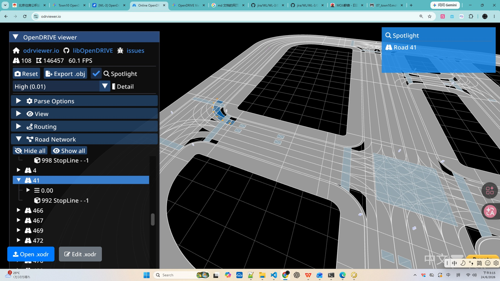

### 8.2 その他のオブジェクト種別の統一処理
以下のオブジェクト種別は `Town10HD_Opt_reference.xodr` ではいずれも `<object>` 要素として出現し、処理方法は `StopLine` と同様である。

#### 8.2.1 ContinentalCrosswalk 横断歩道
- 横断歩道標示を表し、通常 `type="crosswalk"`。
- `s`、`t`、`hdg` で位置決めし、`outline` で幾何輪郭を記述できる。
- 歩行者横断区域と交差点信号ロジックの関連付けに用いることが多い。

##### Town10HD_Opt_reference.xodr における ContinentalCrosswalk の例
```xml
<object id="1140" name="ContinentalCrosswalk" s="4.5659991051613043e+0" t="-9.4969435371012878e-2" zOffset="0.0000000000000000e+0"
        hdg="1.5828447341918945e+0" roll="0.0000000000000000e+0" pitch="0.0000000000000000e+0"
        orientation="+" type="crosswalk" width="2.9213146858085719e+0"
        length="1.9404705441447103e+1">
</object>
```

##### 例のフィールド説明
上記の例における各フィールドの意味は以下のとおり：

| フィールド | 例の値 | 意味の説明 |
| --- | --- | --- |
| `id` | `1140` | オブジェクトの一意な番号。この road 内でこの横断歩道を識別する。 |
| `name` | `ContinentalCrosswalk` | オブジェクト名称。横断歩道（連続ストライプ式）標示であることを示す。 |
| `s` | `4.5659991051613043e+0` (≈4.57 m) | 道路参照線に沿った縦方向位置（メートル）。 |
| `t` | `-9.4969435371012878e-2` (≈-0.095 m) | 参照線に対する横方向オフセット（メートル）。負値は参照線の一方の側にあることを表す。 |
| `zOffset` | `0.0000000000000000e+0` (0 m) | 路面に対する垂直方向の高さオフセット（メートル）。ここでは 0。 |
| `hdg` | `1.5828447341918945e+0` (≈1.583 rad) | オブジェクトの向き角（ラジアン）。約 π/2 に等しく、道路を横断する方向を表す。 |
| `roll` | `0.0` | 縦軸まわりのロール角（ラジアン）。ここでは 0。 |
| `pitch` | `0.0` | 横軸まわりのピッチ角（ラジアン）。ここでは 0。 |
| `orientation` | `+` | 参照線に対する有効方向（`+` 順方向 / `-` 逆方向）。 |
| `type` | `crosswalk` | オブジェクト種別。横断歩道であることを明示する（多くのオブジェクトの `-1` 汎用種別とは異なる）。 |
| `width` | `2.9213146858085719e+0` (≈2.92 m) | オブジェクト幅（メートル）、すなわち横断歩道の道路方向に沿った幅。 |
| `length` | `1.9404705441447103e+1` (≈19.40 m) | オブジェクト長さ（メートル）、すなわち横断歩道が道路を横断するスパン。 |

> 注：この例は自己閉合構造で `outline` 子要素を持たず、幾何範囲は `s/t/hdg` と `width/length` で共に確定される。`outline` が存在する場合、その `cornerLocal` の `u/v/z` の意味は 8.1 節と同じである。

##### 実際のデータ表示

下図は [odrviewer.io](https://odrviewer.io) で `Town10HD_Opt_reference.xodr` を読み込んだ後の、`Road 24` 上の ContinentalCrosswalk オブジェクト（`id=1140`）の実際のレンダリング結果である（図中の青いハイライトがこの横断歩道、右上の Spotlight に `Object 'ContinentalCrosswalk'`、`Type 'crosswalk'` および選択点の `s/t` と世界座標 `x/y/z` が表示される）：

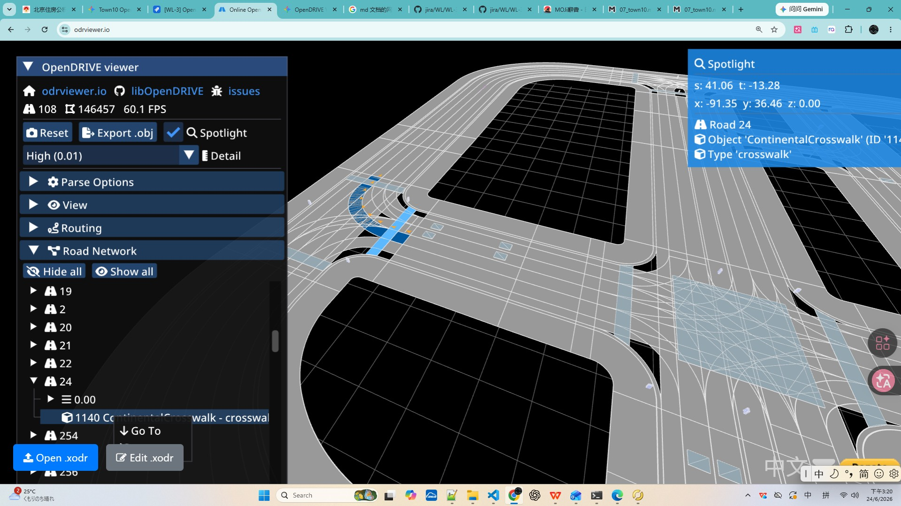

#### 8.2.2 LadderCrosswalk はしご型横断歩道
- もう一つの歩行者横断形式で、通常より目立つ道路横断標示に用いる。
- 同様に汎用フィールド `id`、`name`、`s`、`t`、`hdg`、`width`、`length` を解析できる。
- `outline` が存在する場合は、その横断歩道の格子の具体的な形状を定義する。

##### Town10HD_Opt_reference.xodr における LadderCrosswalk の例
```xml
<object id="1139" name="LadderCrosswalk" s="3.3676265511258073e+1" t="1.4797227501779986e-1" zOffset="0.0000000000000000e+0"
        hdg="1.6373691558837891e+0" roll="0.0000000000000000e+0" pitch="0.0000000000000000e+0"
        orientation="+" type="crosswalk" width="2.8939027420508348e+0"
        length="1.8864728571029232e+1">
    <outline>
        <cornerLocal u="-9.1903185521665378e+0" v="-1.4467594931219736e+0" z="0.0000000000000000e+0"/>
        <cornerLocal u="-9.4323530969778702e+0" v="1.0486859581834835e+0" z="0.0000000000000000e+0"/>
        <cornerLocal u="9.4323759020078484e+0" v="1.4471430075966936e+0" z="0.0000000000000000e+0"/>
        <cornerLocal u="8.8740408316335646e+0" v="-1.0652076913443977e+0" z="0.0000000000000000e+0"/>
        <cornerLocal u="-9.1903185521665378e+0" v="-1.4467594931219736e+0" z="0.0000000000000000e+0"/>
    </outline>
</object>
```

##### 例のフィールド説明
上記の例における各フィールドの意味は以下のとおり：

| フィールド | 例の値 | 意味の説明 |
| --- | --- | --- |
| `id` | `1139` | オブジェクトの一意な番号。この road 内でこのはしご型横断歩道を識別する。 |
| `name` | `LadderCrosswalk` | オブジェクト名称。はしご型（格子状）横断歩道標示であることを示す。 |
| `s` | `3.3676265511258073e+1` (≈33.68 m) | 道路参照線に沿った縦方向位置（メートル）。 |
| `t` | `1.4797227501779986e-1` (≈0.148 m) | 参照線に対する横方向オフセット（メートル）。 |
| `zOffset` | `0.0000000000000000e+0` (0 m) | 路面に対する垂直方向の高さオフセット（メートル）。ここでは 0。 |
| `hdg` | `1.6373691558837891e+0` (≈1.637 rad) | オブジェクトの向き角（ラジアン）。約 π/2 に等しく、道路を横断する方向を表す。 |
| `roll` | `0.0` | 縦軸まわりのロール角（ラジアン）。ここでは 0。 |
| `pitch` | `0.0` | 横軸まわりのピッチ角（ラジアン）。ここでは 0。 |
| `orientation` | `+` | 参照線に対する有効方向（`+` 順方向 / `-` 逆方向）。 |
| `type` | `crosswalk` | オブジェクト種別。横断歩道であることを明示する（多くのオブジェクトの `-1` 汎用種別とは異なる）。 |
| `width` | `2.8939027420508348e+0` (≈2.89 m) | オブジェクト幅（メートル）、すなわち横断歩道の道路方向に沿った幅。 |
| `length` | `1.8864728571029232e+1` (≈18.86 m) | オブジェクト長さ（メートル）、すなわち横断歩道が道路を横断するスパン。 |
| `outline` | — | 局所座標の輪郭。いくつかの `cornerLocal` 頂点から成り、横断歩道の路面上での多角形形状を記述する（始終点の頂点が一致すると閉合を表す）。 |
| `cornerLocal` `u` | `-9.1903185521665378e+0` | 頂点のオブジェクト局所座標系における縦方向（長さ方向に沿った）座標（メートル）。 |
| `cornerLocal` `v` | `-1.4467594931219736e+0` | 頂点のオブジェクト局所座標系における横方向（幅方向に沿った）座標（メートル）。 |
| `cornerLocal` `z` | `0.0000000000000000e+0` | 頂点の垂直方向の高さ座標（メートル）。 |

> 注：この例の `outline` は 5 個の `cornerLocal` を含み、始終点の頂点座標が同一であることが多角形の閉合を表す。フィールドの意味は 8.1 節と同じである。

##### 実際のデータ表示

**① OpenDRIVE viewer（odrviewer.io）でのレンダリング結果**

下図は [odrviewer.io](https://odrviewer.io) で `Town10HD_Opt_reference.xodr` を読み込んだ後の、`Road 469` 上の LadderCrosswalk オブジェクト（`id=1139`）の実際のレンダリング結果である（図中の青いハイライトがこのはしご型横断歩道で、カーブに沿って格子状のストライプが並ぶ。右上の Spotlight に `Object 'LadderCrosswalk'`、`Type 'crosswalk'` および選択点の `s/t` と世界座標 `x/y/z` が表示される）：

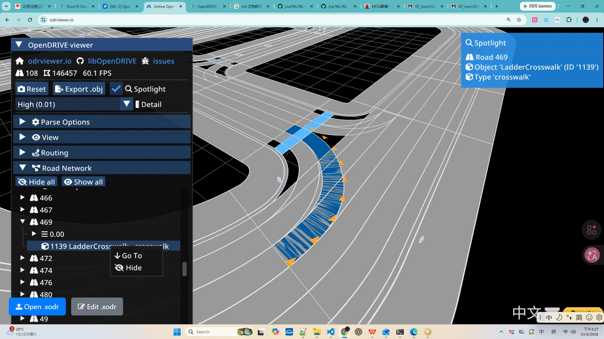

**② RoadRunner（生成元）でのレンダリング結果**

下図は RoadRunner（MathWorks RoadRunner R2023b）で同じ `Town10` シーンを開いた際の、カーブ部のはしご型横断歩道のレンダリング結果である（赤枠でハイライトされた箇所が一つの LadderCrosswalk オブジェクトで、右側の Attributes パネルに `Name=LadderCrosswalk`、`Object Type=crosswalk` が表示される。地図生成元におけるこのオブジェクトの元の外観を示す）：

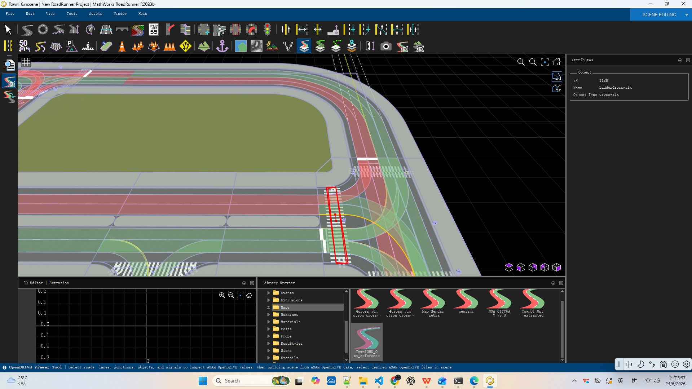

#### 8.2.3 Stencil_ArrowType4R 右折矢印
- 路面の誘導矢印標示で、右折車線または右折誘導方向を表す。
- 解析方法は `StopLine` と同様で、`s/t/hdg` で矢印の位置と向きを得られる。
- `outline` は存在する場合、矢印の境界輪郭を記述する。

##### Town10HD_Opt_reference.xodr における Stencil_ArrowType4R の例
```xml
<object id="1028" name="Stencil_ArrowType4R" s="8.0460257869528178e+1" t="-5.2500002989437178e+0" zOffset="0.0000000000000000e+0"
        hdg="-4.2736644778607058e-10" roll="0.0000000000000000e+0" pitch="0.0000000000000000e+0"
        orientation="-" type="-1" width="1.9181276944121350e+0"
        length="2.5410265098956017e+0"/>
```

##### 例のフィールド説明
上記の例における各フィールドの意味は以下のとおり：

| フィールド | 例の値 | 意味の説明 |
| --- | --- | --- |
| `id` | `1028` | オブジェクトの一意な番号。この road 内でこの右折矢印を識別する。 |
| `name` | `Stencil_ArrowType4R` | オブジェクト名称。路面右折誘導矢印であることを示す。 |
| `s` | `8.0460257869528178e+1` (≈80.46 m) | 道路参照線に沿った縦方向位置（メートル）。 |
| `t` | `-5.2500002989437178e+0` (≈-5.25 m) | 参照線に対する横方向オフセット（メートル）。矢印の存在する車線を定める。 |
| `zOffset` | `0.0000000000000000e+0` (0 m) | 路面に対する垂直方向の高さオフセット（メートル）。ここでは 0。 |
| `hdg` | `-4.2736644778607058e-10` (≈0 rad) | オブジェクトの向き角（ラジアン）。近似的に 0 で、矢印の向きが参照線と一致することを表す。 |
| `roll` | `0.0` | 縦軸まわりのロール角（ラジアン）。ここでは 0。 |
| `pitch` | `0.0` | 横軸まわりのピッチ角（ラジアン）。ここでは 0。 |
| `orientation` | `-` | 参照線に対する有効方向（`+` 順方向 / `-` 逆方向）。 |
| `type` | `-1` | オブジェクト種別。`-1` は汎用種別（細分なし）を表す。 |
| `width` | `1.9181276944121350e+0` (≈1.92 m) | オブジェクト幅（メートル）、すなわち矢印の横方向寸法。 |
| `length` | `2.5410265098956017e+0` (≈2.54 m) | オブジェクト長さ（メートル）、すなわち矢印の道路方向に沿った寸法。 |

> 注：この例は自己閉合構造で `outline` 子要素を持たず、矢印の位置と向きは `s/t/hdg` で確定され、幾何寸法は `width/length` で与えられる。`outline` が存在する場合、その `cornerLocal` の `u/v/z` の意味は 8.1 節と同じである。

##### 実際のデータ表示

**① OpenDRIVE viewer（odrviewer.io）でのレンダリング結果**

下図は [odrviewer.io](https://odrviewer.io) で `Town10HD_Opt_reference.xodr` を読み込んだ後の、`Road 5` 上の Stencil_ArrowType4R 右折矢印オブジェクトの実際のレンダリング結果である（図中の青いハイライトがこのカーブ車線で、車線に沿って並ぶオレンジの矢印が一連の右折誘導矢印である。右上の Spotlight に `Object 'Stencil_ArrowType4R'`、`Type '-1'` および選択点の `s/t` と世界座標 `x/y/z` が表示され、左側のリストにはこの区間下の `1028`/`1029` の 2 つの Stencil_ArrowType4R オブジェクトが確認できる）：

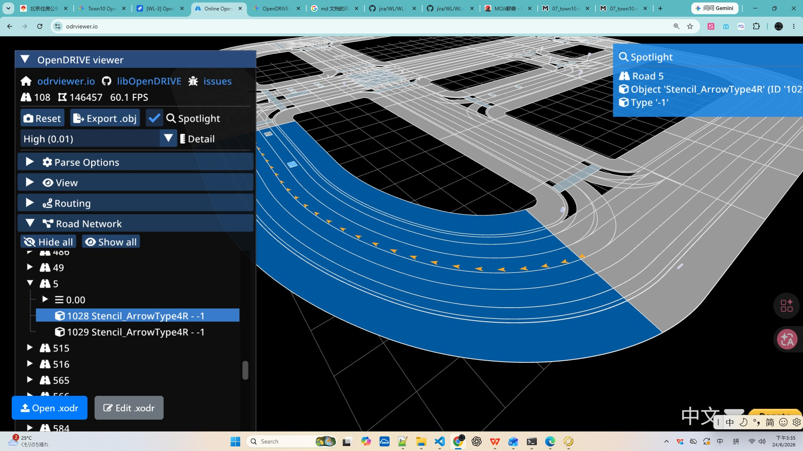

**② RoadRunner（生成元）でのレンダリング結果**

下図は RoadRunner（MathWorks RoadRunner R2023b）で同じ `Town10` シーンを開いた際の、路面右折誘導矢印のレンダリング結果である（白いカーブ矢印が Stencil_ArrowType4R 標示で、地図生成元におけるこのオブジェクトの元の外観を示す）：

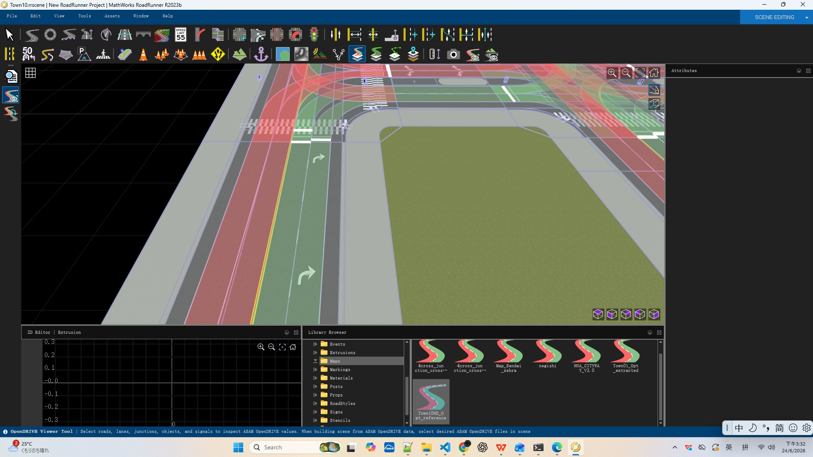

#### 8.2.4 Stencil_ArrowType4L 左折矢印
- 路面の誘導矢印標示で、左折車線または左折誘導方向を表す。
- 構造は `Stencil_ArrowType4R` と同じで、解析も同様に汎用フィールドを再利用する。

##### Town10HD_Opt_reference.xodr における Stencil_ArrowType4L の例
```xml
<object id="1036" name="Stencil_ArrowType4L" s="4.8800000000000097e+0" t="2.2500007630517516e+0" zOffset="0.0000000000000000e+0"
        hdg="3.1415927410125732e+0" roll="0.0000000000000000e+0" pitch="0.0000000000000000e+0"
        orientation="+" type="-1" width="2.5255916699285024e+0"
        length="1.8969955418501385e+0"/>
```

##### 例のフィールド説明
上記の例における各フィールドの意味は以下のとおり：

| フィールド | 例の値 | 意味の説明 |
| --- | --- | --- |
| `id` | `1036` | オブジェクトの一意な番号。この road 内でこの左折矢印を識別する。 |
| `name` | `Stencil_ArrowType4L` | オブジェクト名称。路面左折誘導矢印であることを示す。 |
| `s` | `4.8800000000000097e+0` (≈4.88 m) | 道路参照線に沿った縦方向位置（メートル）。 |
| `t` | `2.2500007630517516e+0` (≈2.25 m) | 参照線に対する横方向オフセット（メートル）。矢印の存在する車線を定める。 |
| `zOffset` | `0.0000000000000000e+0` (0 m) | 路面に対する垂直方向の高さオフセット（メートル）。ここでは 0。 |
| `hdg` | `3.1415927410125732e+0` (≈3.142 rad) | オブジェクトの向き角（ラジアン）。約 π に等しく、矢印の向きが参照線と反対であることを表す。 |
| `roll` | `0.0` | 縦軸まわりのロール角（ラジアン）。ここでは 0。 |
| `pitch` | `0.0` | 横軸まわりのピッチ角（ラジアン）。ここでは 0。 |
| `orientation` | `+` | 参照線に対する有効方向（`+` 順方向 / `-` 逆方向）。 |
| `type` | `-1` | オブジェクト種別。`-1` は汎用種別（細分なし）を表す。 |
| `width` | `2.5255916699285024e+0` (≈2.53 m) | オブジェクト幅（メートル）、すなわち矢印の横方向寸法。 |
| `length` | `1.8969955418501385e+0` (≈1.90 m) | オブジェクト長さ（メートル）、すなわち矢印の道路方向に沿った寸法。 |

> 注：この例は自己閉合構造で `outline` 子要素を持たず、構造は `Stencil_ArrowType4R` と同じである。`hdg≈π` はその向きが右折矢印と反対であることを表す。`outline` が存在する場合、その `cornerLocal` の `u/v/z` の意味は 8.1 節と同じである。

##### 実際のデータ表示

**① OpenDRIVE viewer（odrviewer.io）でのレンダリング結果**

下図は [odrviewer.io](https://odrviewer.io) で `Town10HD_Opt_reference.xodr` を読み込んだ後の、`Road 18` 上の Stencil_ArrowType4L 左折矢印オブジェクト（`id=1036`）の実際のレンダリング結果である（図中の青いハイライトがこの区間の車線で、路面のオレンジの矢印が左折誘導矢印である。右上の Spotlight に `Object 'Stencil_ArrowType4L'`、`Type '-1'` が表示され、左側のリストにはこの区間下の `1036` などのオブジェクトが確認できる）：

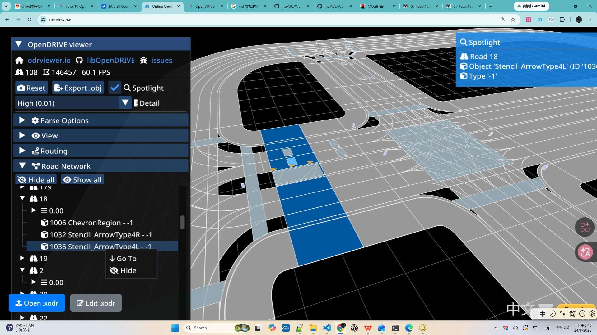

**② RoadRunner（生成元）でのレンダリング結果**

下図は RoadRunner（MathWorks RoadRunner R2023b）で同じ `Town10` シーンを開いた際の、路面左折誘導矢印のレンダリング結果である（白いカーブ矢印が Stencil_ArrowType4L 標示で、地図生成元におけるこのオブジェクトの元の外観を示す）：

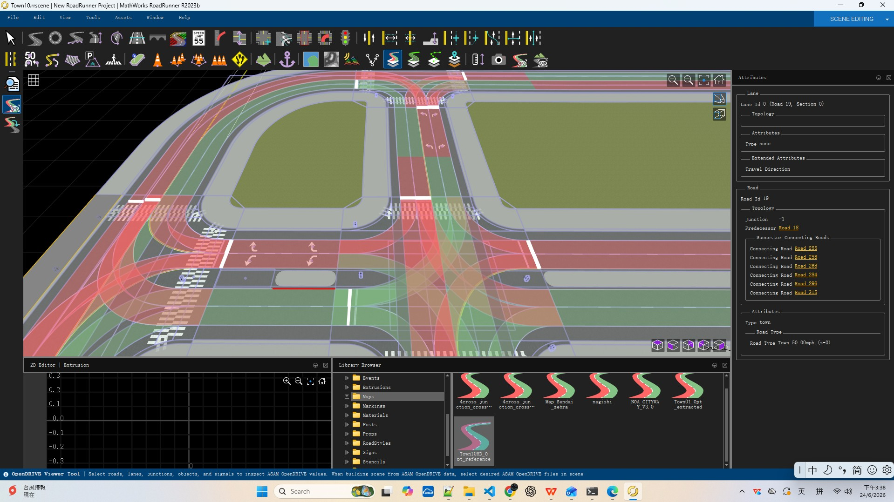

#### 8.2.5 SignPost_10ft 標識ポール
- 路側の支柱オブジェクトで、通常交通標識や道路標識の情報を担うために用いる。
- その `s` と `t` がポール位置を決定し、`height`、`width`、`length` がその幾何寸法を反映する。
- この種別はシミュレーションにおいて視覚認識や道路監督オブジェクトと関連付けられる。

##### Town10HD_Opt_reference.xodr における SignPost_10ft の例
```xml
<object id="1007" name="SignPost_10ft" s="1.0309571972171625e+0" t="7.1180692930790030e+0" zOffset="1.5240000188350677e-1"
        hdg="-3.1415925025939941e+0" roll="0.0000000000000000e+0" pitch="0.0000000000000000e+0"
        orientation="+" type="-1" height="3.0479998779296871e+0" width="4.4965670100644138e-2"
        length="4.4965822688515310e-2"/>
```

##### 例のフィールド説明
上記の例における各フィールドの意味は以下のとおり：

| フィールド | 例の値 | 意味の説明 |
| --- | --- | --- |
| `id` | `1007` | オブジェクトの一意な番号。この road 内でこの標識ポールを識別する。 |
| `name` | `SignPost_10ft` | オブジェクト名称。約 10 フィート（≈3.05 m）高の路側支柱であることを示す。 |
| `s` | `1.0309571972171625e+0` (≈1.03 m) | 道路参照線に沿った縦方向位置（メートル）。 |
| `t` | `7.1180692930790030e+0` (≈7.12 m) | 参照線に対する横方向オフセット（メートル）。支柱の路側位置を定める。 |
| `zOffset` | `1.5240000188350677e-1` (≈0.152 m) | 路面に対する垂直方向の高さオフセット（メートル）。ポール底部の路面に対する持ち上がりを表す。 |
| `hdg` | `-3.1415925025939941e+0` (≈-3.142 rad) | オブジェクトの向き角（ラジアン）。約 -π に等しく、支柱（およびそれが担う標識面）の向きを表す。 |
| `roll` | `0.0` | 縦軸まわりのロール角（ラジアン）。ここでは 0。 |
| `pitch` | `0.0` | 横軸まわりのピッチ角（ラジアン）。ここでは 0。 |
| `orientation` | `+` | 参照線に対する有効方向（`+` 順方向 / `-` 逆方向）。 |
| `type` | `-1` | オブジェクト種別。`-1` は汎用種別（細分なし）を表す。 |
| `height` | `3.0479998779296871e+0` (≈3.05 m) | オブジェクト高さ（メートル）、すなわち支柱の鉛直高さ（約 10 フィート）。 |
| `width` | `4.4965670100644138e-2` (≈0.045 m) | オブジェクト幅（メートル）、すなわちポール本体の横断面寸法。 |
| `length` | `4.4965822688515310e-2` (≈0.045 m) | オブジェクト長さ（メートル）。幅に近く、ポール本体の断面が近似的に正方形/円形であることを示す。 |

> 注：路面標示類オブジェクトと異なり、支柱は `height` で鉛直寸法を表現する。この例は自己閉合構造で `outline` 子要素を持たず、位置は `s/t/zOffset` で確定され、幾何寸法は `height/width/length` で与えられる。

##### 実際のデータ表示

**① OpenDRIVE viewer（odrviewer.io）でのレンダリング結果**

下図は [odrviewer.io](https://odrviewer.io) で `Town10HD_Opt_reference.xodr` を読み込んだ後の、`Road 12` 上の SignPost_10ft 標識ポールオブジェクト（`id=1007`）の実際のレンダリング結果である（図中の青いハイライトがこの区間で、支柱は路側に位置する。右上の Spotlight に `Object 'SignPost_10ft'`、`Type '-1'` および選択点の `s/t` と世界座標 `x/y/z` が表示され、左側のリストにはこの区間下の `1007 SignPost_10ft` オブジェクトが確認できる）：

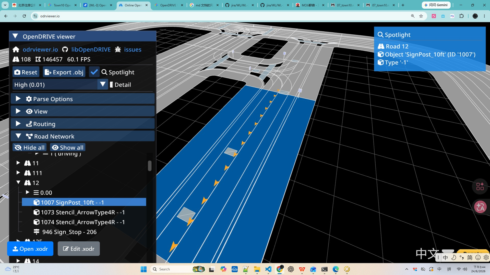

**② RoadRunner（生成元）でのレンダリング結果**

下図は RoadRunner（MathWorks RoadRunner R2023b）で同じ `Town10` シーンを開いた際の、交差点付近の路側標識ポールのレンダリング結果である（路側の菱形/立った標識板が SignPost 支柱で、地図生成元におけるこのオブジェクトの元の外観を示す）：

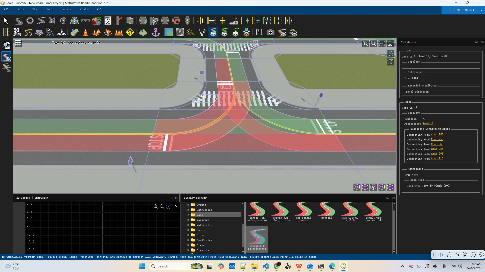

#### 8.2.6 Stencil_STOP 路面 STOP 文字
- 車両の停止を示す路面の「STOP」文字。
- 解析方法は他の路面標示と同様で、主に位置、方向、輪郭に着目する。

##### Town10HD_Opt_reference.xodr における Stencil_STOP の例
```xml
<object id="1072" name="Stencil_STOP" s="2.7620000000000008e+1" t="-1.7499979818177565e+0" zOffset="0.0000000000000000e+0"
        hdg="-5.2016732934867527e-12" roll="0.0000000000000000e+0" pitch="0.0000000000000000e+0"
        orientation="-" type="-1" width="2.8553845907410391e+0"
        length="2.2614954056514591e+0"/>
```

##### 例のフィールド説明
上記の例における各フィールドの意味は以下のとおり：

| フィールド | 例の値 | 意味の説明 |
| --- | --- | --- |
| `id` | `1072` | オブジェクトの一意な番号。この road 内でこの路面 STOP 文字を識別する。 |
| `name` | `Stencil_STOP` | オブジェクト名称。路面「STOP」文字標示であることを示す。 |
| `s` | `2.7620000000000008e+1` (≈27.62 m) | 道路参照線に沿った縦方向位置（メートル）。 |
| `t` | `-1.7499979818177565e+0` (≈-1.75 m) | 参照線に対する横方向オフセット（メートル）。文字の存在する車線を定める。 |
| `zOffset` | `0.0000000000000000e+0` (0 m) | 路面に対する垂直方向の高さオフセット（メートル）。ここでは 0。 |
| `hdg` | `-5.2016732934867527e-12` (≈0 rad) | オブジェクトの向き角（ラジアン）。近似的に 0 で、文字の向きが参照線と一致することを表す。 |
| `roll` | `0.0` | 縦軸まわりのロール角（ラジアン）。ここでは 0。 |
| `pitch` | `0.0` | 横軸まわりのピッチ角（ラジアン）。ここでは 0。 |
| `orientation` | `-` | 参照線に対する有効方向（`+` 順方向 / `-` 逆方向）。 |
| `type` | `-1` | オブジェクト種別。`-1` は汎用種別（細分なし）を表す。 |
| `width` | `2.8553845907410391e+0` (≈2.86 m) | オブジェクト幅（メートル）、すなわち文字の横方向寸法。 |
| `length` | `2.2614954056514591e+0` (≈2.26 m) | オブジェクト長さ（メートル）、すなわち文字の道路方向に沿った寸法。 |

> 注：この例は自己閉合構造で `outline` 子要素を持たず、位置と向きは `s/t/hdg` で確定され、幾何寸法は `width/length` で与えられる。`outline` が存在する場合、その `cornerLocal` の `u/v/z` の意味は 8.1 節と同じである。

##### 実際のデータ表示

**① OpenDRIVE viewer（odrviewer.io）でのレンダリング結果**

下図は [odrviewer.io](https://odrviewer.io) で `Town10HD_Opt_reference.xodr` を読み込んだ後の、`Road 11` 上の Stencil_STOP 路面 STOP 文字オブジェクト（`id=1072`）の実際のレンダリング結果である（図中の青いハイライトがこの区間で、青い小ブロックが STOP 文字の位置である。右上の Spotlight に `Object 'Stencil_STOP'`、`Type '-1'` および選択点の `s/t` と世界座標 `x/y/z` が表示され、左側のリストにはこの区間下の `1072 Stencil_STOP` オブジェクトが確認できる）：

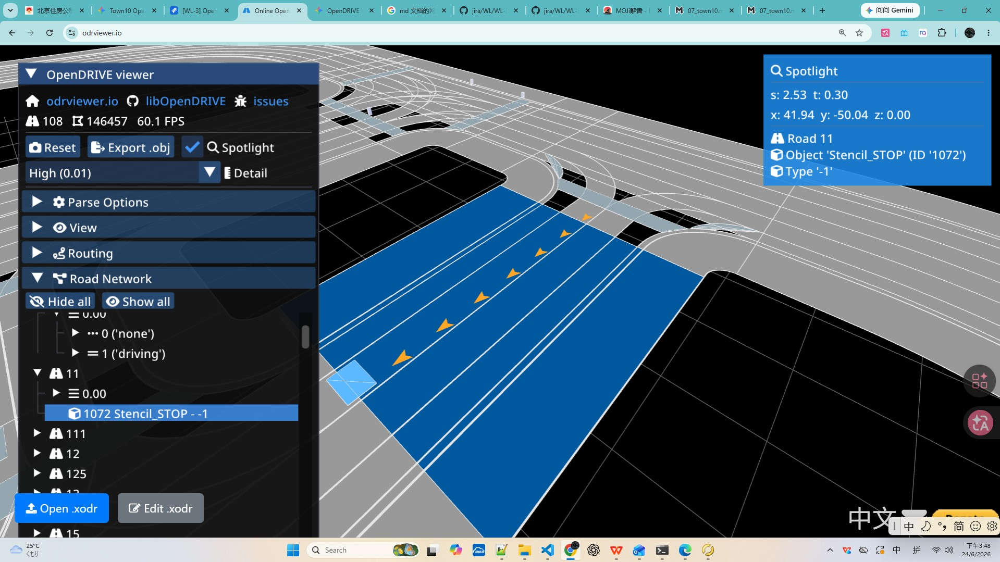

**② RoadRunner（生成元）でのレンダリング結果**

下図は RoadRunner（MathWorks RoadRunner R2023b）で同じ `Town10` シーンを開いた際の、交差点流入路の路面 STOP 文字のレンダリング結果である（赤い路面上の白い「STOP」文字が Stencil_STOP 標示で、地図生成元におけるこのオブジェクトの元の外観を示す）：

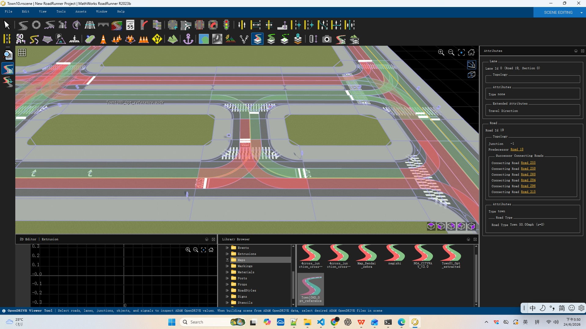

#### 8.2.7 SolidSingleWhite 単白実線区
- 実線区域または分離区域の路面標示を表す。
- `outline` はその区域の多角形境界を記述するために用いる。

##### Town10HD_Opt_reference.xodr における SolidSingleWhite の例
```xml
<object id="1004" name="SolidSingleWhite" s="3.9589388310032390e+0" t="7.8994440462967930e-1" zOffset="-4.7683715820312500e-7"
        hdg="2.8787829875946045e+0" roll="0.0000000000000000e+0" pitch="0.0000000000000000e+0"
        orientation="+" type="-1" width="1.2953070477069488e+0"
        length="7.9517112649725403e+0">
    <outline>
        <cornerLocal u="-3.9738143904775356e+0" v="5.4446814465192972e-1" z="0.0000000000000000e+0"/>
        <cornerLocal u="-3.6105232939146816e+0" v="2.3507955887751564e-1" z="8.9290551841259003e-8"/>
        <cornerLocal u="-3.1994466418109511e+0" v="-2.5547664018262140e-2" z="1.7788261175155640e-7"/>
        <cornerLocal u="-2.7470044571114514e+0" v="-2.3883746741998380e-1" z="2.6507768779993057e-7"/>
        <cornerLocal u="-2.2596167627612900e+0" v="-4.0621379471221530e-1" z="3.5017728805541992e-7"/>
        <cornerLocal u="-1.7437035817055673e+0" v="-5.2910058927957948e-1" z="4.3248292058706284e-7"/>
        <cornerLocal u="-1.2056849368893907e+0" v="-6.0892179450664230e-1" z="5.1129609346389771e-7"/>
        <cornerLocal u="-6.5198085125787486e-1" v="-6.4710135377799816e-1" z="5.8591831475496292e-7"/>
        <cornerLocal u="-8.9011347756127179e-2" v="-6.4506321047825566e-1" z="6.5565109252929688e-7"/>
        <cornerLocal u="4.7680355067076619e-1" v="-6.0423130799199498e-1" z="7.1979593485593796e-7"/>
        <cornerLocal u="1.0390438210776693e+0" v="-5.2602958970378211e-1" z="7.7765434980392456e-7"/>
        <cornerLocal u="1.5912894405195033e+0" v="-4.1188199899825406e-1" z="8.2852784544229507e-7"/>
        <cornerLocal u="2.1271203860511463e+0" v="-2.6321247925996261e-1" z="8.7171792984008789e-7"/>
        <cornerLocal u="2.6401166347274909e+0" v="-8.1444973873502136e-2" z="9.0652611106634140e-7"/>
        <cornerLocal u="3.1238581636034368e+0" v="1.3199657377650453e-1" z="9.3225389719009399e-7"/>
        <cornerLocal u="3.5719249497338765e+0" v="3.7568822030549143e-1" z="9.4820279628038406e-7"/>
        <cornerLocal u="3.9778969701736955e+0" v="6.4820602232887836e-1" z="9.5367431640625000e-7"/>
    </outline>
</object>
```

##### 例のフィールド説明
上記の例における各フィールドの意味は以下のとおり：

| フィールド | 例の値 | 意味の説明 |
| --- | --- | --- |
| `id` | `1004` | オブジェクトの一意な番号。この road 内でこの単白実線区を識別する。 |
| `name` | `SolidSingleWhite` | オブジェクト名称。単白実線（区域）路面標示であることを示す。 |
| `s` | `3.9589388310032390e+0` (≈3.96 m) | 道路参照線に沿った縦方向位置（メートル）。 |
| `t` | `7.8994440462967930e-1` (≈0.79 m) | 参照線に対する横方向オフセット（メートル）。 |
| `zOffset` | `-4.7683715820312500e-7` (≈0 m) | 路面に対する垂直方向の高さオフセット（メートル）。ここでは近似的に 0。 |
| `hdg` | `2.8787829875946045e+0` (≈2.879 rad) | オブジェクトの向き角（ラジアン）。参照線方向に対して回転する。 |
| `roll` | `0.0` | 縦軸まわりのロール角（ラジアン）。ここでは 0。 |
| `pitch` | `0.0` | 横軸まわりのピッチ角（ラジアン）。ここでは 0。 |
| `orientation` | `+` | 参照線に対する有効方向（`+` 順方向 / `-` 逆方向）。 |
| `type` | `-1` | オブジェクト種別。`-1` は汎用種別（細分なし）を表す。 |
| `width` | `1.2953070477069488e+0` (≈1.30 m) | オブジェクト幅（メートル）、すなわち実線区の横方向寸法。 |
| `length` | `7.9517112649725403e+0` (≈7.95 m) | オブジェクト長さ（メートル）、すなわち実線区の道路方向に沿ったスパン。 |
| `outline` | — | 局所座標の輪郭。いくつかの `cornerLocal` 頂点から成り、実線区の路面上での多角形形状を記述する。 |
| `cornerLocal` `u` | `-3.9738143904775356e+0` | 頂点のオブジェクト局所座標系における縦方向（長さ方向に沿った）座標（メートル）。 |
| `cornerLocal` `v` | `5.4446814465192972e-1` | 頂点のオブジェクト局所座標系における横方向（幅方向に沿った）座標（メートル）。 |
| `cornerLocal` `z` | `0.0000000000000000e+0` | 頂点の垂直方向の高さ座標（メートル）。 |

> 注：この例の `outline` は 17 個の `cornerLocal` を含み、曲線に沿って順に並び、弧状の実線区の境界を描き出す。各 `cornerLocal` の `z` 値は位置に応じて微小に変化し、路面のわずかな起伏を反映する。フィールドの意味は 8.1 節と同じである。

##### 実際のデータ表示

**① OpenDRIVE viewer（odrviewer.io）でのレンダリング結果**

下図は [odrviewer.io](https://odrviewer.io) で `Town10HD_Opt_reference.xodr` を読み込んだ後の、`Road 707` 上の SolidSingleWhite 単白実線区オブジェクト（`id=1004`）の実際のレンダリング結果である（図中の青いハイライトのブロックが `outline` 多角形で描かれた実線区である。右上の Spotlight に `Object 'SolidSingleWhite'`、`Type '-1'` が表示され、左側のリストにはこの区間下の `1004 SolidSingleWhite` オブジェクトが確認できる）：

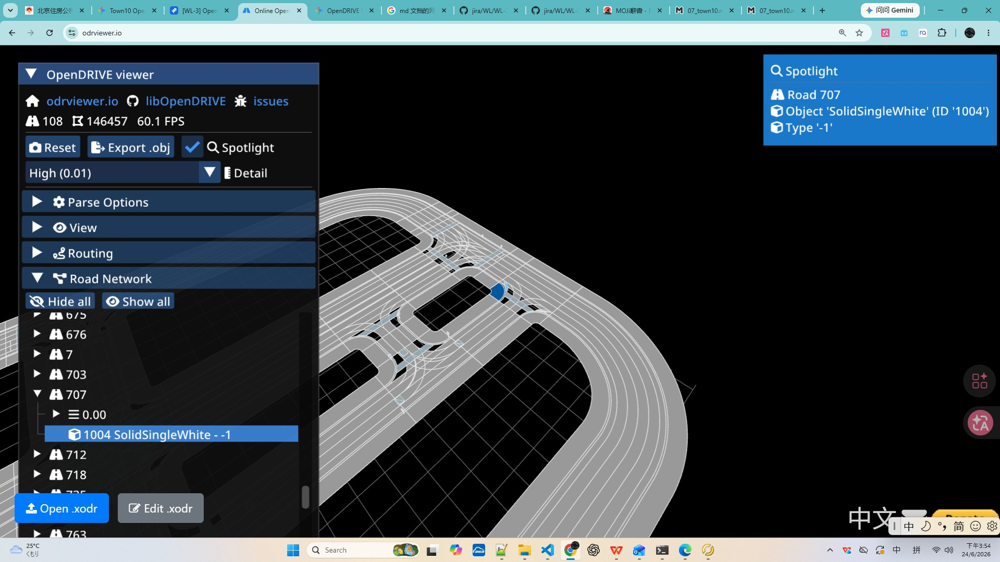

**② RoadRunner（生成元）でのレンダリング結果**

下図は RoadRunner（MathWorks RoadRunner R2023b）で同じ `Town10` シーンを開いた際の、交差点コーナー部の単白実線区のレンダリング結果である（路面の白い実線ブロックが SolidSingleWhite 標示で、地図生成元におけるこのオブジェクトの元の外観を示す）：

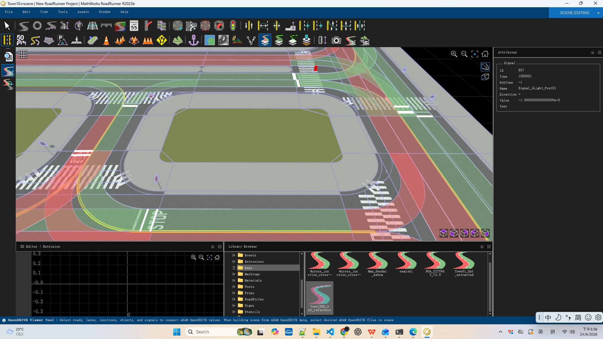

#### 8.2.8 ChevronRegion 山形導流帯
- 導流帯または分離区域の「山形」路面標示を表す。
- このオブジェクトは通常車両の進行方向を規制し道路区間を分離するために用いる。

##### Town10HD_Opt_reference.xodr における ChevronRegion の例
```xml
<object id="1006" name="ChevronRegion" s="5.1758086417993443e+0" t="-1.7926323755951472e+0" zOffset="3.8146972656250000e-6"
        hdg="3.0573234558105469e+0" roll="0.0000000000000000e+0" pitch="0.0000000000000000e+0"
        orientation="+" type="-1" width="4.9307013537216049e+0"
        length="1.0404835227700218e+1">
    <outline>
        <cornerLocal u="-5.2024141319817261e+0" v="1.5908691479582338e+0" z="0.0000000000000000e+0"/>
        <cornerLocal u="-2.6937966502462132e+0" v="1.8094897887170767e+0" z="-4.7683715820312500e-7"/>
        <cornerLocal u="-1.8517916851070026e-1" v="2.0281104294759125e+0" z="-9.5367431640625000e-7"/>
        <cornerLocal u="2.3234383132248269e+0" v="2.2467310702347554e+0" z="-1.4305114746093750e-6"/>
        <cornerLocal u="4.8320557949603540e+0" v="2.4653517109935947e+0" z="-1.9073486328125000e-6"/>
        <cornerLocal u="5.2024215603248365e+0" v="-1.6716645354889295e+0" z="-5.7220458984375000e-6"/>
        <cornerLocal u="2.6913271844302642e+0" v="-1.8700859735534614e+0" z="-5.2452087402343750e-6"/>
        <cornerLocal u="1.8023280853572032e-1" v="-2.0685074116179933e+0" z="-4.7683715820312500e-6"/>
        <cornerLocal u="-2.3308615673588235e+0" v="-2.2669288496825253e+0" z="-4.2915344238281250e-6"/>
        <cornerLocal u="-4.8419559432533816e+0" v="-2.4653502877470537e+0" z="-3.8146972656250000e-6"/>
        <cornerLocal u="-5.2024141319817261e+0" v="1.5908691479582338e+0" z="0.0000000000000000e+0"/>
    </outline>
</object>
```

##### 例のフィールド説明
上記の例における各フィールドの意味は以下のとおり：

| フィールド | 例の値 | 意味の説明 |
| --- | --- | --- |
| `id` | `1006` | オブジェクトの一意な番号。この road 内でこの山形導流帯を識別する。 |
| `name` | `ChevronRegion` | オブジェクト名称。「山形」導流帯路面標示であることを示す。 |
| `s` | `5.1758086417993443e+0` (≈5.18 m) | 道路参照線に沿った縦方向位置（メートル）。 |
| `t` | `-1.7926323755951472e+0` (≈-1.79 m) | 参照線に対する横方向オフセット（メートル）。 |
| `zOffset` | `3.8146972656250000e-6` (≈0 m) | 路面に対する垂直方向の高さオフセット（メートル）。ここでは近似的に 0。 |
| `hdg` | `3.0573234558105469e+0` (≈3.057 rad) | オブジェクトの向き角（ラジアン）。参照線方向に対して回転する。 |
| `roll` | `0.0` | 縦軸まわりのロール角（ラジアン）。ここでは 0。 |
| `pitch` | `0.0` | 横軸まわりのピッチ角（ラジアン）。ここでは 0。 |
| `orientation` | `+` | 参照線に対する有効方向（`+` 順方向 / `-` 逆方向）。 |
| `type` | `-1` | オブジェクト種別。`-1` は汎用種別（細分なし）を表す。 |
| `width` | `4.9307013537216049e+0` (≈4.93 m) | オブジェクト幅（メートル）、すなわち導流帯の横方向寸法。 |
| `length` | `1.0404835227700218e+1` (≈10.40 m) | オブジェクト長さ（メートル）、すなわち導流帯の道路方向に沿ったスパン。 |
| `outline` | — | 局所座標の輪郭。いくつかの `cornerLocal` 頂点から成り、導流帯の路面上での多角形形状を記述する（始終点の頂点が一致すると閉合を表す）。 |
| `cornerLocal` `u` | `-5.2024141319817261e+0` | 頂点のオブジェクト局所座標系における縦方向（長さ方向に沿った）座標（メートル）。 |
| `cornerLocal` `v` | `1.5908691479582338e+0` | 頂点のオブジェクト局所座標系における横方向（幅方向に沿った）座標（メートル）。 |
| `cornerLocal` `z` | `0.0000000000000000e+0` | 頂点の垂直方向の高さ座標（メートル）。 |

> 注：この例の `outline` は 11 個の `cornerLocal` を含み、始終点の頂点座標が同一であることが多角形の閉合を表し、山形導流帯の境界を描き出す。フィールドの意味は 8.1 節と同じである。

#### 8.2.9 CrosshatchRegion ゼブラゾーン（網掛け）
- 網掛けで塗りつぶされた駐停車禁止区または導流帯を表す。
- 解析も同様に汎用フィールドに基づき、`outline` が網掛け区域の境界を定義する。

##### Town10HD_Opt_reference.xodr における CrosshatchRegion の例
```xml
<object id="1005" name="CrosshatchRegion" s="2.1391307027393442e+1" t="2.9071922808434181e-2" zOffset="0.0000000000000000e+0"
        hdg="9.6705120801925659e-1" roll="0.0000000000000000e+0" pitch="0.0000000000000000e+0"
        orientation="-" type="-1" width="2.7108256658744459e+1"
        length="2.7516586268451064e+1">
    <outline>
        <cornerLocal u="3.0223469626388528e+0" v="1.3554128020001734e+1" z="0.0000000000000000e+0"/>
        <cornerLocal u="5.7063330221649160e+0" v="9.6101168825249133e+0" z="0.0000000000000000e+0"/>
        <cornerLocal u="8.3903190816909863e+0" v="5.6661057450480996e+0" z="0.0000000000000000e+0"/>
        <cornerLocal u="1.1074305141217042e+1" v="1.7220946075712718e+0" z="0.0000000000000000e+0"/>
        <cornerLocal u="1.3758291200743106e+1" v="-2.2219165299055419e+0" z="0.0000000000000000e+0"/>
        <cornerLocal u="1.1661518463211760e+1" v="-3.6384429377244345e+0" z="4.7683715820312500e-7"/>
        <cornerLocal u="9.5647457256804138e+0" v="-5.0549693455433129e+0" z="9.5367431640625000e-7"/>
        <cornerLocal u="7.4679729881490537e+0" v="-6.4714957533622055e+0" z="1.4305114746093750e-6"/>
        <cornerLocal u="5.3712002506177079e+0" v="-7.8880221611810839e+0" z="1.9073486328125000e-6"/>
        <cornerLocal u="3.2744275130863585e+0" v="-9.3045485689999694e+0" z="2.3841857910156250e-6"/>
        <cornerLocal u="1.1776547755550091e+0" v="-1.0721074976818855e+1" z="2.8610229492187500e-6"/>
        <cornerLocal u="-9.1911796197634388e-1" v="-1.2137601384637744e+1" z="3.3378601074218750e-6"/>
        <cornerLocal u="-3.0158906995076933e+0" v="-1.3554127792456626e+1" z="3.8146972656250000e-6"/>
        <cornerLocal u="-5.7014915911018100e+0" v="-9.6668879991248815e+0" z="3.8146972656250000e-6"/>
        <cornerLocal u="-8.3870924826959232e+0" v="-5.7796482057931371e+0" z="3.8146972656250000e-6"/>
        <cornerLocal u="-1.1072693374290042e+1" v="-1.8924084124613927e+0" z="3.8146972656250000e-6"/>
        <cornerLocal u="-1.3758294265884157e+1" v="1.9948313808703517e+0" z="3.8146972656250000e-6"/>
        <cornerLocal u="-1.1660714112318775e+1" v="3.4397434607617754e+0" z="3.3378601074218750e-6"/>
        <cornerLocal u="-9.5631339587534008e+0" v="4.8846555406531991e+0" z="2.8610229492187500e-6"/>
        <cornerLocal u="-7.4655538051880299e+0" v="6.3295676205446227e+0" z="2.3841857910156250e-6"/>
        <cornerLocal u="-5.3679736516226484e+0" v="7.7744797004360464e+0" z="1.9073486328125000e-6"/>
        <cornerLocal u="-3.2703934980572740e+0" v="9.2193917803274701e+0" z="1.4305114746093750e-6"/>
        <cornerLocal u="-1.1728133444919031e+0" v="1.0664303860218894e+1" z="9.5367431640625000e-7"/>
        <cornerLocal u="9.2476680907347841e-1" v="1.2109215940110310e+1" z="4.7683715820312500e-7"/>
        <cornerLocal u="3.0223469626388528e+0" v="1.3554128020001734e+1" z="0.0000000000000000e+0"/>
    </outline>
</object>
```

##### 例のフィールド説明
上記の例における各フィールドの意味は以下のとおり：

| フィールド | 例の値 | 意味の説明 |
| --- | --- | --- |
| `id` | `1005` | オブジェクトの一意な番号。この road 内でこのゼブラゾーン（網掛け）を識別する。 |
| `name` | `CrosshatchRegion` | オブジェクト名称。網掛けで塗りつぶされた駐停車禁止/導流帯の路面標示であることを示す。 |
| `s` | `2.1391307027393442e+1` (≈21.39 m) | 道路参照線に沿った縦方向位置（メートル）。 |
| `t` | `2.9071922808434181e-2` (≈0.029 m) | 参照線に対する横方向オフセット（メートル）。 |
| `zOffset` | `0.0000000000000000e+0` (0 m) | 路面に対する垂直方向の高さオフセット（メートル）。ここでは 0。 |
| `hdg` | `9.6705120801925659e-1` (≈0.967 rad) | オブジェクトの向き角（ラジアン）。参照線方向に対して回転する。 |
| `roll` | `0.0` | 縦軸まわりのロール角（ラジアン）。ここでは 0。 |
| `pitch` | `0.0` | 横軸まわりのピッチ角（ラジアン）。ここでは 0。 |
| `orientation` | `-` | 参照線に対する有効方向（`+` 順方向 / `-` 逆方向）。 |
| `type` | `-1` | オブジェクト種別。`-1` は汎用種別（細分なし）を表す。 |
| `width` | `2.7108256658744459e+1` (≈27.11 m) | オブジェクト幅（メートル）、すなわち網掛け区の横方向寸法。 |
| `length` | `2.7516586268451064e+1` (≈27.52 m) | オブジェクト長さ（メートル）、すなわち網掛け区の道路方向に沿ったスパン。 |
| `outline` | — | 局所座標の輪郭。いくつかの `cornerLocal` 頂点から成り、網掛け区の路面上での多角形境界を記述する（始終点の頂点が一致すると閉合を表す）。 |
| `cornerLocal` `u` | `3.0223469626388528e+0` | 頂点のオブジェクト局所座標系における縦方向（長さ方向に沿った）座標（メートル）。 |
| `cornerLocal` `v` | `1.3554128020001734e+1` | 頂点のオブジェクト局所座標系における横方向（幅方向に沿った）座標（メートル）。 |
| `cornerLocal` `z` | `0.0000000000000000e+0` | 頂点の垂直方向の高さ座標（メートル）。 |

> 注：この例の `outline` は 25 個の `cornerLocal` を含み、始終点の頂点座標が同一であることが多角形の閉合を表す。頂点数が多めなのは比較的大きな面積の網掛け区の境界を描き出すためである。各頂点の `z` 値は位置に応じて微小に変化し、路面のわずかな起伏を反映する。フィールドの意味は 8.1 節と同じである。

#### 8.2.10 統一フィールドと解析戦略
- これらのオブジェクトはいずれも以下の汎用フィールドで解析できる：
  - `id`、`name`、`s`、`t`、`zOffset`、`hdg`、`orientation`、`type`、`width`、`length`
  - `outline`：存在する場合は物体の局所座標系における幾何輪郭を表す
  - `validity`：存在する場合は特定の車線や路線区間に対するオブジェクトの有効範囲を限定する
- したがって、これらの種別に対して `StopLine` と同じ解析・統計戦略を採用することで、路面標示、横断歩道、誘導矢印、標示区域などの道路物体を統一的に処理できる。

## 9. 要素統計サマリー

| 要素 | 数量 |
| --- | --- |
| Road 道路 | 108（通常 23 + 接続 85） |
| LaneSection 車線断面 | 108 |
| Lane 車線 | 509 |
| RoadMark 標示 | 2802 |
| Junction 交差点 | 9 |
| Connection 接続 | 85 |
| Signal 信号定義 | 21 |
| SignalReference 信号参照 | 63 |
| Controller 制御器 | 32 |
| Object 道路物体 | 60 |

---
*分析は Town10HD_Opt_reference.xodr ファイル構造のタグごとの統計に基づく。この地図は信号制御交差点、横断歩道、誘導標示を含む典型的な高密度都市道路シーンである。*
